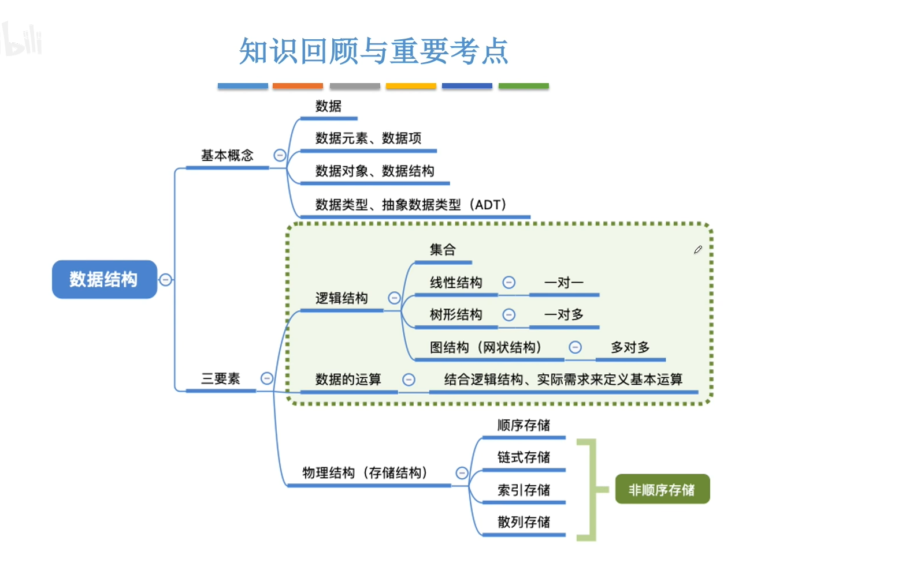
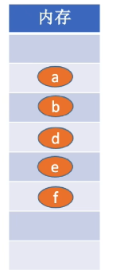
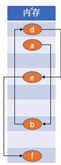
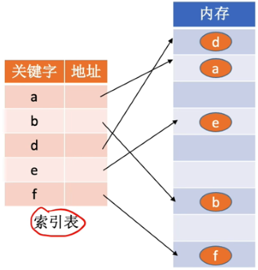
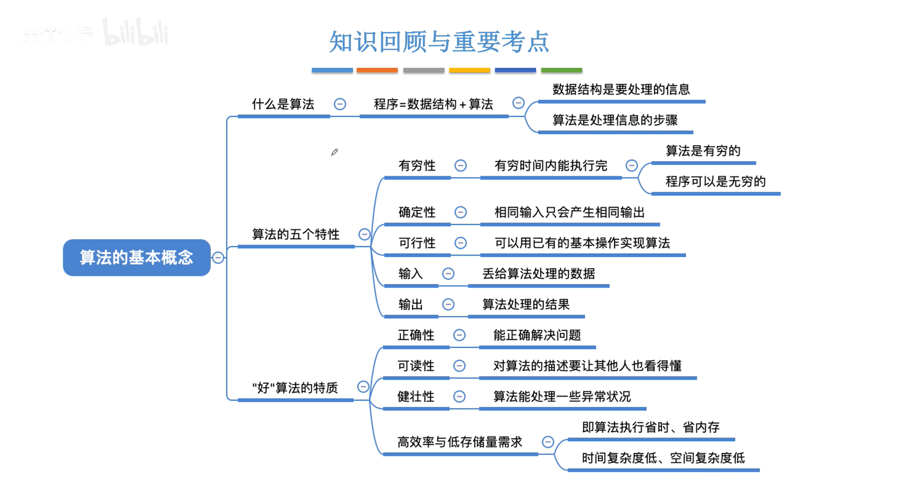
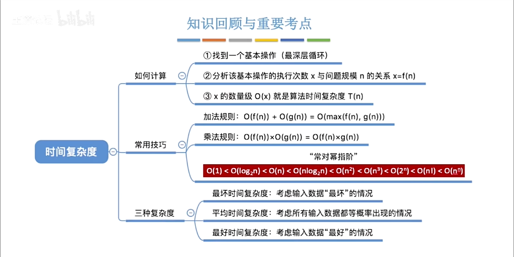
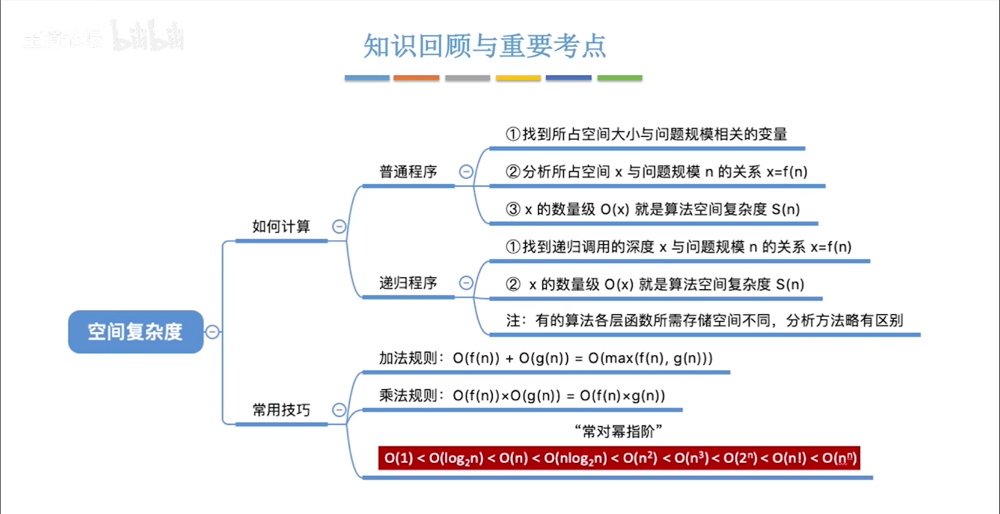
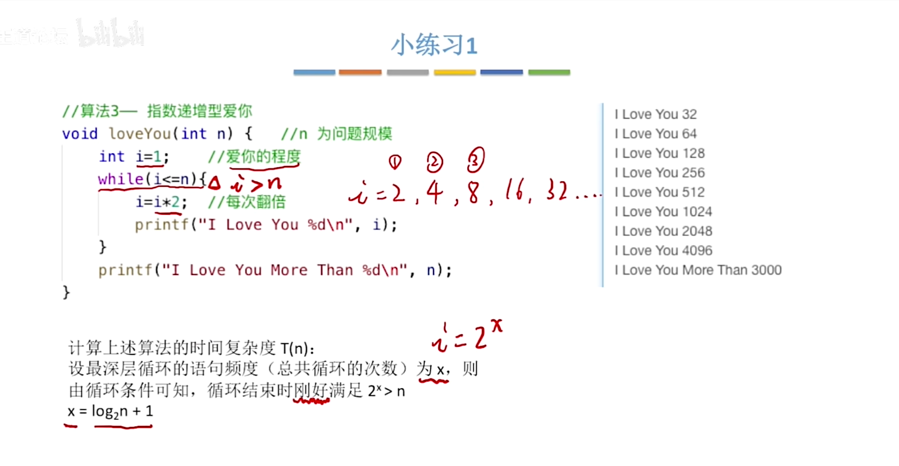
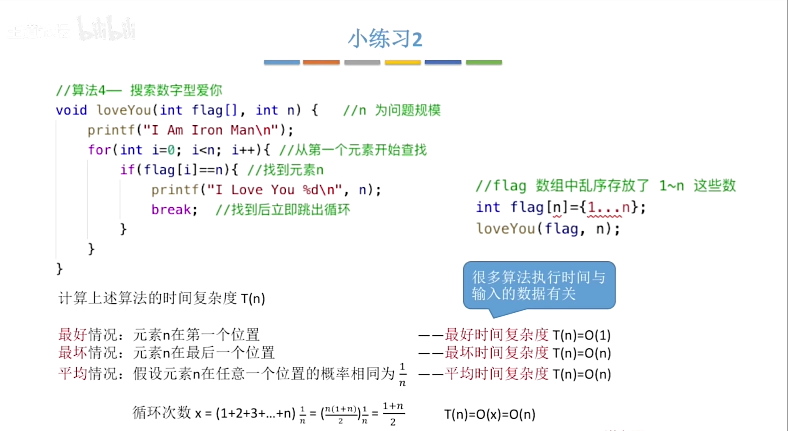

#
<!--more-->
![数据结构]<!--more-->
(/img/datastruct/1_extract/1.png)

## 1.1 数据
- 信息的载体，被计算机程序识别和处理的符号的集合
## 1.2 数据元素
- 数据的基本单位，常作为一个整体进行考虑和处理。一个数据元素可由若干数据项组成。
- 例如一个人的信息
## 1.3 数据项
- 数据不可分割的最小单位。
- 例如姓名字段
## 1.4 数据对象
- 性质相同的数据元素的集合，是数据的一个子集。
- 例如所有人的信息

|概念|定义|举例|
|:---:|:---:|:---:|
|数据|信息的载体，被计算机程序识别和处理的符号的集合|一个人的信息|
|数据元素|数据的基本单位，常作为一个整体进行考虑和处理。一个数据元素可由若干数据项组成。|一个人的信息|
|数据项|数据不可分割的最小单位。|姓名字段|
|数据对象|性质相同的数据元素的集合，是数据的一个子集。|所有人的信息|

## 1.5 数据结构
- 相互之间存在一种或多种特定关系的数据元素的集合。
- 例如所有人的信息按照年龄排序
## 1.6 逻辑结构
- 数据对象中数据元素之间的相互关系
- 例如所有人的信息按照年龄排序
## 1.7 物理结构
- 数据的逻辑结构在计算机中的存储形式
- 例如所有人的信息按照年龄排序，存储在数组中
## 1.8 数据类型
- 一组性质相同的值的集合及定义在此集合上的一些操作的总称
- 例如整数类型，浮点数类型
## 1.9 抽象数据类型
- 一个数学模型及定义在该模型上的一组操作
- 例如整数类型，浮点数类型
## 1.10 算法
- 为解决特定问题而规定的一个有限长的操作序列
- 例如排序算法
## 1.11 数据类型
- 一个值的集合和定义在此集合上的一组操作的总称

|原子类型|其值不可再分的数据类型|
|:---:|:---:|
|结构类型|其值可再分为若干成分的数据类型|
## 1.12 抽象数据类型
- 一个数学模型及定义在该模型上的一组操作
---

# 2 数据结构三要素
## 2.1 逻辑结构
- 数据元素之间的逻辑关系
- 集合、线性、树形、图形

## 2.2 数据运算
- 增删查改

## 2.3 物理结构（存储结构）
- 用计算机表示数据元素的逻辑关系
插入表格：

|顺序存储|链式存储|索引存储|散列存储|
|:---:|:---:|:---:|:---:|
|数组|链表|索引表|散列表|
|逻辑相邻则物理相邻|逻辑相邻则物理不一定相邻|附加索引表|根据关键字得到存储地址|
|||||
---
# 3 算法的基本概念

## 3.1 啥是算法
- 对特定问题求解步骤的一种描述
- 指令的有限序列
- 每条指令表示一个或多个操作
## 3.2 算法特性
- 有穷性

   ·执行有限步骤后结束
   
   ·每一步都可在有限时间内完成

- 确定性
 
   ·每一步都有确定的含义
   
   ·对于相同的输入只能得出相同的输出

- 可行性

   ·可以通过已经实现的基本运算执行有限次得出结果

- 输入

   ·有0个或多个输入

- 输出

   ·至少有1个或多个输出

## 3.3 算法设计的要求
- 正确性

   ·算法能够得出正确的结果

- 可读性

   ·算法要便于阅读、理解和交流

- 健壮性

   ·算法对不合理数据输入有适当的处理能力

- 时间效率高和存储量低

   ·算法执行时间短，占用存储空间少

## 3.4 算法效率的度量方法
### 3.4.1 事后统计方法

- 运行时间取决于计算机的硬件、软件环境

### 3.4.2 事前分析估算方法
- O(1)<O(logn)<O(n)<O(nlogn)<O(n2)<O(n3)<O(2n)<O(n!)<O(nn)
- 时间复杂度

- 空间复杂度

- 例子：

