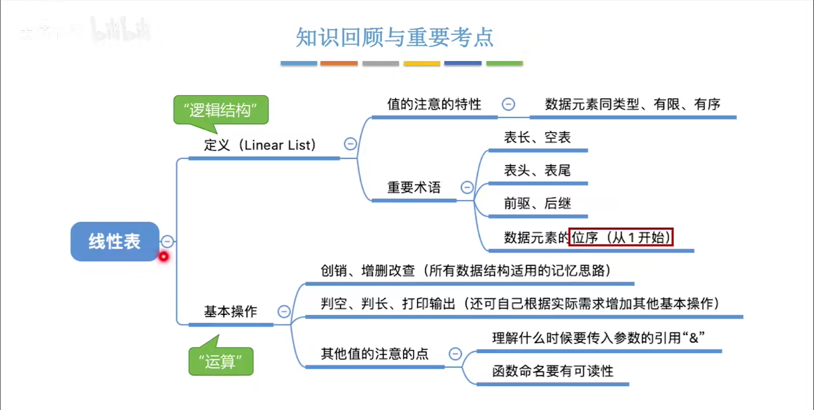
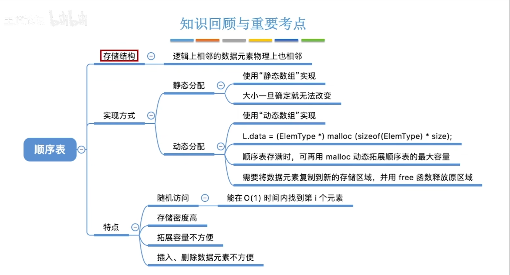
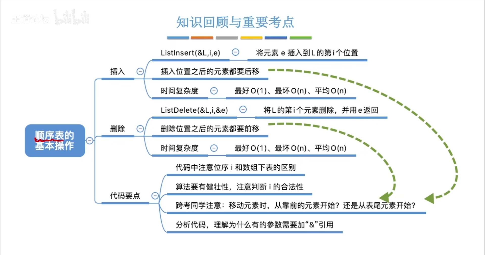
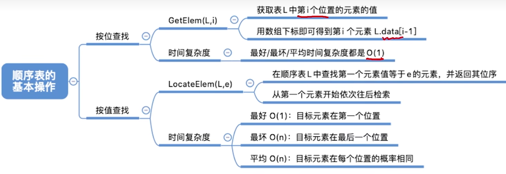

#
<!--more-->



## 2.1 定义
- L=(a<sub>1</sub>,a<sub>2</sub>,a<sub>3</sub>,...,a<sub>n</sub>)
- 有限个相同数据类型的数据元素的有序序列
- 一些概念
   
   ·位序：数据元素在线性表中的位置
   
   ·表头：第一个元素a<sub>1</sub>

   ·表尾：最后一个元素a<sub>n</sub>

- 一些性质

   ·除第一个元素外，每个元素有且仅有一个直接前驱
   ·除最后一个元素外，每个元素有且仅有一个直接后继
## 2.2 基本操作

|函数|功能|说明|
|:---:|:---:|:---:|
|InitList(&L)|初始化|构造一个空的线性表L，分配内存空间|
|DestroyList(&L)|销毁|销毁线性表，并释放内存空间|
|ClearList(&L)|清空|清空线性表，保留内存空间|
|Empty(L)|判空|判断线性表是否为空|
|Length(L)|求长|返回线性表的长度|
|GetElem(L,i,&e)|取值|返回线性表中第i个元素的值|
|LocateElem(L,e,compare())|查找|返回线性表中第一个与e满足compare()的元素的位序|
|PriorElem(L,cur_e,&pre_e)|前驱|返回线性表中元素cur_e的前驱元素的值|
|NextElem(L,cur_e,&next_e)|后继|返回线性表中元素cur_e的后继元素的值|
|ListInsert(&L,i,e)|插入|在线性表的第i个位置插入元素e|
|ListDelete(&L,i,&e)|删除|删除线性表中第i个位置的元素，并返回其值|
|ListTraverse(L,visit())|遍历|依次对线性表中每个元素调用visit()函数|

## 2.3 顺序表


### 2.3.1 顺序存储实现线性表
- 静态分配
```c
/*
实现顺序表
静态分配
*/
#include<stdio.h>
#define MaxSize 10
typedef struct
{
    int data[MaxSize];
    int length;
}SqList;

//初始化
void InitList(SqList* L){
    L->length=0;//逻辑归零
}

int main(){
    SqList L;
    InitList(&L);
    //违规访问
    for(int i=0;i<MaxSize;i++){
        printf("ta[%d]=%d\n",i,L.data[i]);
    }
    return 0;
}
```
- 动态分配
```c
/*
顺序表
动态分配
*/
#include<stdio.h>
#include<stdlib.h>
#define InitSize 10 //默认最大长度
typedef struct
{
    int *data ;//指针，用于动态分配
    int MaxSize; 
    int length;
}SeqList;
//初始化
void InitList(SeqList *L){
    //申请空间
    L->data=(int*)malloc(InitSize*sizeof(int));
    L->length=0;
    L->MaxSize=InitSize;
}

//动态增长
void IncreaseSize(SeqList *L, int len){
    int* p=L->data;
    L->data=(int *)malloc((L->MaxSize+len)*sizeof(int));
    //将数据复制到新的区域
    int i=0;
    for(i=0;i<L->length;i++){
        L->data[i]=p[i];
    }
    L->MaxSize=L->MaxSize+len;
    free(p);
}

int main(){
    SeqList L;
    //初始化
    InitList(&L);
    printf("最大长度：%d\n",L.MaxSize);
    //增长
    IncreaseSize(&L,5);
    printf("+5\n");
    printf("最大长度：%d",L.MaxSize);
    return 0;
}
```
- 基本操作




```c
/*
顺序表
静态分配
*/
#include<stdio.h>
#define MaxSize 10
typedef struct
{
    int data[MaxSize];
    int length;
}SqList;
//初始化
void InitList(SqList* L){
    L->length=0;//逻辑上置零
}
void PrintList(SqList L){
    //判空
    if(L.data==NULL || L.length==0)
        return;
    int i=0;
    for(i=0;i<L.length;i++)
        printf("%d ",L.data[i]);
}

int main(){
    SqList L;
    InitList(&L);
    ListInsert(&L,1,1);
    ListInsert(&L,2,2);
    ListInsert(&L,3,4);
    ListInsert(&L,4,5);
    printf("前：");
    PrintList(L);
    ListInsert(&L,3,3);
    printf("\n位序：3，插入：3");
    printf("\n后：");
    PrintList(L);

    //删除
    int x=0;
    ListDelete(&L,1,&x);
    printf("\n删除第%d个元素：%d",1,x);
    printf("\n删除后：");
    PrintList(L);

    ListDelete(&L,2,&x);
    printf("\n删除第%d个元素：%d",2,x);
    printf("\n删除后：");
    PrintList(L);

    printf("\n删除第%d个元素：%d",L.length,x);
    ListDelete(&L,L.length,&x);
    printf("\n删除后：");
    PrintList(L);

    //按位查找
    printf("\n第1个：%d",GetElement(L,0));
    printf("\n第2个：%d",GetElement(L,1));

    //按值查找
    printf("\n2的位序：%d",LocateElement(L,2));
    printf("\n4的位序：：%d",LocateElement(L,4));
    printf("\n5的位序：：%d",LocateElement(L,5));
    return 0;
}

//位序插入
int ListInsert(SqList *L,int i, int e){
    //满否
    if (L->length>=MaxSize || i<1 || i>L->length+1) return 0;
    int j=0;
    for(j=L->length;j>=i;j--)//后移
        L->data[j]=L->data[j-1];
    L->data[j]=e;//插入
    return ++(L->length);
}

//删除
int ListDelete(SqList *L,int i, int *e){
    if(i<1|| i>L->length) return 0;
    *e=L->data[i-1];
    int j=i;
    for(;j<L->length;j++) L->data[j-1]=L->data[j];
    L->length--;
    return 1;
}

//按位查找
int GetElement(SqList L,int i){
    if(i<1 || i>L.length) return 0;
    return L.data[i-1];
}

//按值查找
int LocateElement(SqList L,int e){
    int i=0;
    for(;i<L.length;i++)
        if(L.data[i]==e)
            return i+1;
    return -1;
}
```


||按位插入/删除||
|:---:|:---:|:---:|
|最好|尾插|O(1)|
|最坏|头插|O(n)|
|平均|$$p=\frac{1}{n+1}$$ $$1p+2p+...+np$$|O(n)|

||按位查找|按值查找|
|:---:|:---:|:---:|
|最好|O(1)|O(1)|
|最坏|O(1)|O(n)|
|平均|O(1)|O(n)|