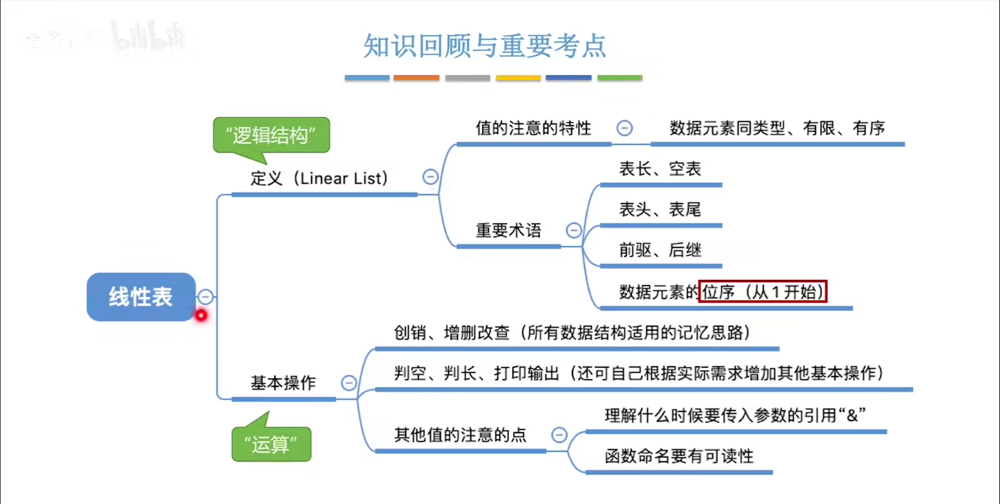

#
<!--more-->



### 2.4.1 定义


||顺序表|单链表|
|:---:|:---:|:---:|
|结构|||
|优点|随机存取，存储密度高|不要求大片连续空间，方便改容量|
|缺点|要求大片连续空间，改容量不便|不可随机存取，额外指针空间|


|带头结点|不带头结点|
|:---:|:---:|
||写代码更麻烦|
||对第一个结点和后续结点的处理逻辑不同|
||对空表和非空表的处理需要用不同的逻辑|

### 2.4.2基本操作


- 查找
    - 按位查找
    - 按值查找
- 插入
    - 位序插入
    - 指定结点后插
- 删除
    - 按位删除
    - 删除指定节点

```c
#include<stdio.h>
#include<stdlib.h>
typedef struct LNode{
    int data;
    struct LNode *next;
} LNode, *Linklist;
//输出链表
void printlist(LNode L){
    LNode* p=&L;
    for(;p!=NULL;p=p->next)
        printf("%d ",p->data);
}

//头插法-带头结点
Linklist HeadInsert(Linklist L){
    LNode *s;
    int i=0,x=0;
    int input[6]={5,4,3,2,1,-1};
    L=(Linklist)malloc(sizeof(LNode));
    L->next=NULL;
    for(;input[i]!=-1;i++){
        InsertNextNode(L,input[i]);
    }
    return L;
}

//尾插法-带头结点
Linklist TailInsert(Linklist L){
    LNode *s,*r;
    int i=0,x=0;
    int input[6]={5,4,3,2,1,-1};
    L=(Linklist)malloc(sizeof(LNode));
    L->next=NULL;
    r=L;
    for(;input[i]!=-1;i++){
        s=(LNode*)malloc(sizeof(LNode));
        s->data=input[i];
        r->next=s;
        r=s;
    }
    r->next=NULL;
    return L;
}

//尾插法-不带头结点
Linklist HeadInsertNoHead(Linklist L){
    LNode *s;
    int i=1,x=0;
    int input[6]={5,4,3,2,1,-1};
    L=(Linklist)malloc(sizeof(LNode));
    L->data=input[0];
    L->next=NULL;
    for(;input[i]!=-1;i++){
        s=(LNode*)malloc(sizeof(LNode));
        s->next=L->next;
        L->next=s;
        s->data=input[i];
    }
    return L;
}


//按位查找
LNode* GetElement(Linklist L,int i){
    if(i<0) return NULL;
    int j=0;
    LNode* p=L;
    for(;p!=NULL && j<i;j++)
        p=p->next;
    return p;
}

//按值查找
LNode* LocateElem(Linklist L,int e){
    LNode* p=L->next;
    for(;p!=NULL && p->data!=e;p=p->next);
    return p;
}

//求
int Length(Linklist L){
    int i=0;
    LNode* p=L;
    for(;p!=NULL;p=p->next)
        i++;
    return i;
}

void test_head(){
    printf("带头结点测试：");
    Linklist L=NULL;
    L=HeadInsert(L);
    printlist(*(L->next));

    //按位查找
    printf("\n第3个位置的元素为：%d\n",GetElement(L,3)->data);

    //按位插入
    printf("\n在第1个位置插入11\n");
    ListInsert_head(L,1,11);
    printf("插入后：");
    printlist(*(L->next));    

    //后插
    printf("\n在第2个位置后插22\n");
    LNode *p=GetElement(L,2);
    InsertNextNode(p,22);
    printf("插入后：");
    printlist(*(L->next));

    //前插
    printf("\n在第3个位置前插33\n");
    p=GetElement(L,3);
    InsertPriorNode(p,33);
    printf("插入后：");
    printlist(*(L->next));

    //按位删除
    printf("\n删除第1个位置\n");
    int e;
    ListDelete(L,1,&e);
    printf("删除后：");
    printlist(*(L->next));

    //逆置
    printf("\n逆置\n");
    Reverse(&L);
    printf("逆置后：");
    printlist(*(L->next));
    
}
void test_nohead(){
    Linklist L=NULL;
    L=HeadInsertNoHead(L);
    printf("\n\n\n不带头结点测试：");
    printlist(*L);

    //按位插入
    printf("\n在第1个位置插入11\n");
    ListInsert_nohead(&L,1,11);
    printf("插入后：");
    printlist(*L);

    printf("\n在第2个位置插入22\n");
    ListInsert_nohead(&L,2,22);
    printf("插入后：");
    printlist(*L);

    
}
int main(){
    test_head();
    test_nohead();
    return 0;
}


//按位插入_头
int ListInsert_head(Linklist L, int i, int e){
    if(i<1) return 0;
    LNode *p=GetElement(L,i-1);
    return InsertNextNode(p,e);
}

//按位插入_不头
int ListInsert_nohead(Linklist *L,int i, int e){
    if(i<1) return 0;
    if(i==1){
        LNode *s=(LNode*)malloc(sizeof(LNode));
        s->data=e;
        s->next=*L;
        *L=s;
        return 1;
    }
    LNode *p=*L;
    int j=1;
    for(;p!=NULL && j<i-1;j++) p=p->next;
    if(p==NULL) return 0;
    LNode *s=(LNode*)malloc(sizeof(LNode));
    s->data=e;
    s->next=p->next;//顺序不能换        
    p->next=s;
    return 1;
}

//后插
int InsertNextNode(LNode *p, int e){
    if(p==NULL) return 0;
    LNode *s=(LNode*)malloc(sizeof(LNode));
    s->data=e;
    s->next=p->next;
    p->next=s;
    return 1;
}

//前插
int InsertPriorNode(LNode *p, int e){//只需交换数据域
    if(p==NULL) return 0;
    LNode *s=(LNode*)malloc(sizeof(LNode));
    if(s==NULL) return 0;
    s->next=p->next;
    p->next=s;
    s->data=p->data;
    p->data=e;
    return 1;
}

//按位删除
int ListDelete(Linklist L, int i, int *e){
    if(i<1) return 0;
    LNode *p=L;
    int j=0;
    for(;p!=NULL && j<i-1;j++) p=p->next;
    if(p==NULL) return 0;
    LNode *q=p->next;
    if(q==NULL) return 0;
    p->next=q->next;
    *e=q->data;
    free(q);
    return 1;
}

//逆置
void Reverse(Linklist *L){
    LNode *p=(*L)->next;
    (*L)->next=NULL;
    LNode *q;
    while(p!=NULL){
        q=p->next;
        p->next=(*L)->next;
        (*L)->next=p;
        p=q;
    }
}
```