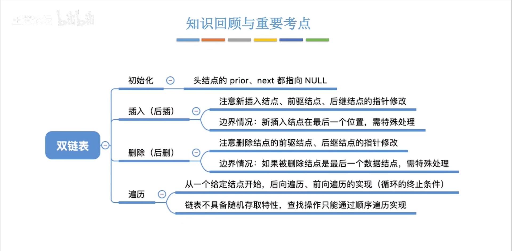
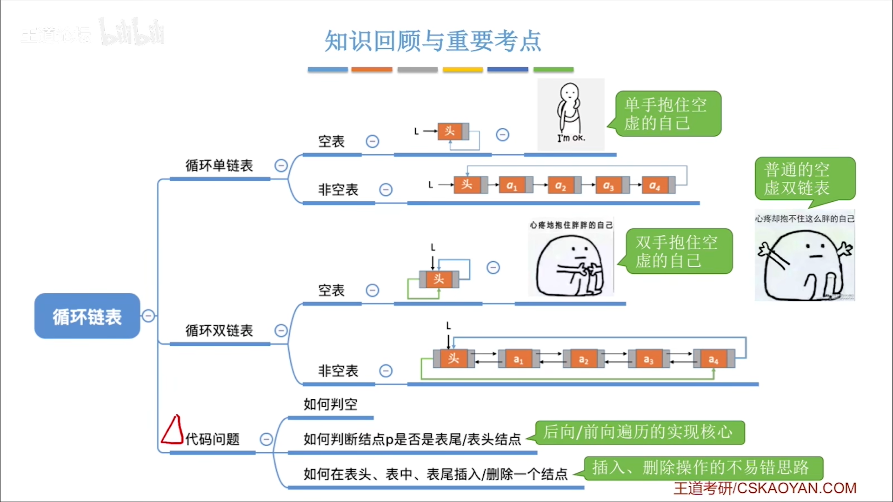
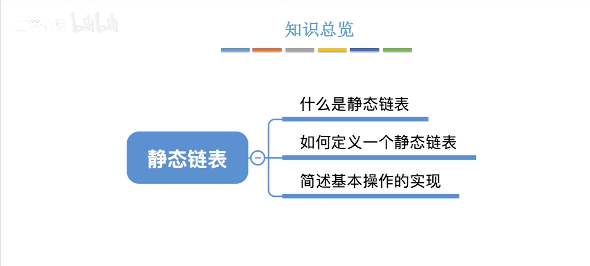
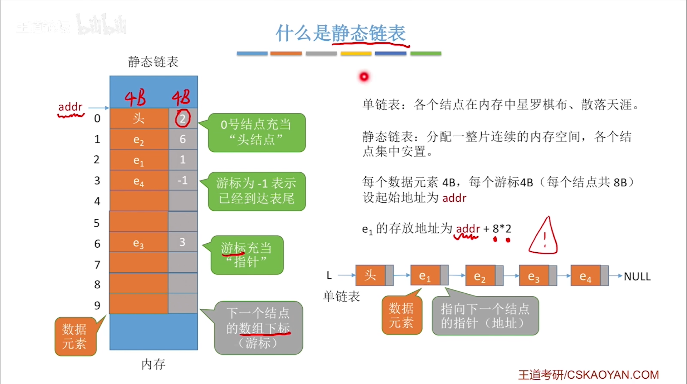
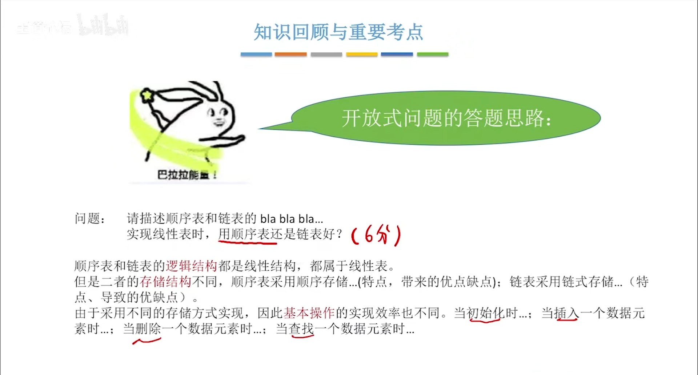

#
<!--more-->


# 2 线性表


|单链表|双链表
|:---:|:---:|
|无法逆向检索，不太方便|可进可退，存储密度更低


### 2.4.1 基本操作



- 插入
- 删除
- 遍历
```c
#include<stdio.h>
#include<stdlib.h>
typedef struct DNode{
    int data;
    struct DNode *prior,*next;
} DNode, *DLinklist;

//创建一个结点
DNode* CreateNode(int data){
    DNode *p;
    p=(DNode*)malloc(sizeof(DNode));
    p->data=data;
    p->prior=NULL;
    p->next=NULL;
    return p;
}

//输出链表
void printlist(DLinklist L){
    DNode* p=L;
    for(;p!=NULL;p=p->next)
        printf("%d ",p->data);
}

int main(){
    DLinklist L=NULL;
    //创建一个结点
    DNode *p=CreateNode(1);
    //插入
    InsertNextNode(p,CreateNode(2));
    InsertNextNode(p->next,CreateNode(3));
    InsertNextNode(p->next->next,CreateNode(4));
    InsertNextNode(p->next->next->next,CreateNode(5));

    //输出链表
    printlist(p);
    return 0;
}

//后插
int InsertNextNode(DNode *p, DNode *s){
    if(p==NULL||s==NULL)
        return 0;
    s->next=p->next;
    if(p->next!=NULL)
        p->next->prior=s;
    s->prior=p;
    p->next=s;
    return 1;
}

//删除
int DeleteNode(DNode *p){
    if(p==NULL)
        return 0;
    p->prior->next=p->next;
    p->next->prior=p->prior;
    free(p);
    return 1;
}

```

## 2.5 循环链表



## 2.6 静态链表






### 2.6.1 代码实现
- 插入
- 删除

## 2.7 顺序表vs链表

||顺序表|链表
|:---:|:---:|:---:|
|逻辑结构|线性结构|线性结构
|存储结构|顺序存储|链式存储
|优点|随机存取，存储密度高|插入和删除


