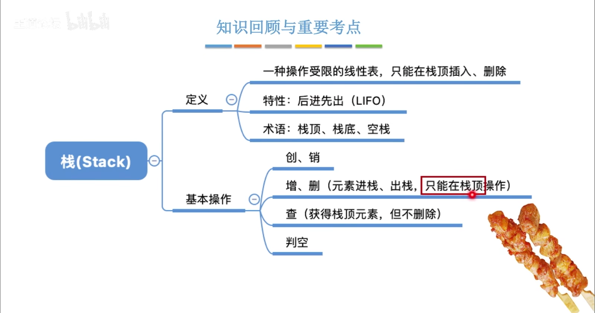
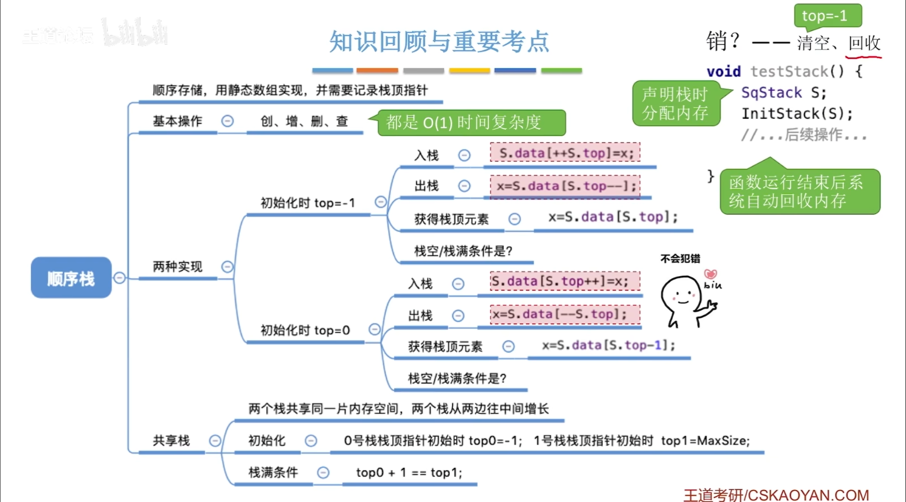
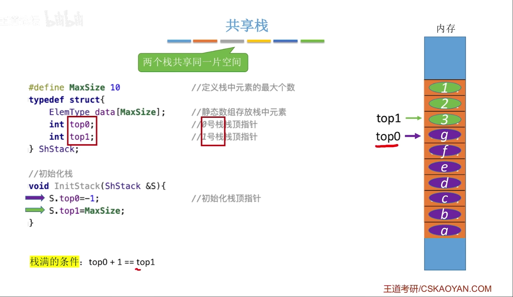
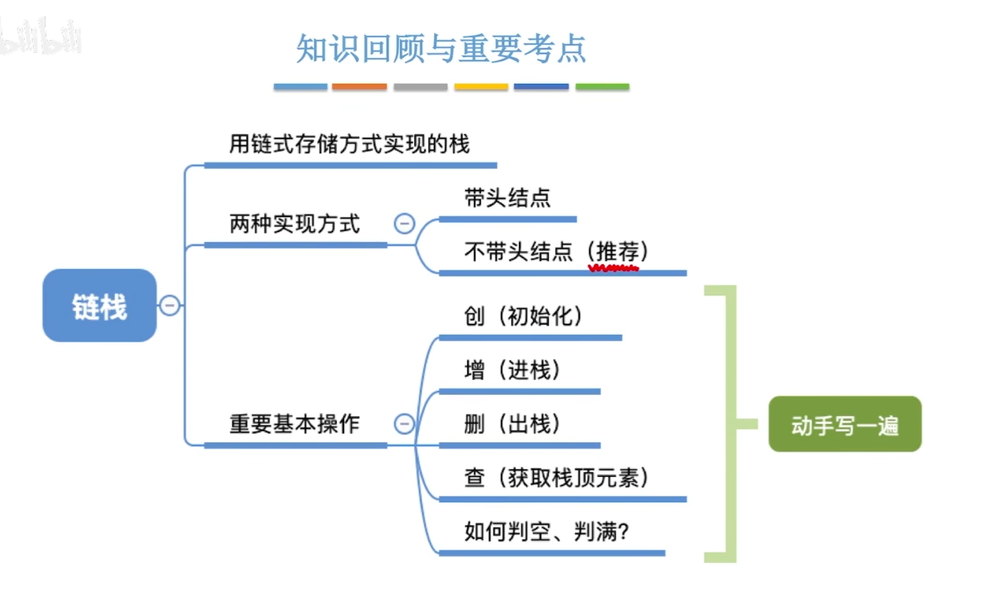

#
<!--more-->




## 3.1 定义
- 栈是限定仅在表尾进行插入和删除操作的线性表

## 3.2 基本操作
|操作|描述|
|:---:|:---:|
|InitStack(&S)|初始化栈S，构造一个空栈|
|DestroyStack(&S)|若栈存在，则销毁它|
|Push(&S,x)|若栈S存在，插入新元素x到栈S中并成为栈顶元素|
|Pop(&S,&x)|删除栈S中栈顶元素，并用x返回其值|
|GetTop(S,&x)|返回栈S中栈顶元素，不修改栈顶指针|
|StackEmpty(S)|若栈为空，返回true，否则返回false|

- （常考：给你一个出栈序列，问你能不能通过入栈操作得到这个出栈序列）共有卡特兰数种出栈序列：$C_n=\frac{1}{n+1}\binom{2n}{n}$

## 3.3 顺序栈



- 顺序栈的实现
```c
#include<stdio.h>
#include<stdlib.h>
#define MAXSIZE 10
typedef struct{
    int data[MAXSIZE];
    int top;
} SqStack;

//初始化
void InitStack(SqStack *S){
    S->top=-1;
}

//判空
int StackEmpty(SqStack S){
    if(S.top==-1)
        return 1;
    else
        return 0;
}

//入栈
int Push(SqStack *S, int x){
    if(S->top==MAXSIZE-1)
        return 0;
    S->top++;
    S->data[S->top]=x;
    return 1;
}

//出栈
int Pop(SqStack *S, int *x){
    if(S->top==-1)
        return 0;
    *x=S->data[S->top];
    S->top--;
    return 1;
}

//取栈顶元素
int GetTop(SqStack S, int *x){
    if(S.top==-1)
        return 0;
    *x=S.data[S.top];
    return 1;
}
```

- 共享栈



## 3.4 链栈


- 链栈的实现
```c

```