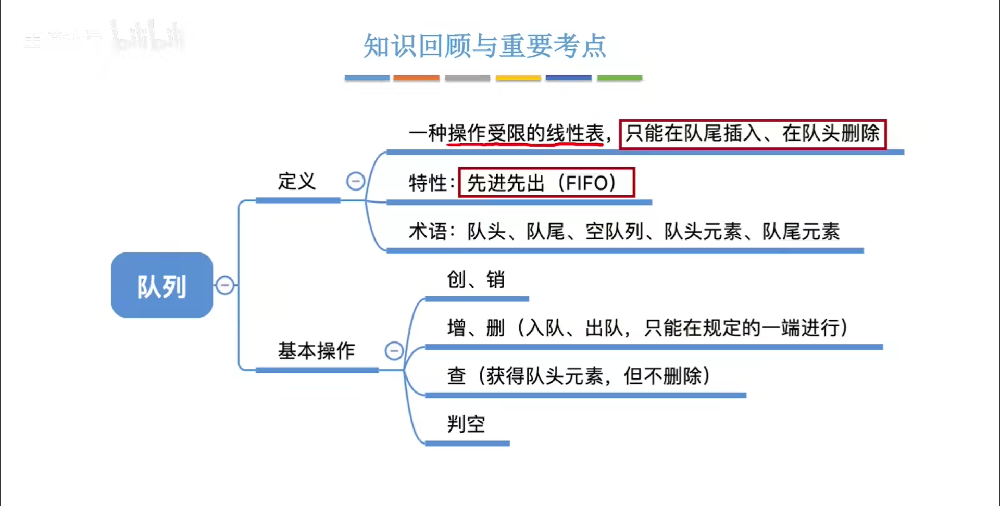
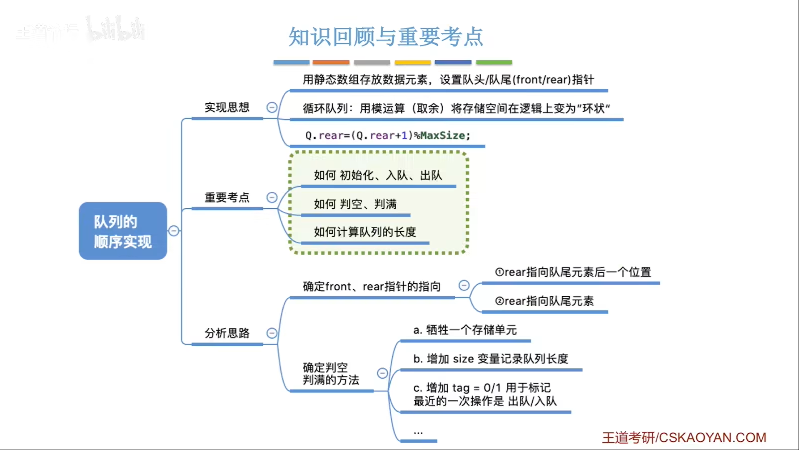
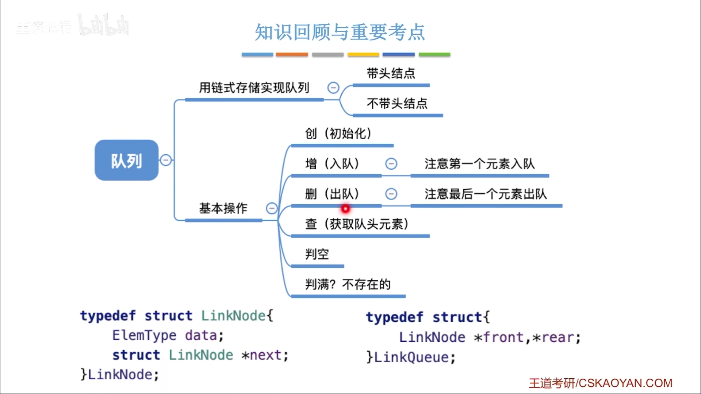
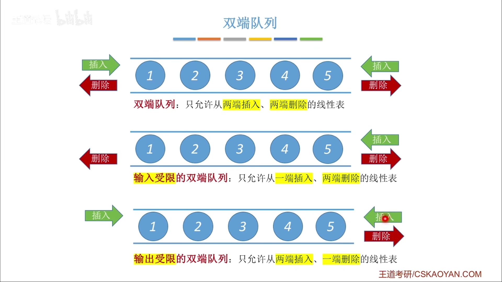
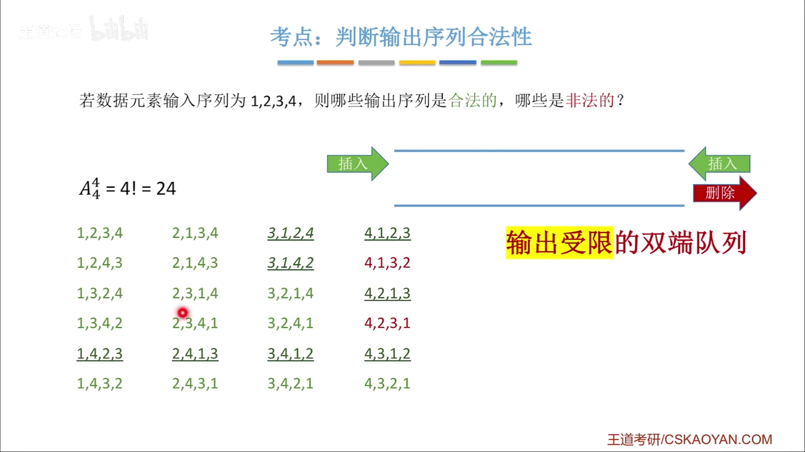

#
<!--more-->




## 3.2.1 定义
- 队列是只允许在一端进行插入操作，而在另一端进行删除操作的线性表

## 3.2.2 基本操作
|操作|描述|
|:---:|:---:|
|InitQueue(&Q)|初始化队列Q，构造一个空队列|
|DestroyQueue(&Q)|若队列Q存在，则销毁它|
|EnQueue(&Q,x)|若队列Q存在，插入新元素x到队列Q中并成为队尾元素|
|DeQueue(&Q,&x)|删除队列Q中队头元素，并用x返回其值|
|GetHead(Q,&x)|返回队列Q中队头元素，不修改队头指针|
|QueueEmpty(Q)|若队列为空，返回true，否则返回false|

## 3.2.3 顺序队列



- 顺序队列的实现
```c
#include<stdio.h>
#include<stdlib.h>
#define MAXSIZE 10
typedef struct{
    int data[MAXSIZE];
    int front,rear;
} SqQueue;

//初始化
void InitQueue(SqQueue *Q){
    int i;
    for(i=0;i<MAXSIZE;i++)
        Q->data[i]=0;
}

//判空
int QueueEmpty(SqQueue Q){
    if(Q.front==Q.rear)
        return 1;
    else
        return 0;
}

//入队
int EnQueue(SqQueue *Q, int x){
    if((Q->rear+1)%MAXSIZE==Q->front)
        return 0;
    Q->data[Q->rear]=x;
    Q->rear=(Q->rear+1)%MAXSIZE;
    return 1;
}

//出队
int DeQueue(SqQueue *Q, int *x){
    if(Q->front==Q->rear)
        return 0;
    *x=Q->data[Q->front];
    Q->front=(Q->front+1)%MAXSIZE;
    return 1;
}

```
-  循环队列
    - 入队：
    
            Q.data[Q.rear]=x
            Q.rear=(Q.rear+1)%MaxSize

    - 出队：

            x=Q.data[Q.front]
            Q.front=(Q.front+1)%MaxSize 


    - 元素个数：
            (rear+MaxSize-front)%MaxSize

||队满|队空|
|:---:|:---:|:---:|
|1|(Q.rear+1)%MaxSize==Q.front|Q.rear==Q.front
|2|size==MaxSize|size=0
(删除成功时flag=0,插入成功时flag=1)|front==rear && flag==1|front==rear && flag==0

## 3.2.4 链式队列



```c
#include<stdio.h>
#include<stdlib.h>
typedef struct LinkNode
{
    int data;
    struct LinkNode *next;
}LinkNode;

typedef struct
{
    LinkNode *front,*rear;
}LinkQueue;

//初始化
void InitQueue(LinkQueue *Q){
    Q->front=Q->rear=(LinkNode*)malloc(sizeof(LinkNode));
    Q->front->next=NULL;
}

//判空
int QueueEmpty(LinkQueue Q){
    if(Q.front==Q.rear)
        return 1;
    else
        return 0;
}

//入队
int EnQueue(LinkQueue *Q, int x){
    LinkNode *s=(LinkNode*)malloc(sizeof(LinkNode));
    s->data=x;
    s->next=NULL;
    Q->rear->next=s;
    Q->rear=s;
    return 1;
}

//出队
int DeQueue(LinkQueue *Q, int *x){
    if(Q->front==Q->rear)
        return 0;
    LinkNode *p=Q->front->next;
    *x=p->data;
    Q->front->next=p->next;
    if(Q->rear==p)
        Q->rear=Q->front;
    free(p);
    return 1;
}
```

- 双端队列




