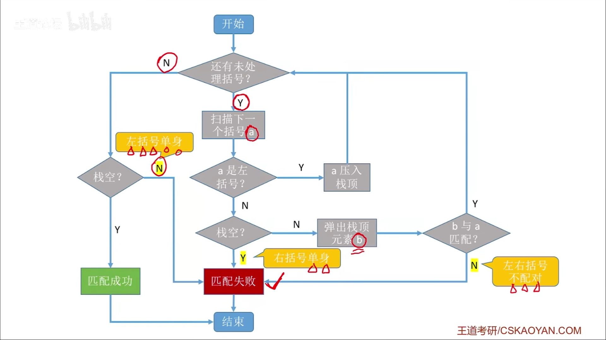
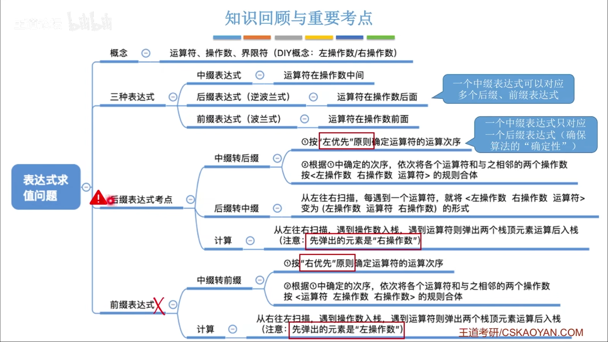
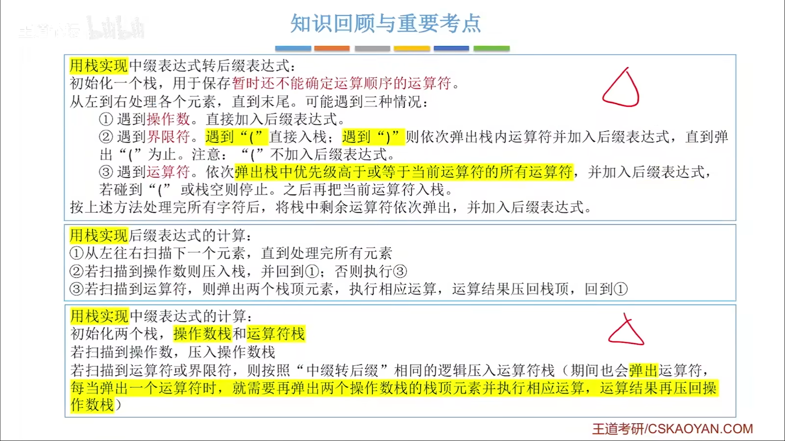
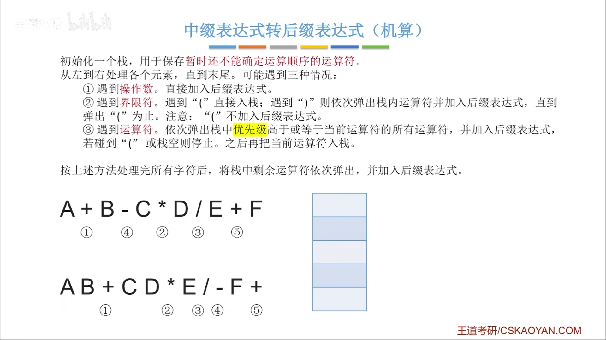
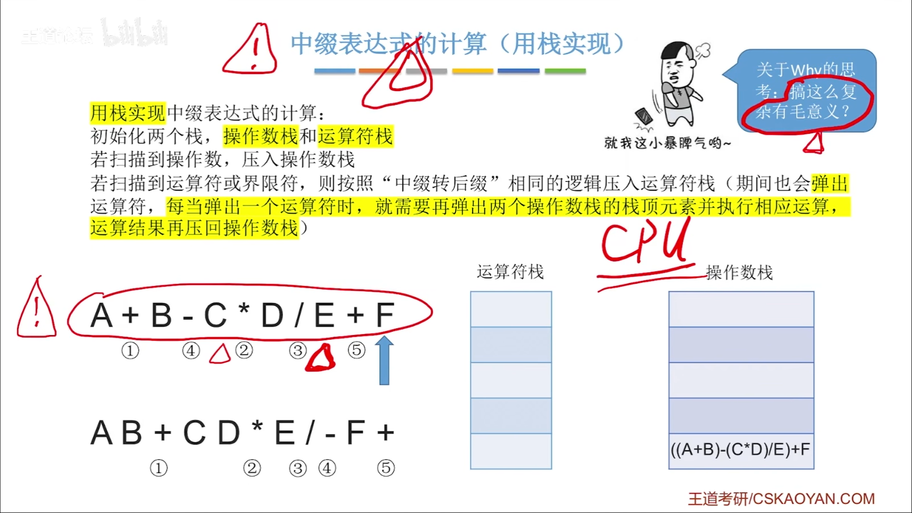
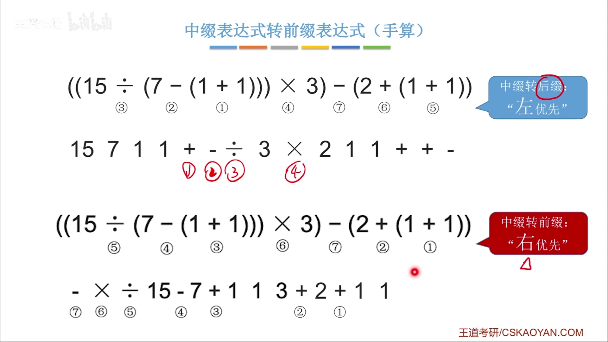

#
<!--more-->

## 3.3.1 括号匹配问题



```c
#include<stdio.h>
#define MAXSIZE 10
typedef struct{
    char data[MAXSIZE];
    int top;
} SqStack;

//初始化
void InitStack(SqStack *S){
    S->top=-1;
}

//判空
int StackEmpty(SqStack S){
    if(S.top==-1)
        return 1;
    else
        return 0;
}

//入栈
int Push(SqStack *S, char x){
    if(S->top==MAXSIZE-1)
        return 0;
    S->top++;
    S->data[S->top]=x;
    return 1;
}

//出栈
int Pop(SqStack *S, char *x){
    if(S->top==-1)
        return 0;
    *x=S->data[S->top];
    S->top--;
    return 1;
}

//取栈顶元素
int GetTop(SqStack S, char *x){
    if(S.top==-1)
        return 0;
    *x=S.data[S.top];
    return 1;
}

int main(){
    //1. 括号匹配
    char str1[100] = "((())){[]}"; //合法
    char str2[100] = "((()){[]})"; //合法
    char str3[100] = "((()){[]}"; //不合法
    printf("%d",match(str1));
    printf("%d",match(str2));
    printf("%d",match(str3));
}

int match(char str[]){
    SqStack stack;
    InitStack(&stack);
    int i=0;
    char x;
    for(;str[i]!='\0';i++){
        switch (str[i])
        {
        case '(':
        case '[':
        case '{':
            Push(&stack, str[i]);
            break;
        case ')':
            if(!Pop(&stack, &x) || x!='(')
                return 0;
            break;
        case ']':
            if(!Pop(&stack, &x) || x!='[')
                return 0;
            break;
        case '}':
            if(!Pop(&stack, &x) || x!='{')
                return 0;
            break;
        default:
            break;
        }
    }
    if(!StackEmpty(stack))
        return 0;
    return 1;
}
```

## 3.3.2 表达式求值




- 中缀->后缀
    - 手算

            1）确定各个运算符的运算顺序
            2）选择下一个运算符(左右符)
            3）还有符号则返回2）

    - 代码
        
        

- 中缀表达式的计算



- 用栈实现后缀表达式的计算

        1）从左往右扫描下一个元素，直到处理完所有元素
        2）若扫描到操作数则入栈，返回1）
        3）若扫描到运算符，弹出两个栈顶，执行运算后入栈(先出栈的是右操作数)

- 中缀->前缀

        1）确定各个运算符的运算顺序
        2）选择下一个运算符(符左右)
        3）还有符号则返回2）

