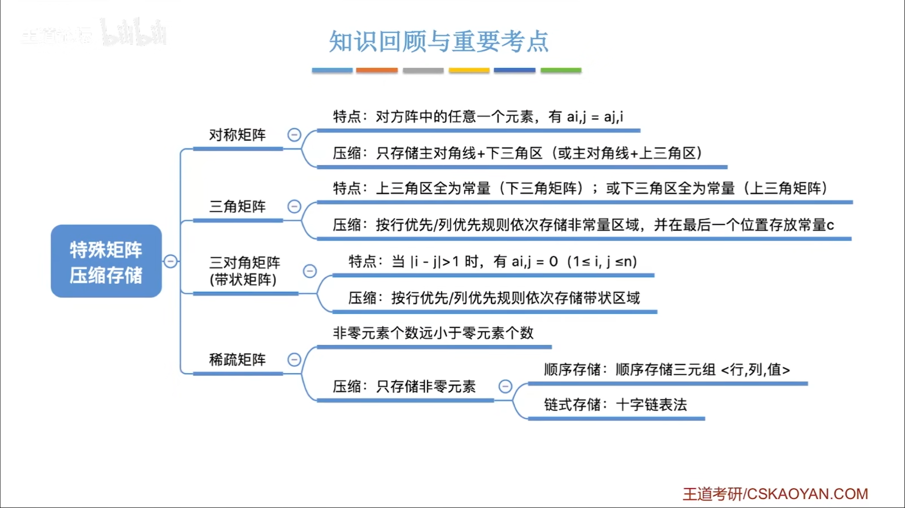
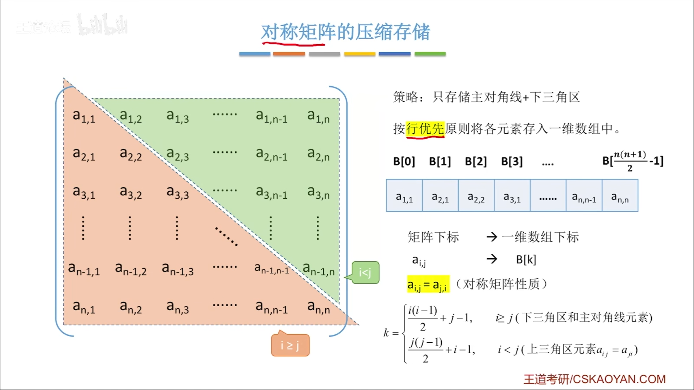
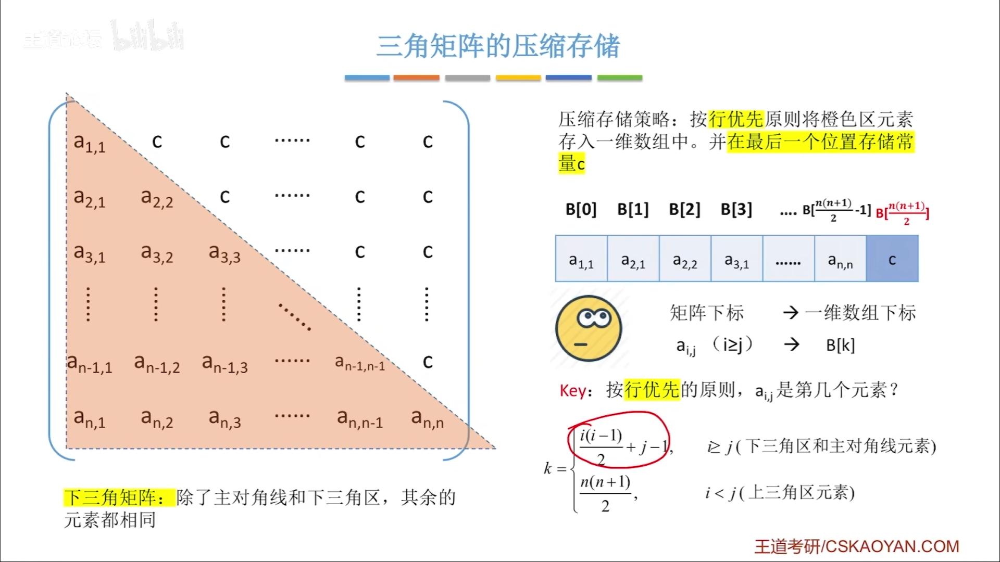
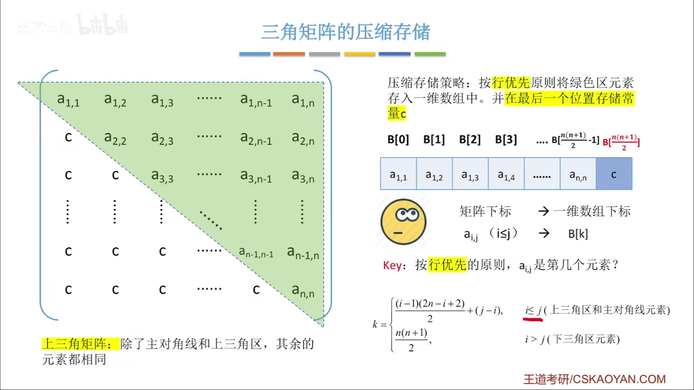
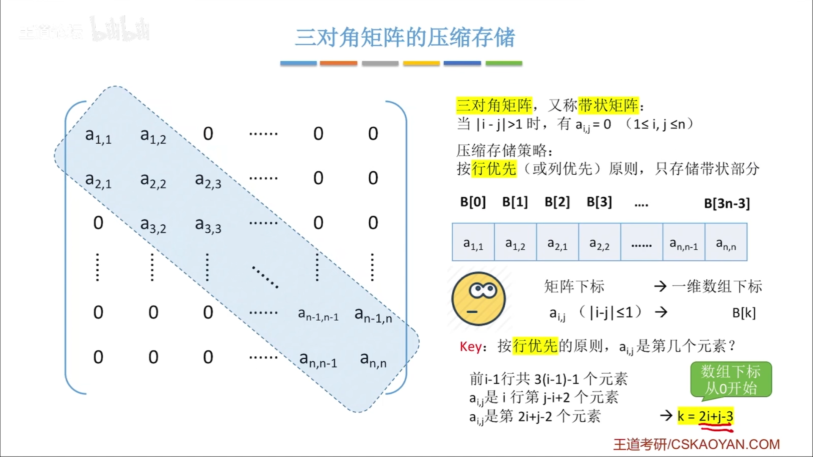
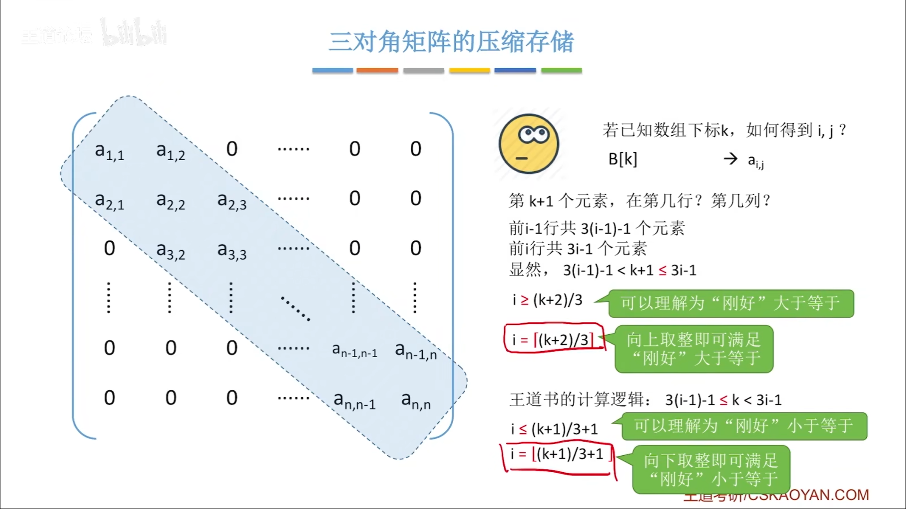
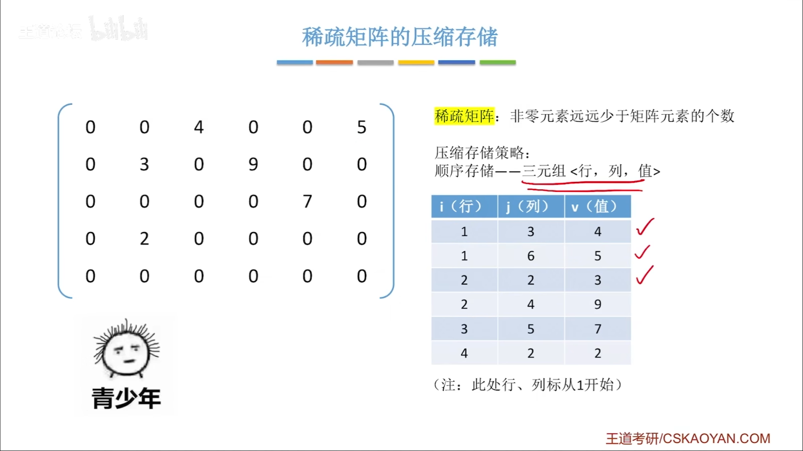
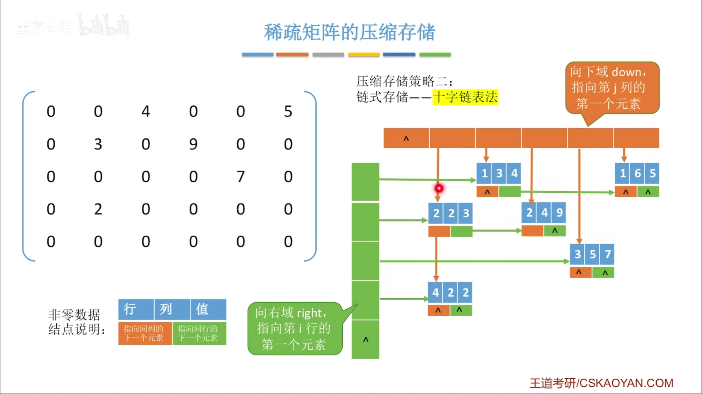
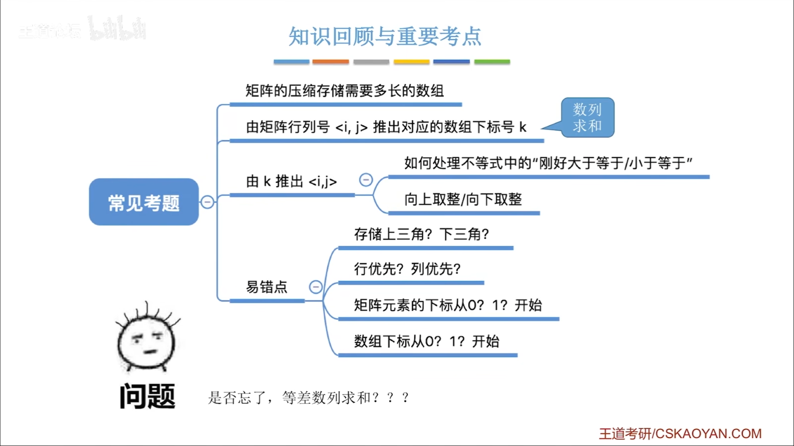

#
<!--more-->

## 3.4.1 对称矩阵

- 存主对角线+下三角

    $$a_{k}=a_{ij}=a_{ji} (i>=j)$$

    - 列优先

        $$k=\frac{i(i-1)}{2}+j-1$$
    - 行优先

        $$k=\frac{j(j-1)}{2}+i-1$$

## 3.4.2 三角矩阵

- 存主对角线+下三角/上三角+c

    $$a_{k}=a_{ij} (i>=j)$$

- 下三角，行优先

    $$k=\left\{\begin{array}{l}{\frac{i(i-1)}{2}+j-1} & {i \geq j} \\\\ {\frac{n(n-1)}{2}} & {i<j}\end{array}\right.$$

- 上三角，行优先
    
    $$k=\left\{\begin{array}{l}{\frac{(i-1)(2n-i+2)}{2}+j-i} & {i \leq j} \\\\ {\frac{n(n-1)}{2}} & {i>j}\end{array}\right.$$

## 3.4.3 三对角矩阵

- $$k=2i+j-3$$

## 3.4.4 稀疏矩阵
- 顺序存储

- 链式存储

