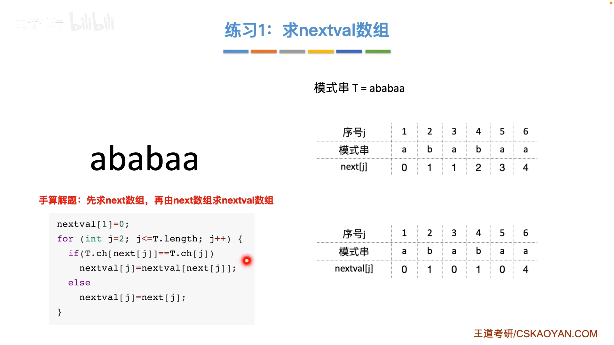

#
<!--more-->

### 

## 4.1 定义


- 一种特殊的线性表

## 4.2 串的存储结构


- 顺序存储


```c
#define MAXLEN 255
typedef struct{
    char ch[MAXLEN]; //静态数组
    int length;
} SString;

typedef struct{
    char *ch; //动态数组
    int length;
} HString;
```

- 链式存储


```c
//2. 链式存储
typedef struct StringNode{
    char ch; //1：1
    struct StringNode *next;
} StringNode, *String;

typedef struct StringNode{
    char ch[4]; //1：4
    struct StringNode *next;
} StringNode, *String;
```


## 4.3 基本操作

|函数名|功能|时间复杂度|
|:---|:---|:---|
|StrAssign(SString &T, char *chars)|生成一个其值等于chars的串T|O(n)|
|StrCopy(SString &T, SString S)|由串S复制得串T|O(n)|
|StrEmpty(SString S)|若S为空串，则返回true，否则返回false|O(1)|
|StrLength(SString S)|返回串S的元素个数，即串的长度|O(1)|
|ClearString(SString &S)|将串S清为空串|O(1)|
|DestroyString(SString &S)|串S存在，则销毁它|O(1)|
|Concat(SString &T, SString S1, SString S2)|用T返回由S1和S2联接而成的新串|O(n)|

```c
//求子串
int SubString(SString *Sub, SString S, int pos, int len){
    //1. 参数合法性判断
    if(pos<1 || pos>S.length || len<0 || len>S.length-pos+1)
        return 0;
    //2. 子串赋值
    for(int i=pos; i<pos+len; i++)
        Sub->ch[i-pos+1]=S.ch[i];
    Sub->length=len;
    return 1;
}

//比较
int StrCompare(SString S, SString T){
    for(int i=1; i<=S.length && i<=T.length; i++){
        if(S.ch[i]!=T.ch[i])
            return S.ch[i]-T.ch[i];
    }
    return S.length-T.length;
}

//定位
int Index(SString S, SString T){
    int i=1, n=S.length, m=T.length;
    SString sub;
    while(i<=n-m+1){
        SubString(&sub, S, i, m);
        if(StrCompare(sub, T)!=0)
            ++i;
        else
            return i;
    }
    return 0;
}
```

## 4.4 模式匹配


### 4.4.1 朴素模式匹配算法

```c
//朴素模式匹配算法
int Index(SString S, SString T){
    int i=1, n=S.length, m=T.length;
    while(i<=n-m+1){
        int j=1;
        while(j<=m){
            if(S.ch[i+j-1]==T.ch[j])
                ++j;
            else
                break;
        }
        if(j>m)
            return i;
        else
            ++i;
    }
    return 0;
}
//定位算法中，子串的长度是固定的，而模式匹配算法中，子串的长度是可变的
```
### 4.4.2 KMP模式匹配算法


- 1）根据模式求next数组


- 算法优化



next[3]=1 , next[3]与next[1]相等，所以转到next[1]后也会失配，所以next[3]可以改为next[1]=0

```c
//KMP算法
//求next
void get_next(SString T, int next[]){
    //1. 初始化
    int i=1, j=0;
    next[1]=0;
    while(i<T.length){
        if(j==0 || T.ch[i]==T.ch[j]){
            ++i;
            ++j;
            next[i]=j;
        }
        else
            j=next[j];
    }
}

//求nextval
void get_nextval(SString T, int nextval[]){
    //1. 初始化
    int i=1, j=0;
    nextval[1]=0;
    while(i<T.length){
        if(j==0 || T.ch[i]==T.ch[j]){
            ++i;
            ++j;
            if(T.ch[i]!=T.ch[j])
                nextval[i]=j;
            else
                nextval[i]=nextval[j];
        }
        else
            j=nextval[j];
    }
}


int Index_KMP(SString S, SString T, int next[]){
    int i=1, j=1;
    while(i<=S.length && j<=T.length){
        if(j==0 || S.ch[i]==T.ch[j]){
            ++i;
            ++j;
        }
        else
            j=next[j];//i不回溯
    }
    if(j>T.length)
        return i-T.length;
    else
        return 0;
}
```