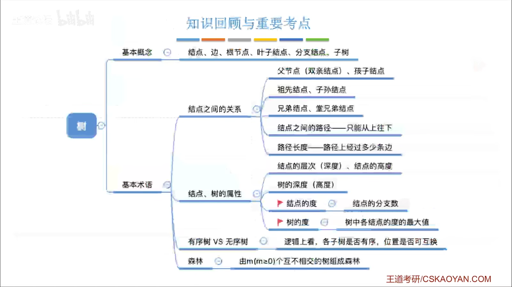
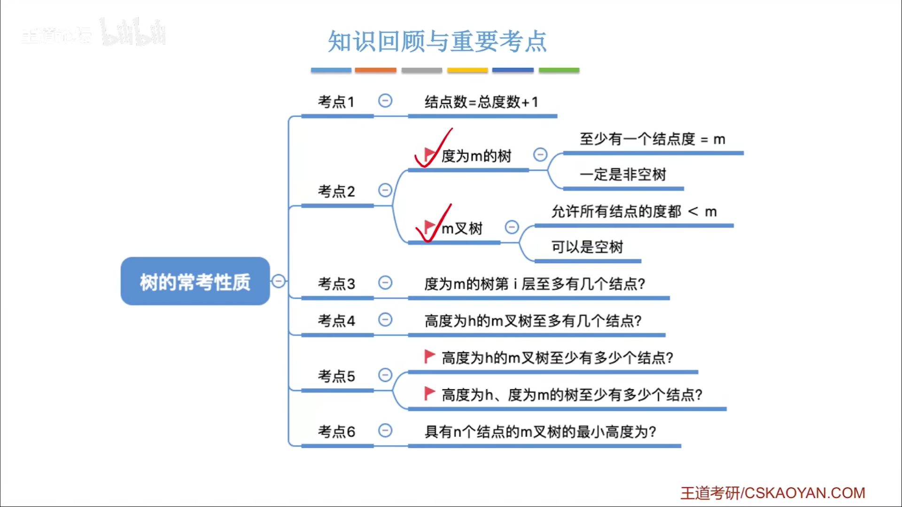

#
<!--more-->

<!--more-->

## 5.1.1 一些性质

- 根在第0层
- 节点数=总度数+1
- 结点的度：结点拥有的子树的个数
- m叉树中可以没有m个子树，但是不能超过m个子树
- 度为m的树，第i层最多有$$m^{i-1}$$个结点
- 高度为h的m叉树，最多有$$\frac{m^h-1}{m-1}$$个结点
- 高度为h的m叉树，最少有h个结点
- 高度为h，度为m的树，最多有$$\frac{m^{h+1}-1}{m-1}$$个结点，最少有h+m-1个结点
- n个结点的m叉树的最小高度为：$$\lceil log_m(n(m-1)+1)\rceil$$

