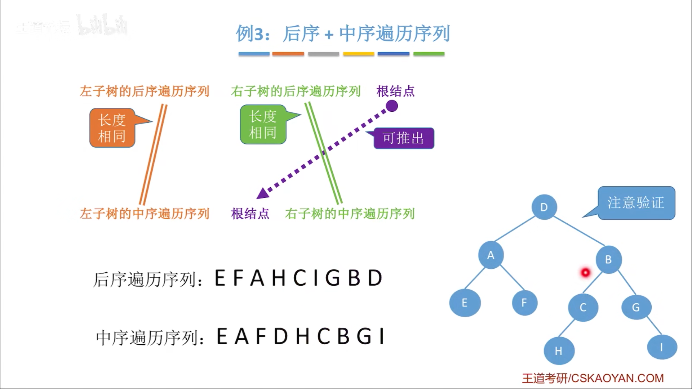

#
<!--more-->


<!--more-->
- 二叉树是有序树，有左右之分
- 二叉树有五种基本形态：空二叉树、只有根结点、只有左子树、只有右子树、左右子树都有

### 5.2.1 特殊二叉树
|名称|说明|特点|
|:---:|:---:|:---:|
|满二叉树|所有分支结点都存在左子树和右子树，并且所有叶子都在同一层上||
|完全二叉树|叶子结点只能出现在最下层和次下层，并且最下面一层的结点都集中在该层最左边的若干位置的二叉树||
|二叉排序树|空树 / 左子树上所有结点的值均小于它的根结点的值；右子树上所有结点的值均大于它的根结点的值；左右子树也分别为二叉排序树||
|平衡二叉树|空树 / 左子树和右子树的深度之差的绝对值不超过1，且它的左子树和右子树都是一棵平衡二叉树||

### 5.2.2 一些性质
- 叶子结点比度为2的结点多1个
- 第i层最多有2<sup>i-1</sup>个结点
- 高度为h的二叉树至多有2<sup>h</sup>-1个结点
- 有n个结点的完全二叉树高度为$$\lceil log_2(n+1)\rceil 或 \lfloor log_2n\rfloor+1$$
- 若完全二叉树有2k个结点，n<sub>0</sub>=k,n<sub>1</sub>=1,n<sub>2</sub>=k-1

- 若完全二叉树有2k-1个结点，n<sub>0</sub>=k,n<sub>1</sub>=0,n<sub>2</sub>=k-1

### 5.2.3 存储结构
- 顺序存储
```c
#define MaxSize 100
typedef struct{
    int value;
    int isEmpty;
}TreeNode;

TreeNode t[MaxSize];
```


- 链式存储
  
```c
typedef struct BiTnode{
    int data;
    struct BiTnode *lchild, *rchild;
}BiTNode,BiTree;
```
- n个结点的二叉链表共有n+1个空链域

### 5.2.4 遍历


- 先序遍历
```c
//先序遍历
void PreOrder(BiTree T){
    if(T){
        visit(T);//操作
        PreOrder(T->lchild);
        PreOrder(T->rchild);
    }
}
```
- 中序遍历
```c
//中序遍历
void InOrder(BiTree T){
    if(T){
        InOrder(T->lchild);
        visit(T);//操作
        InOrder(T->rchild);
    }
}
```
- 后序遍历
```c
//后序遍历
void PostOrder(BiTree T){
    if(T){
        PostOrder(T->lchild);
        PostOrder(T->rchild);
        vist(T);//操作
    }
}
```

- 求树的深度
```c
//求树的深度
int treeDepth(BiTree T){
    if(!T)
        return 0;
    else{
        int l=treeDepth(T->lchild);
        int r=treeDepth(T->rchild);
        return (l>r)?(l+1):(r+1);
    }
}
```

- 层次遍历
```c
//层次遍历
void LevelOrder(BiTree T){
    BiTree p;
    BiTree q[MaxSize];
    int front=0, rear=0;
    if(T){
        rear=(rear+1)%MaxSize;
        q[rear]=T;
        while(front!=rear){
            front=(front+1)%MaxSize;
            p=q[front];
            visit(p);
            if(p->lchild){
                rear=(rear+1)%MaxSize;
                q[rear]=p->lchild;
            }
            if(p->rchild){
                rear=(rear+1)%MaxSize;
                q[rear]=p->rchild;
            }
        }
    }
}
```

### 5.2.5 练习
- 求遍历序列


- 根据序列求树





### 5.2.6 线索二叉树


- 存储结构
```c
//线索二叉树
typedef struct ThreadNode{
    int data;
    struct ThreadNode *lchild, *rchild;
    int ltag, rtag;//左右线索标志
}ThreadNode, *ThreadTree;
```
- 中序线索二叉树


- 先序线索二叉树


- 后序线索二叉树


- 线索化


```c
//土办法找到中序前驱
BiTNode *p=NULL, *pre=NULL,*final=NULL;
void findPre(BiTree T){
    if(T){
        findPre(T->lchild);
        visit(T);
        findPre(T->rchild);
    }
}
void visit(BiTNode* q){
    if(q==p)
        final=pre;
    else
        pre=q;
}
```

```c
//中序线索化
ThreadNode *pre=NULL;
void InThread(ThreadTree p){
    if(p){
        InThread(p->lchild);
        if(!p->lchild){
            p->lchild=pre;
            p->ltag=1;
        }
        if(!pre->rchild){
            pre->rchild=p;
            pre->rtag=1;
        }
        pre=p;
        InThread(p->rchild);
    }
}
//先序线索化
void PreThread(ThreadTree p){
    if(p){
        if(!p->lchild){
            p->lchild=pre;
            p->ltag=1;
        }
        if(!pre->rchild){
            pre->rchild=p;
            pre->rtag=1;
        }
        pre=p;
        if(p->ltag==0)
            PreThread(p->lchild);
        PreThread(p->rchild);
    }
}
//后序线索化
void PostThread(ThreadTree p){
    if(p){
        if(!p->lchild){
            p->lchild=pre;
            p->ltag=1;
        }
        if(!pre->rchild){
            pre->rchild=p;
            pre->rtag=1;
        }
        pre=p;
        PreThread(p->lchild);
        PreThread(p->rchild);
    }
}
void CreateInThread(ThreadTree T){
    pre=NULL;
    if(T){
        InThread(T);
        if(!pre->rchild){
            pre->rtag=1;
        }
    }
}
```

- 线索二叉树找前驱/后继


    - 中序，后继

        1）p->rtag==1，则next=p->rchild

        2）p->rtag==0，则
        ```c
        //中序线索二叉树找后继
        ThreadNode *Firstnode(ThreadNode *p){
            while(p->ltag==0)
                p=p->lchild;
            return p;
        }
        ThreadNode *Nextnode(ThreadNode *p){
            if(p->rtag==0)
                return Firstnode(p->rchild);
            else
                return p->rchild;
        }
        ```
    - 中序，前驱

        1）p->ltag==1，则pre=p->lchild

        2）p->ltag==0,pre=左子树的最右下

        ```c
        //中序线索二叉树找到前驱
        ThreadNode *Lastnode(ThreadNode *p){
            while(p->rtag==0)
                p=p->rchild;
            return p;
        }
        ThreadNode *Prenode(ThreadNode *p){
            if(p->ltag==0)
                return Lastnode(p->lchild);
            else
                return p->lchild;
        }
        //对中序线索二叉树逆向遍历
        void InOrder(ThreadNode *T){
            for(ThreadNode *p=Lastnode(T); p!=NULL; p=Prenode(p))
                visit(p);
        }
        ```
    - 先序，后继

        1）p->rtag==1，则next=p->rchild

        2）p->rtag==0，则next=左孩子（无则右孩子）

    - 先序，前驱


        1）p->ltag==1，则prep->lchild
    
        2）p->ltag==0
    
        - 若能找到p的父，p为左孩子，则pre=父
    
        - 若能找到p的父，p为右孩子，左兄弟空，则pre=父
    
        - 若能找到p的父，p为右孩子，左兄弟不空，则pre=左子树中最后一个被中序遍历的结点
    
    - 后序，前驱
    
        1）p->ltag==1，则pre=p->lchild
    
        2）p->ltag==0，则pre=右孩子（无则左孩子）
    
    - 后序，后继


        1）p->rtag==1，则next->rchild
    
        2）p->rtag==0
    
        - 若能找到p的父，p为右孩子，则next=父
    
        - 若能找到p的父，p为左孩子，右兄弟空，则next=父
    
        - 若能找到p的父，p为左孩子，右兄弟不空，则next=右子树中第一个被后序遍历的结点


