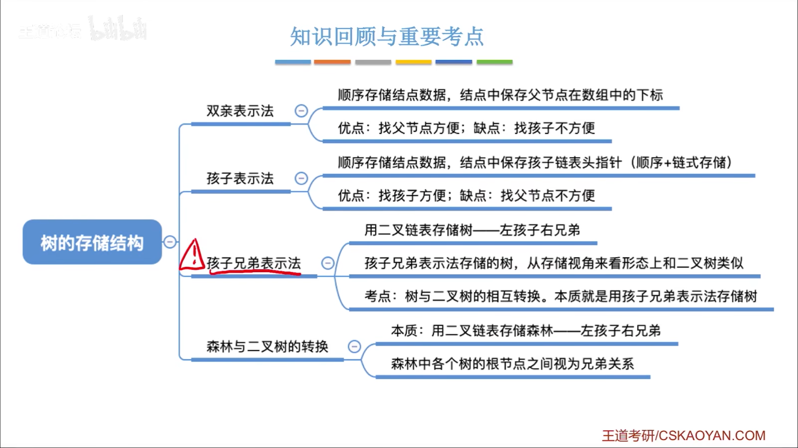
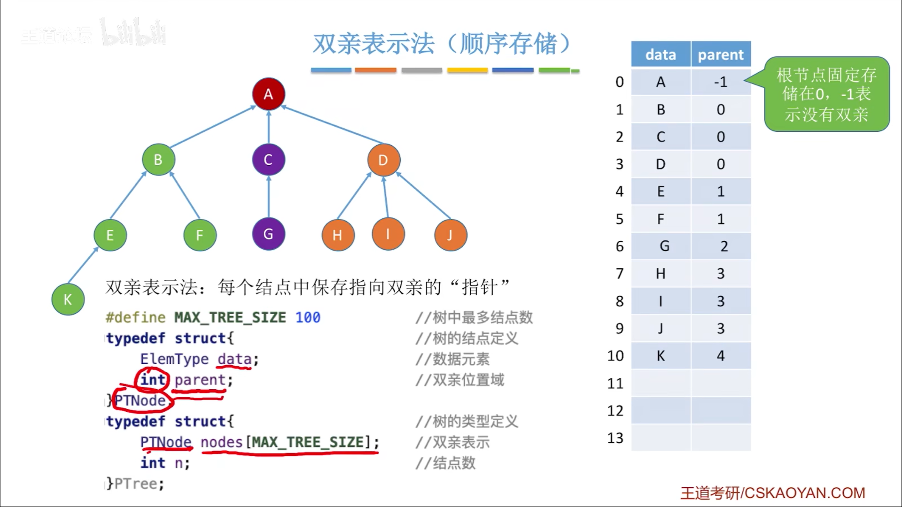
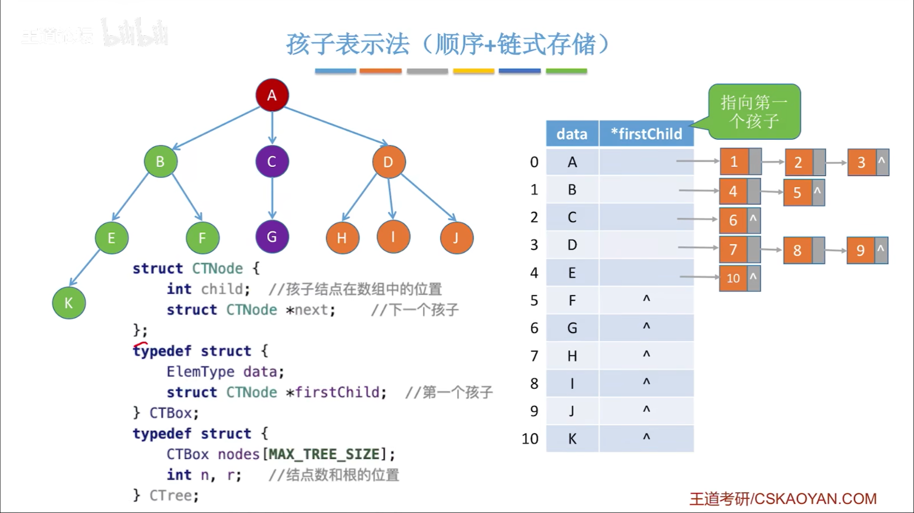
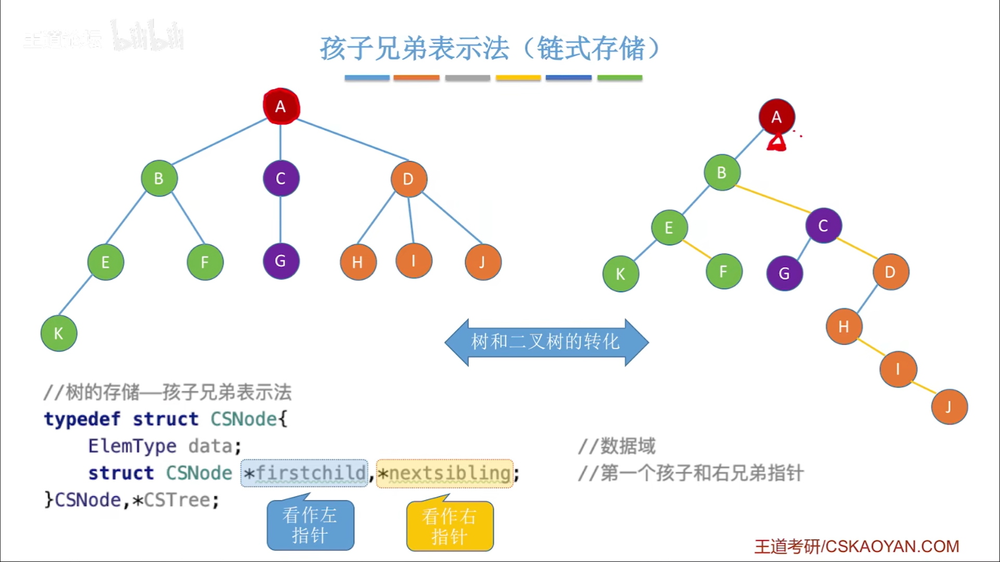
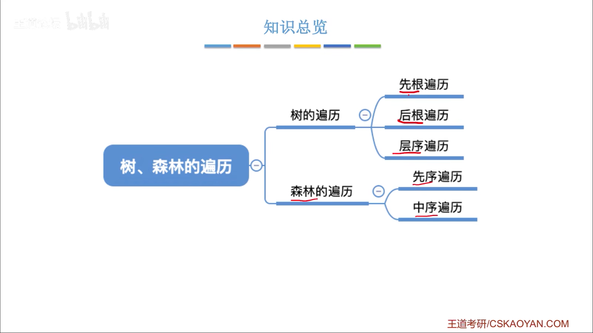
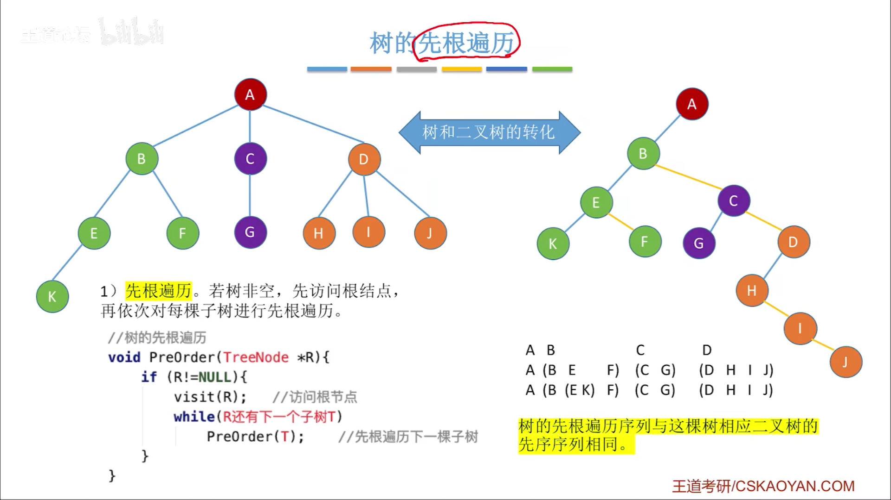
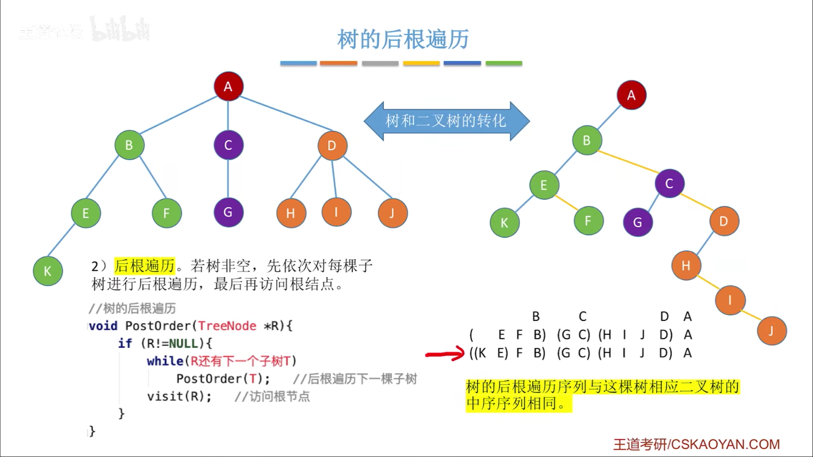
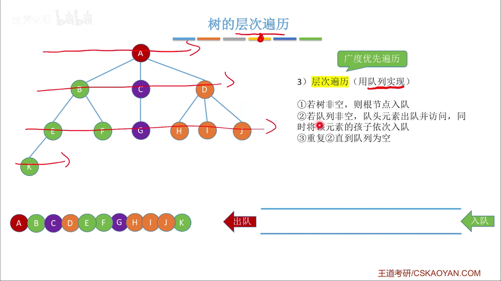

#
<!--more-->

<!--more-->

### 5.3.1 双亲表示法

- 查双亲方便
- 空数据导致遍历慢
- 查孩子只能从头遍历

### 5.3.2 孩子表示法

### 5.3.3 孩子兄弟表示法

## 5.3.4 树、森林的遍历

### 5.3.5 树的先根遍历

### 5.3.6 树的后根遍历

### 5.3.7 树的层次遍历

|树|森林|二叉树
|:---|:---|:---|
|先根遍历|先根遍历|先序遍历|
|后根遍历|中序遍历|中序遍历|