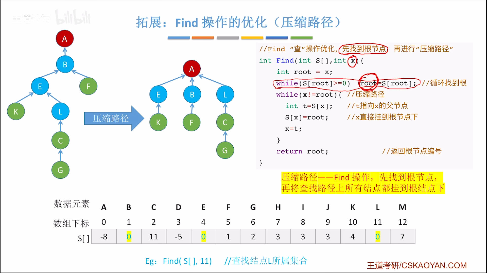

#
<!--more-->

### 5.5.1 存储结构

- 双亲表示法

### 5.5.2 操作

- 时间复杂度

|操作|最坏时间复杂度|
|:---|:---|
|Find(x)|O(n)|
|Union(x,y)|O(1)|
- 优化union操作
    
    

    - 树高不超过$$\lfloor log_2n \rfloor+1$$
    - find时间复杂度为$$O( log_2n)$$
- 优化find操作

    
    

    - 每次查找时，将路径上的结点都放到根下面

​        