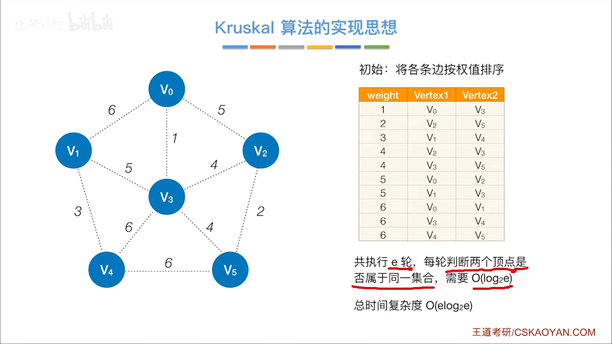

#
<!--more-->

### 6.2-1 定义
- T是连通网的生成树，T中所有边的代价之和称为生成树的代价，代价最小的生成树称为最小生成树
- 最小生成树不唯一
- 生成树的边数=顶点数-1
- 只有连通网才有最小生成树

### 6.2-2 Prim算法
- 从某个顶点出发，选择代价最小的边，然后再选择与之相连的代价最小的边，直到所有顶点都被选中（看顶点）

    - 过程

### 6.2-3 Kruskal算法
- 从代价最小的边开始，依次选择代价更小的边，直到所有顶点都被选中（看边）

    - 过程
    

