#
<!--more-->

### 

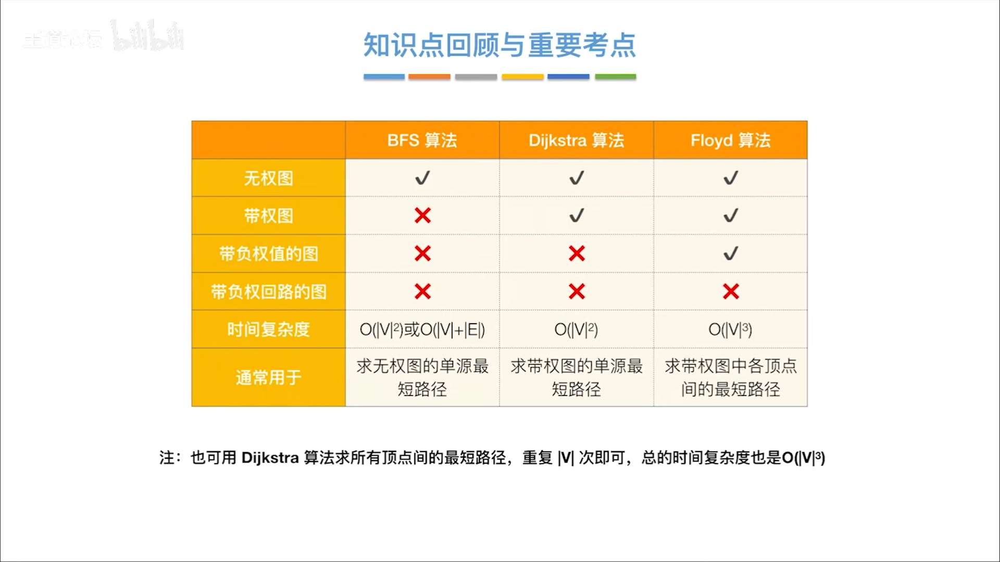

<!--more-->
### 6.3-1 单源最短路径
- ##### 1） BFS算法(无权)
    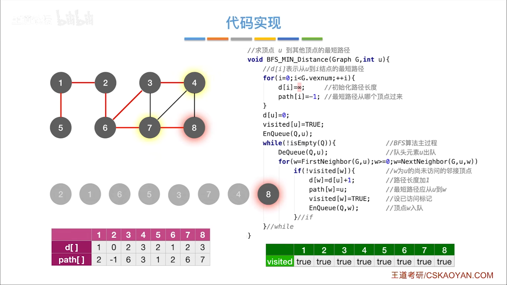
    
    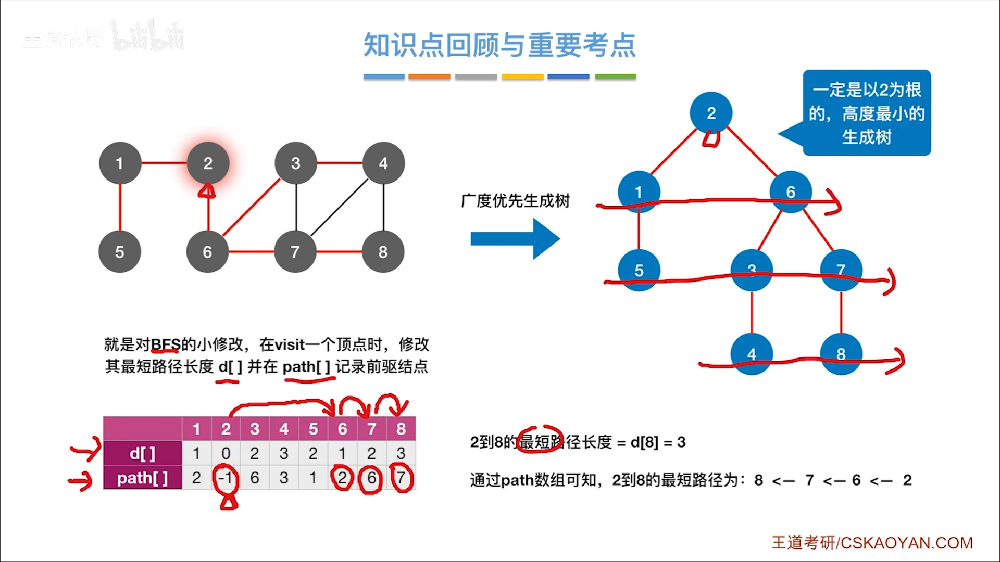
    

- ##### 2）Dijkstra(带权)
    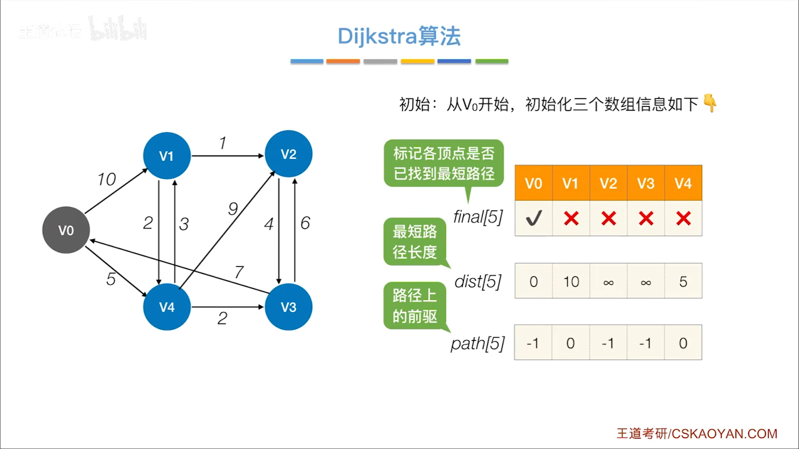
    
    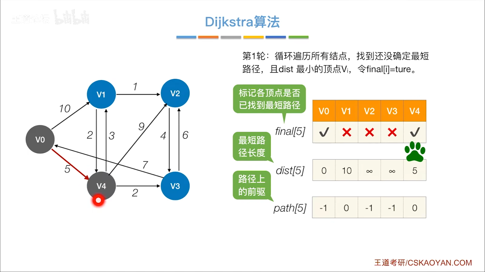
    
    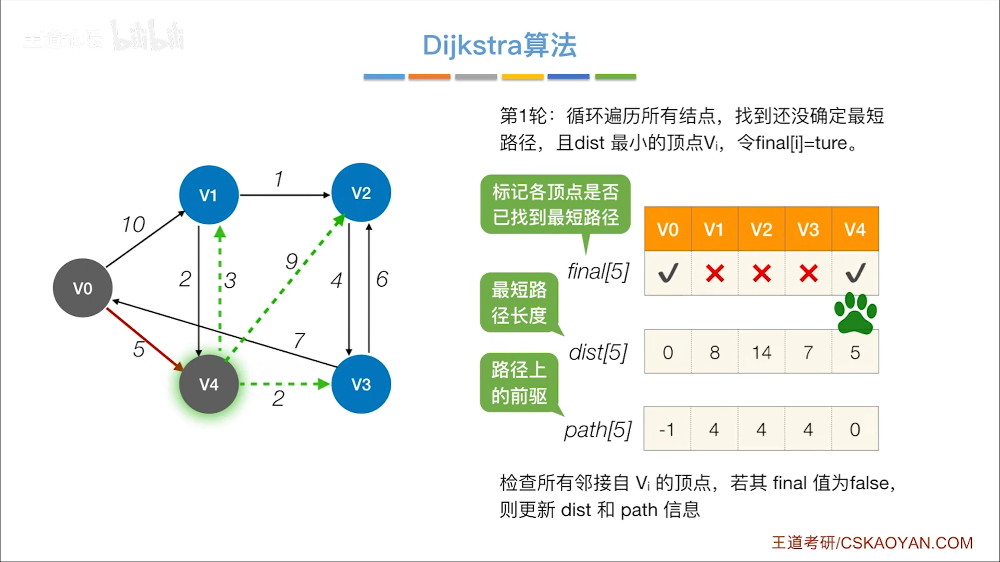
    
    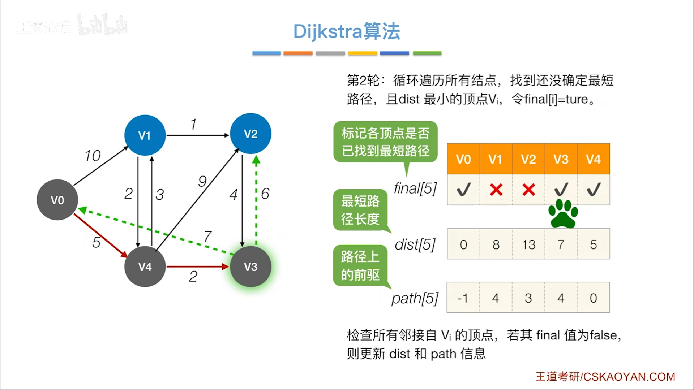
    
    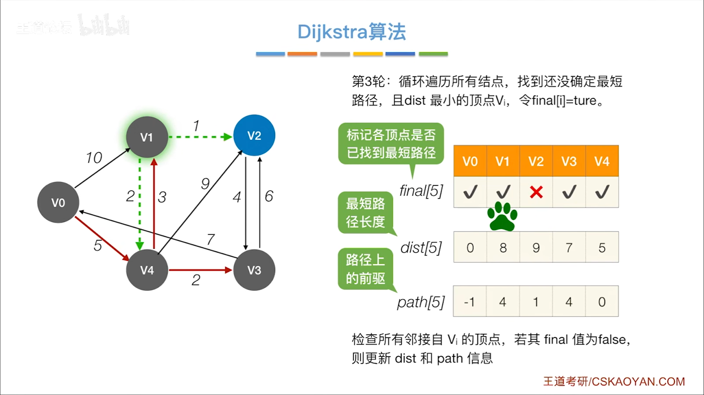
    
    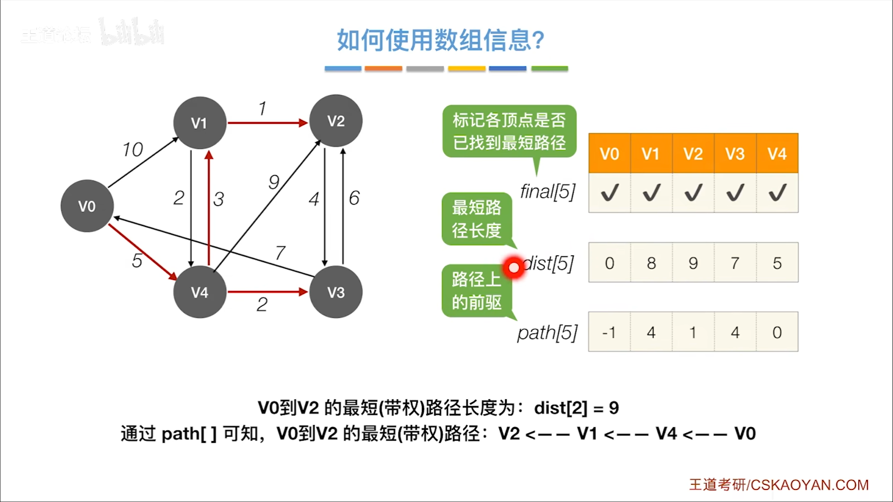
    
    - 时间复杂度：O(|V|2)
    - 不可用于有负权边的图

### 6.3-2 各顶点间最短路径
- ##### 1）Floyd算法
    - 动态规划思想：

        - 1）允许在v0中转，求最短路径
        - 2）允许在v0、v1中转，求最短路径
        - 3）允许在v0、v1、v2中转，求最短路径
        - ...
    

    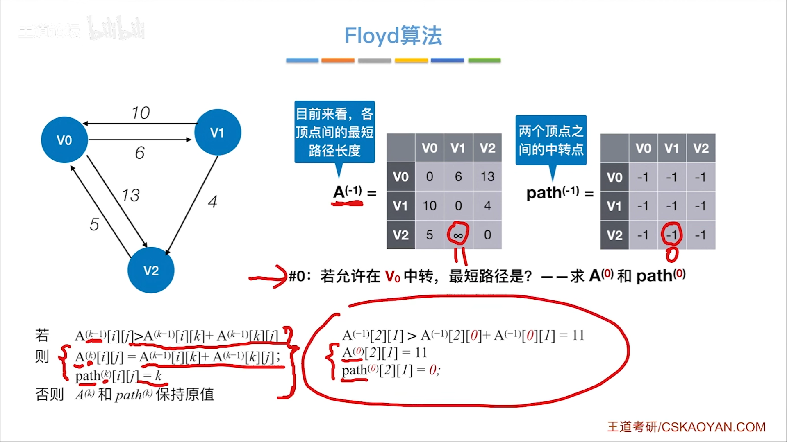
    
    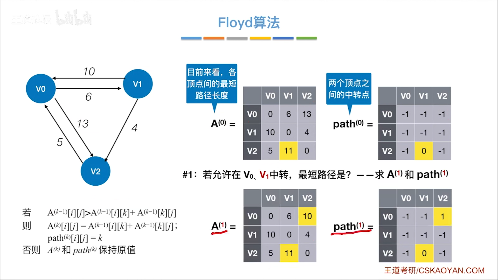
    
    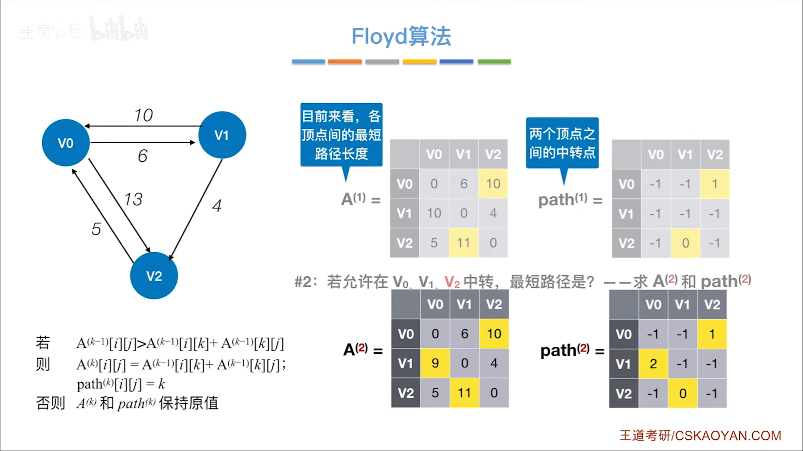
    
    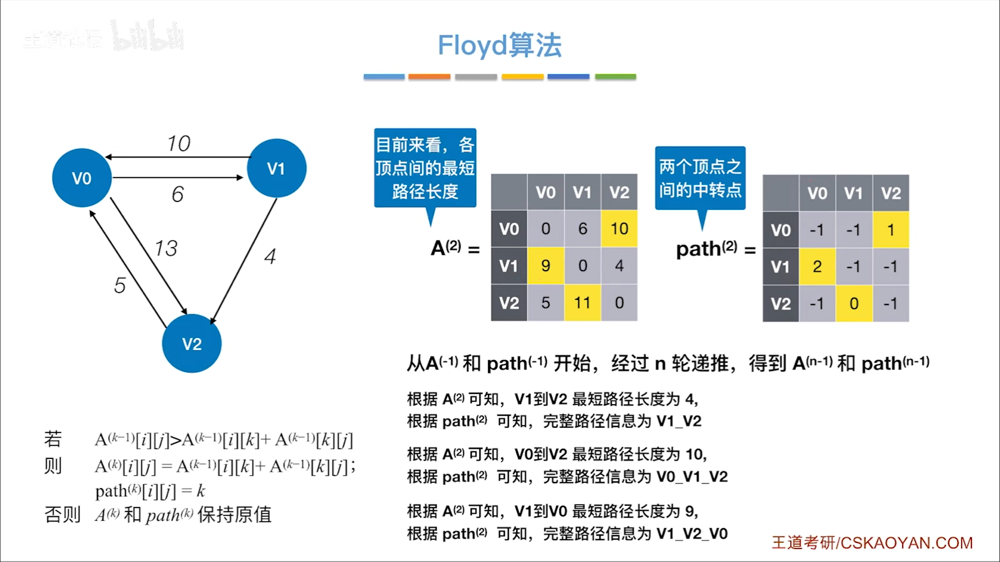
    
    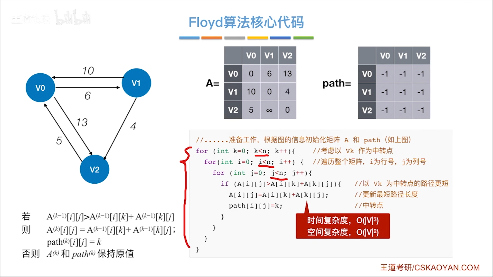
    
    - 时间复杂度：O(|V|3)
    - 不能解决负权回路的问题