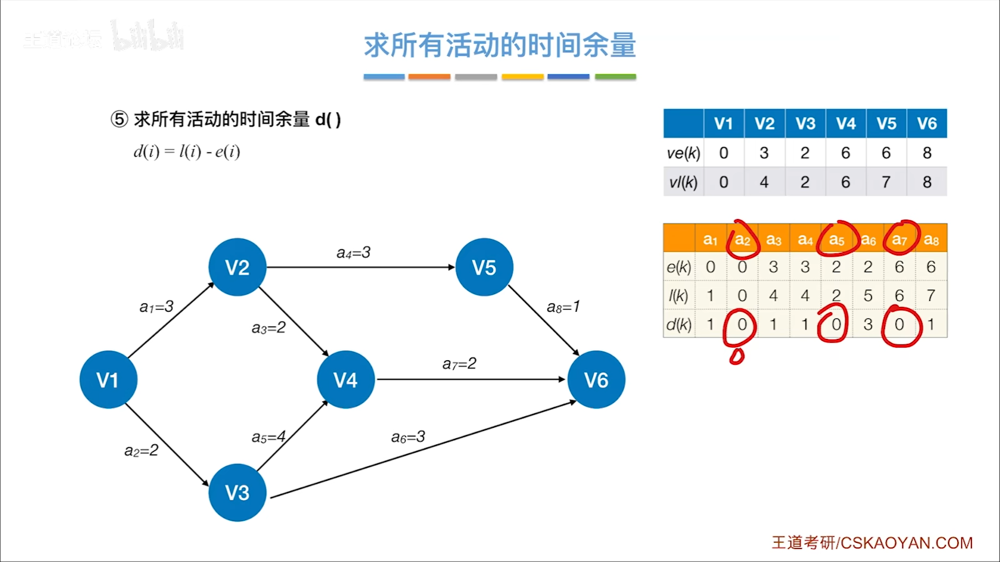

#
<!--more-->

### 

<!--more-->
### 6.4-1 DAG描述表达式

### 6.4-2 拓扑排序

- AOV网（Activity On Vertex Network）：顶点表示活动，弧表示活动之间的优先关系
- 实现：

- 时间复杂度：
    - 邻接表：O(|V|+|E|)
    - 邻接矩阵：O(|V|2)
- 逆拓扑排序

### 6.4-3 关键路径

- AOE网（Activity On Edge Network）：弧表示活动，顶点表示事件
    - 只有某顶点代表的时间发生后，该顶点出发的弧上的活动才能开始
    - 只有在进入某顶点的所有弧上的活动都完成后，该顶点代表的事件才能发生
- 关键路径：从源点到汇点的最长路径
- 关键活动：关键路径上的活动
- 事件Vk的最早发生时间ve(k)：决定了所有从Vk出发的活动的最早开始时间
- 活动ai的最早开始时间e(i)：决定了该活动弧的起点所表示的事件的最早发生时间
- 事件Vk的最迟发生时间vl(k)：在不推迟整个工程完成时间的前提下，该事件必须发生的最迟时间
- 活动ai的最迟开始时间l(i)：该活动弧的终点所表示的事件的最迟发生时间与该活动所需的时间之差
- 求关键路径
    - 1）正大

    - 2）反小

    - 3）=起点

    - 4）=终点-

    - 5）相减

