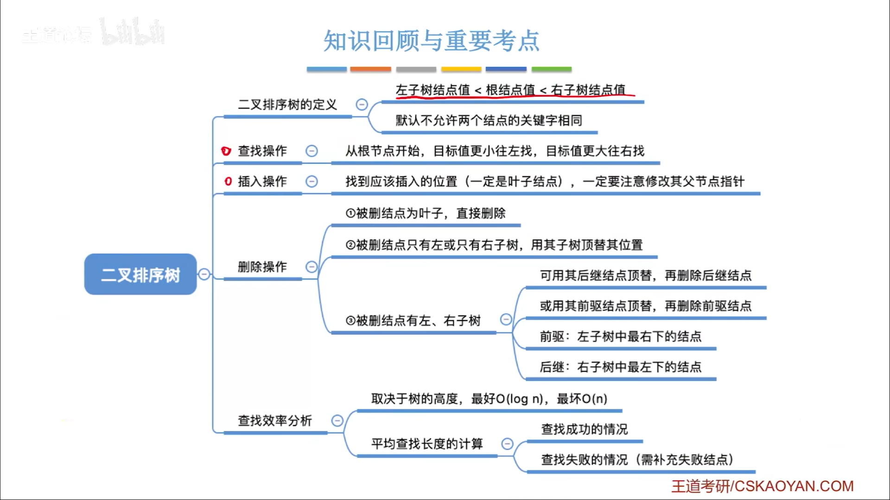
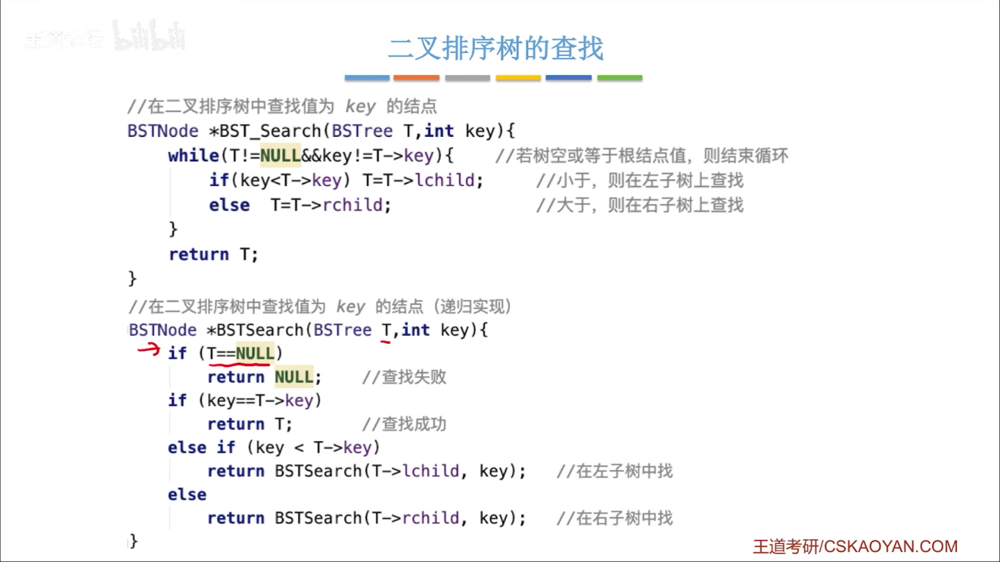
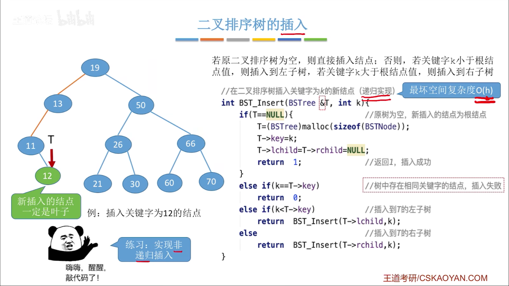
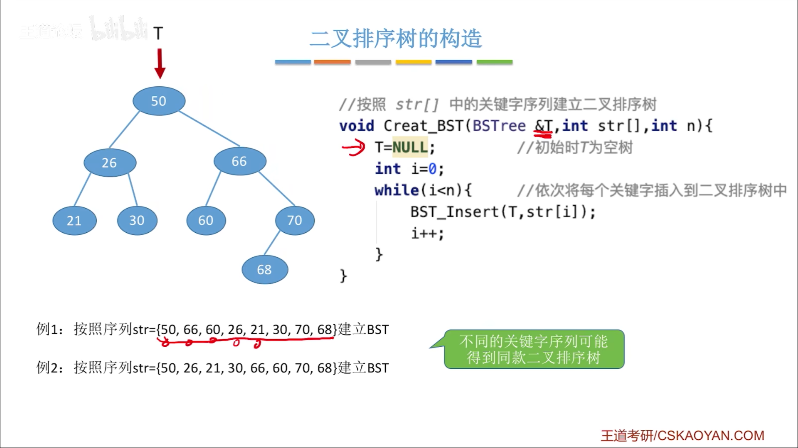

#
<!--more-->

### 

<!--more-->
- 左<根<右
- 中序遍历：升序排列
- 操作
    - 查找

    - 插入

    - 构造

    - 删除z
        - z是叶子

            删
        - z只有一颗左子树/右子树

            删，子树代替
        - z有两棵子树

            用前驱（左子树最右下）/后继（右子树最左下）代替，删除前驱/后继
- 查找效率分析

    - 最好：O(log2n)
    - 最坏：O(n)
