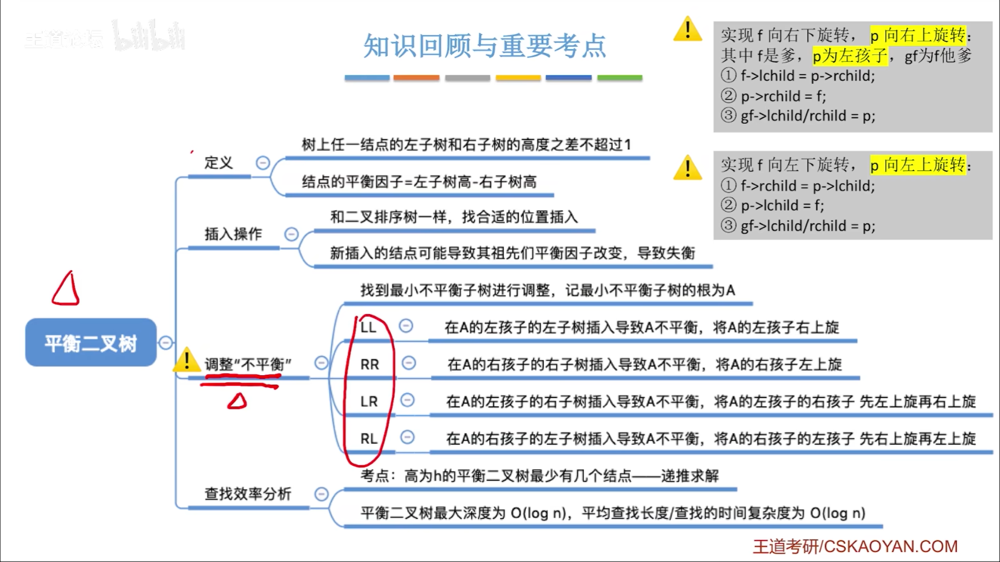
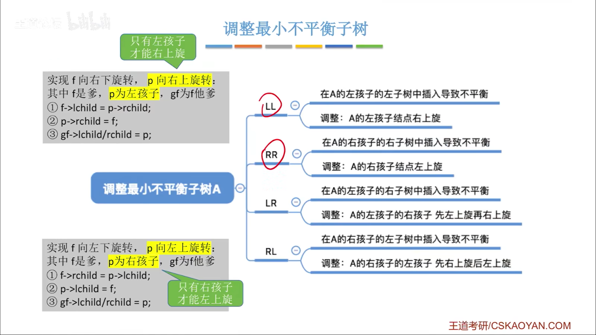
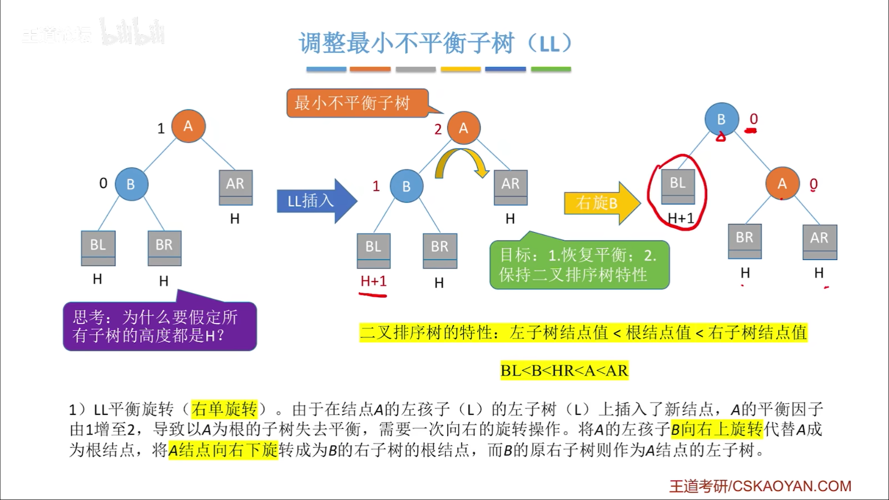
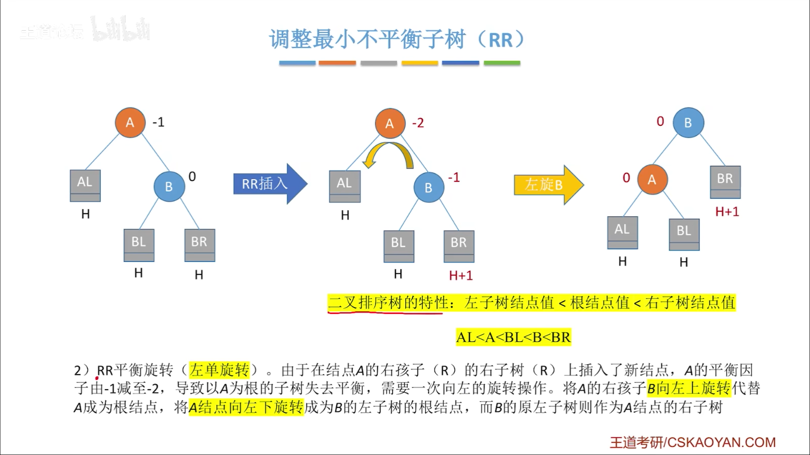
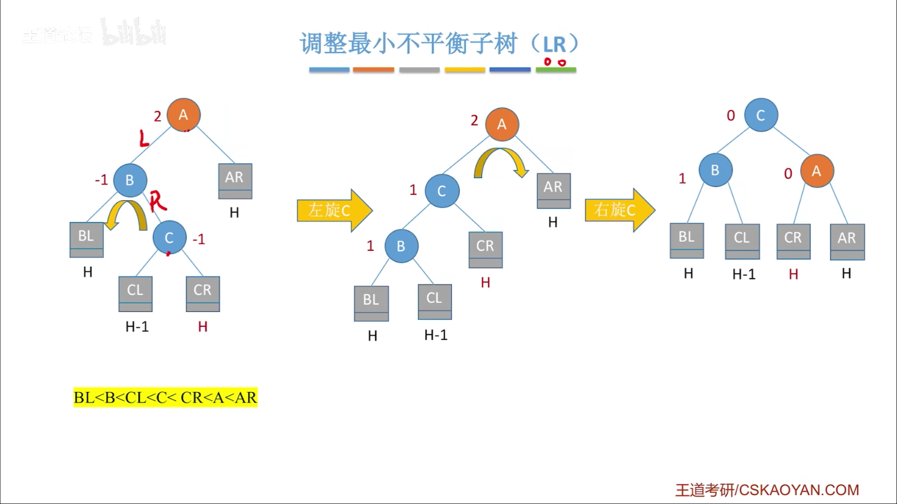
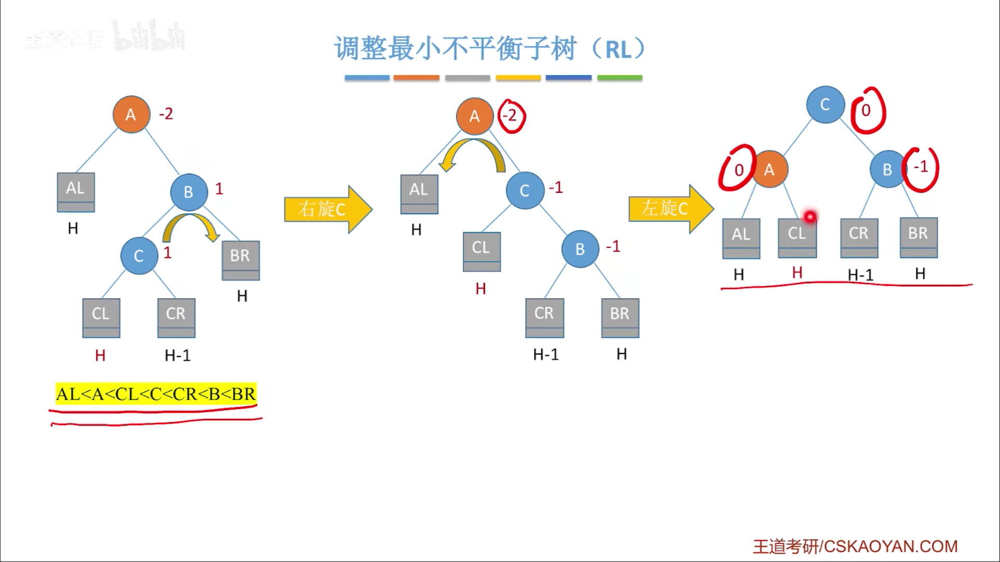
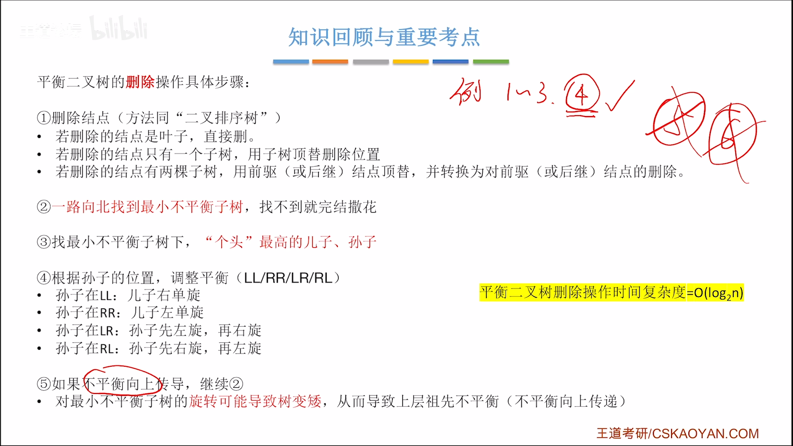

#
<!--more-->

<!--more-->

### 7.3-1 定义
- 左右子树高度差不超过1的二叉排序树，简称AVL树

### 7.3-2 操作
- 插入
    - 1） 插入二叉排序树
    - 2）调整最小不平衡子树A

        
        

        - LL型：在A的左孩子的左子树插入

        
        

        - RR型：在A的右孩子的右子树插入

        
        

        - LR型：在A的左孩子的右子树插入
        
    
        
        

        - RL型：在A的右孩子的左子树插入
        
        
        

- 删除

