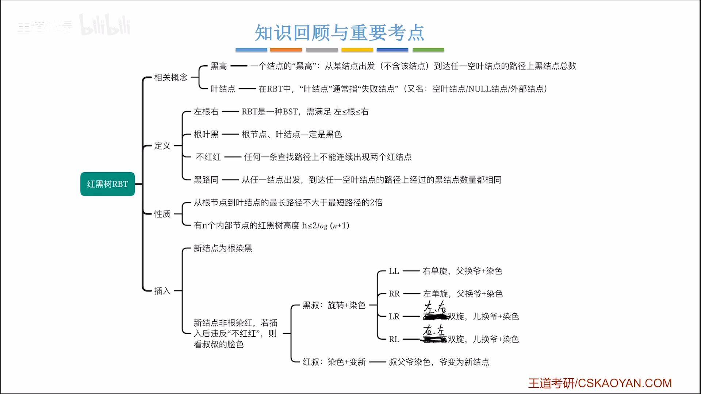
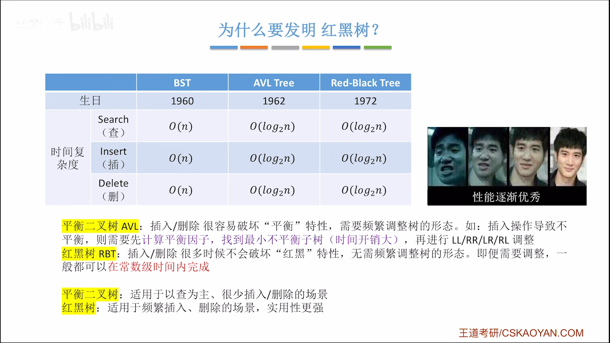
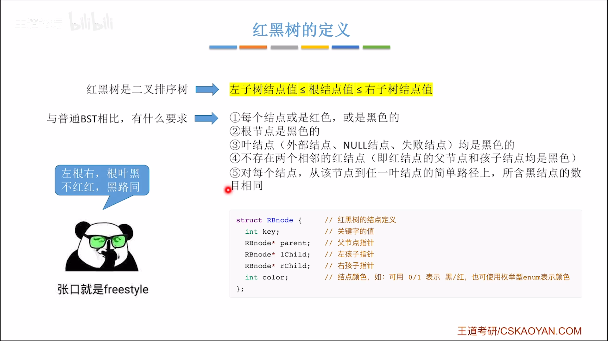
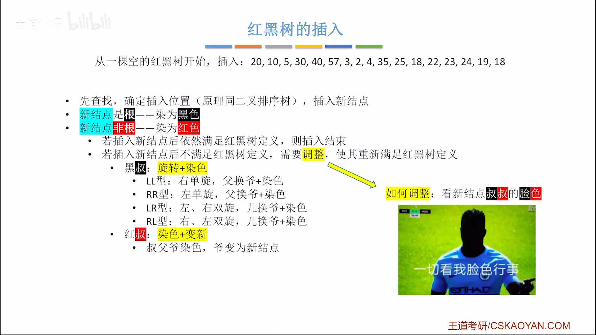
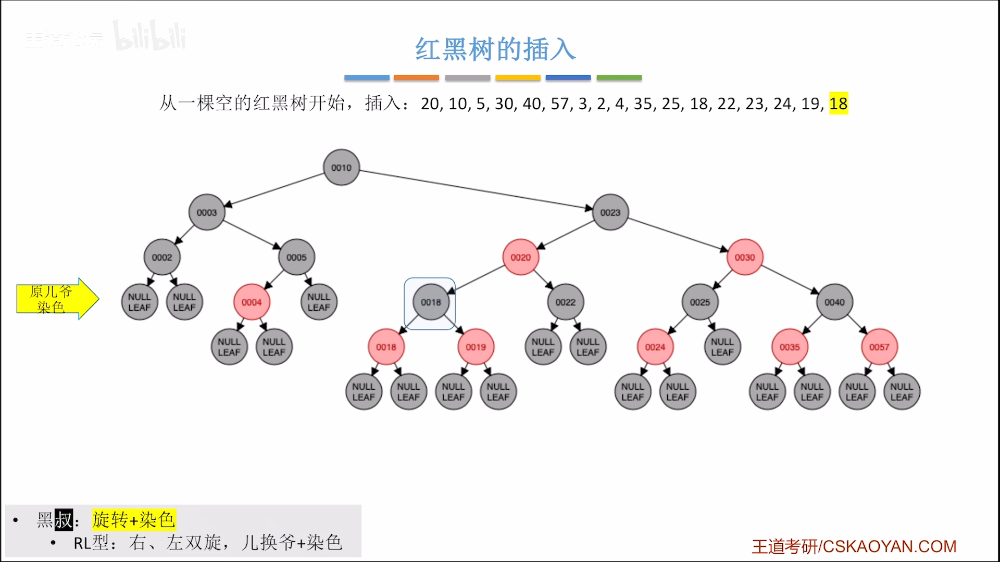

#
<!--more-->

## 9.7 红黑树

<!--more-->

### 7.4-1 为什么要有红黑树
- 平衡二叉树插入/删除操作效率低，因为调整次数多

### 7.4-2 定义
- 二叉排序树
- 左根右
- 根叶黑
- 不红红
- 黑路同

### 7.4-3 性质
- 从根到叶子的最长的可能路径不多于最短的可能路径的两倍长
- 有n个结点的红黑树的高度至多为2log2(n+1)
- 若根节点黑高为h，则红黑树的高度至多为2h

### 7.4-4 操作
- 查找
- 插入

- 删除
