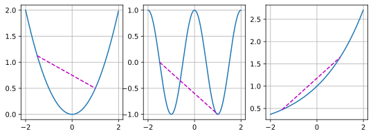
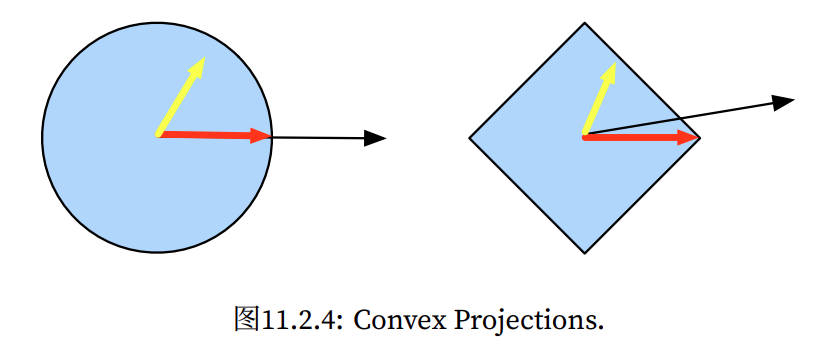

#  
<!--more-->
# 2 凸性

- 如果算法在凸性条件设定下的效果很差，那通常我们很难在其他条件下看到好的结果。


```python
%matplotlib inline
import numpy as np
import torch
from mpl_toolkits import mplot3d
from d2l import torch as d2l
```

## 2.1 定义

### 2.1.1 凸集

- 对于任何$a, b \in X$，连接a和b的线段也位于X中，则向量空间中的一个集合X是凸（convex）的。

- 假设X和Y是凸集，那么$X \bigcap Y$也是凸集的

- 通常，深度学习中的问题是在凸集上定义的。

### 2.1.2 凸函数

- 给定一个凸集X，如果对于所有$x, x' \in X$和所有$\lambda \in [0,1]$，函数f是凸的，则：
$$\lambda f(x) + (1 - \lambda) f( x' ) \geq f( \lambda x + (1 - \lambda) x')$$


```python
f = lambda x: 0.5 * x**2 # 凸函数
g = lambda x: torch.cos(np.pi * x) # 非凸函数
h = lambda x: torch.exp(0.5 * x) # 凸函数
x, segment = torch.arange(-2, 2, 0.01), torch.tensor([-1.5, 1])
d2l.use_svg_display()
_, axes = d2l.plt.subplots(1, 3, figsize=(9, 3))
for ax, func in zip(axes, [f, g, h]):
    d2l.plot([x, segment], [func(x), func(segment)], axes=ax)
```


    

    


### 2.1.3 詹森不等式

- 凸性定义的一种推广：
$$\sum_i \alpha_ i f(x_i) \geq f \left( \sum_i \alpha_ i x_ i \right) \text{and}  E_ X [ f( X ) ] \geq f ( E_ X [ X ] )$$

- 其中$\alpha_i$是满足$\sum_ i \alpha_i = 1$的非负实数，X是随机变量。

- 凸函数的期望不小于期望的凸函数

- 詹森不等式的一个常见应用：用一个较简单的表达式约束一个较复杂的表达式。例如，它可以应用于部分观察到的随机变量的对数似然。具体地说，由于$\int P(Y) P ( X | Y ) d Y = P ( X )$，所以
  $$ E_ {Y \sim P ( Y ) } [ -log P ( X | Y ) ] \geq -log P ( X )$$

    - Y 是典型的未观察到的随机变量，P(Y )是它可能如何分布的最佳猜测，P(X)是将Y 积分后的分布。例如，在聚类中Y 可能是簇标签，而在应用簇标签时，P(X | Y )是生成模型。

## 2.2 性质

- 局部极小值是全局极小值

- 凸函数的下水平集是凸的

- 凸性和二阶导数

    - 当一个函数的二阶导数存在时，我们很容易检查这个函数的凸性。只需$\nabla f ^ 2 \geq 0$，即$ \mathbf{ x }^ T \mathbf{H} \mathbf{ x } \geq 0$

## 2.3 约束

- 凸优化的一个很好的特性是能够让我们有效地处理约束。它使我们能够解决以下形式的约束优化问题：
  $$\begin{aligned} & minimize \space \space \space f( x ) \\\\ & subject to c_i ( x ) \leq 0 for \space all \space i \in \{1, ... ,N \} \end{aligned}$$

  - 其中$c_i$是约束函数

### 2.3.1 拉格朗日函数

- 通常，求解一个有约束的优化问题是困难的，解决这个问题的一种方法来自物理中相当简单的直觉。想象一个球在一个盒子里，球会滚到最低的地方，重力将与盒子两侧对球施加的力平衡。简而言之，目标函数（即重力）的梯度将被约束函数的梯度所抵消（由于墙壁的“推回”作用，需要保持在盒子内）。请注意，任何不起作用的约束（即球不接触壁）都将无法对球施加任何力。

- 上述推理可以通过以下鞍点优化问题来表示：
  $$ L ( \mathbf{ x }, \alpha_1 , ... , \alpha_ n) = f ( \mathbf{ x }) + \sum_ {i=1} ^ n  \alpha_ i c_i ( \mathbf{ x }) \space where \space \alpha_ i \geq 0$$

  - $\alpha$是拉格朗日乘数，它确保约束被正确地执行。选择它们的大小足以确保所有i的$c_ i ( \mathbf { x }) \leq 0$

  - L的鞍点是原始约束优化问题的最优解

### 2.3.2 惩罚
- 通常，添加惩罚是确保近似满足约束的一种好方法。在实践中，这被证明比精确的满意度更可靠。此外，对于非凸问题，许多使精确方法在凸情况下的性质（例如，可求最优解）不再成立。

### 2.3.3 投影

- 满足约束条件的另一种策略是投影。例如在处理梯度截断时，我们通过$ \mathbf{ g } \leftarrow \mathbf{ g } \cdot min ( 1, \frac{\theta}{||\mathbf{ g }||})$确保梯度的长度以$\theta$为界限。这就是g在半径为$\theta$的球上的投影。

- 在凸集$\mathbf{ C }$上的投影是
$$Proj_ {\mathbf{ C }} ( \mathbf{ x }) = argmin_{\mathbf{ c' } \in \mathbf{ C }} || \mathbf{ x } - \mathbf{ c' }||$$

- 它是凸集中离x最近的点。



