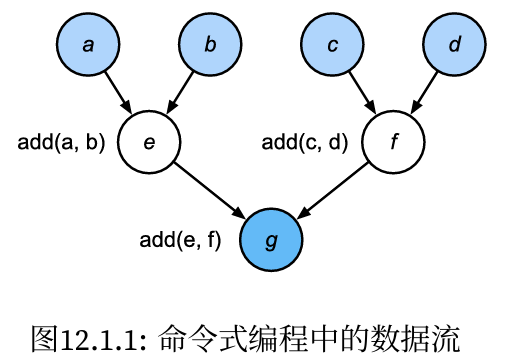

#  
<!--more-->
# 1 编译器和解释器

- 命令式编程使用诸如print、“+”和if之类的语句来更改程序的状态。


```python
def add(a, b):
    return a + b
def fancy_func(a, b, c, d):
    e = add(a, b)
    f = add(c, d)
    g = add(e, f)
    return g
print(fancy_func(1, 2, 3, 4))
```

    10
    




- 尽管命令式编程很方便，但可能效率不高。一方面原因，Python会单独执行这三个函数的调用，而没有考虑add函数在fancy_func中被重复调用。如果在一个GPU（甚至多个GPU）上执行这些命令，那么Python解释器产生的开销可能会非常大。此外，它需要保存e和f的变量值，直到fancy_func中的所有语句都执行完毕。这是因为程序不知道在执行语句e = add(a, b)和f = add(c, d)之后，其他部分是否会使用变量e和f

### 1.1 符号式编程

- 代码通常只在完全定义了过程之后才执行计算:
    - 定义计算流程；
    - 将流程编译成可执行的程序；
    - 给定输入，调用编译好的程序执行

- 这将允许进行大量的优化。首先，在大多数情况下，我们可以跳过Python解释器。从而消除因为多个更快的GPU与单个CPU上的单个Python线程搭配使用时产生的性能瓶颈。其次，编译器可以将上述代码优化和重写为print((1 + 2) + (3 + 4))甚至print(10)。因为编译器在将其转换为机器指令之前可以看到完整的代码，所以这种优化是可以实现的。例如，只要某个变量不再需要，编译器就可以释放内存（或者从不分配内存），或者将代码转换为一个完全等价的片段。


```python
def add_():
    return '''
def add(a, b):
    return a + b
'''
def fancy_func_():
    return '''
def fancy_func(a, b, c, d):
    e = add(a, b)
    f = add(c, d)
    g = add(e, f)
    return g
'''
def evoke_():
    return add_() + fancy_func_() + 'print(fancy_func(1, 2, 3, 4))'
program = evoke_()
print(program)
y = compile(program, '', 'exec')
exec(y)
```

    
    def add(a, b):
        return a + b
    
    def fancy_func(a, b, c, d):
        e = add(a, b)
        f = add(c, d)
        g = add(e, f)
        return g
    print(fancy_func(1, 2, 3, 4))
    10
    

- 命令式（解释型）编程和符号式编程的区别:
    - 命令式编程更容易使用。在Python中，命令式编程的大部分代码都是简单易懂的。命令式编程也更容易调试，这是因为无论是获取和打印所有的中间变量值，或者使用Python的内置调试工具都更加简单；
    - 符号式编程运行效率更高，更易于移植。符号式编程更容易在编译期间优化代码，同时还能够将程序移植到与Python无关的格式中，从而允许程序在非Python环境中运行，避免了任何潜在的与Python解释器相关的性能问题。

## 1.2 混合式编程

- 大部分深度学习框架都在命令式编程与符号式编程之间进行选择。
    - Theano、TensorFlow（灵感来自前者）、Keras和CNTK采用了符号式编程。
    - Chainer和PyTorch采取了命令式编程。在后来的版本更新中，TensorFlow2.0和Keras增加了命令式编程。
    - torchscript允许用户使用纯命令式编程进行开发和调试，同时能够将大多数程序转换为符号式程序，以便在需要产品级计算性能和部署时使用。

## 1.3 Sequential的混合式编程

- 要了解混合式编程的工作原理，最简单的方法是考虑具有多层的深层网络。按照惯例，Python解释器需要执行所有层的代码来生成一条指令，然后将该指令转发到CPU或GPU。对于单个的（快速的）计算设备，这不会导致任何重大问题。另一方面，如果我们使用先进的8‐GPU服务器，Python将很难让所有的GPU都保持忙碌。在这里，瓶颈是单线程的Python解释器。让我们看看如何通过将Sequential替换为HybridSequential来解决代码中这个瓶颈。


```python
import torch
from torch import nn
from d2l import torch as d2l

def get_net():
    net = nn.Sequential(
        nn.Linear(512, 256), 
        nn.ReLU(),
        nn.Linear(256, 128),
        nn.ReLU(),
        nn.Linear(128, 2)
    )
    return net
x = torch.randn(size=(1, 512))
net = get_net()
net(x)
```


    tensor([[ 0.0288, -0.0197]], grad_fn=<AddmmBackward0>)


- 通过使用torch.jit.script函数来转换模型，我们就有能力编译和优化多层感知机中的计算，而模型的计算结果保持不变。


```python
net = torch.jit.script(net)
net(x)
```


    tensor([[ 0.0288, -0.0197]], grad_fn=<AddmmBackward0>)


### 1.3.1 通过混合式编程加速

- 定义一个度量时间的类


```python
#@save
class Benchmark:
    '''用于测量运行时间'''
    def __init__(self, description='Done'):
        self.description = description
    def __enter__(self):
        self.timer = d2l.Timer()
        return self
    def __exit__(self, *args):
        print(f'{self.description}: {self.timer.stop():.4f} sec')
```

- 使用torchscript提高了计算性能。


```python
net = get_net()
with Benchmark('无torchscript'):
    for _ in range(1000):
        net(x)

net = torch.jit.script(net)
with Benchmark('有torchscript'):
    for _ in range(1000):
        net(x)
```

    无torchscript: 0.1060 sec
    有torchscript: 0.0884 sec
    

### 1.3.2 序列化

- 编译模型的好处之一是我们可以将模型及其参数序列化（保存）到磁盘。这允许这些训练好的模型部署到其他设备上，并且还能方便地使用其他前端编程语言。同时，通常编译模型的代码执行速度也比命令式编程更快。让我们看看save的实际功能。


```python
net.save('my_mlp')
!ls -lh my_mlp*
```

    'ls' �����ڲ����ⲿ���Ҳ���ǿ����еij���
    ���������ļ���
    
