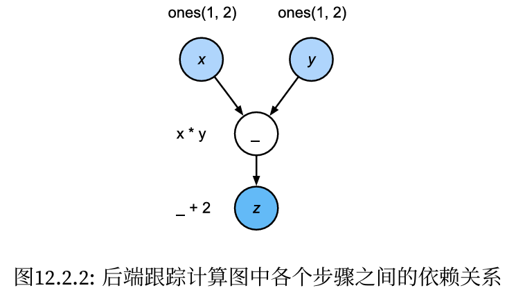
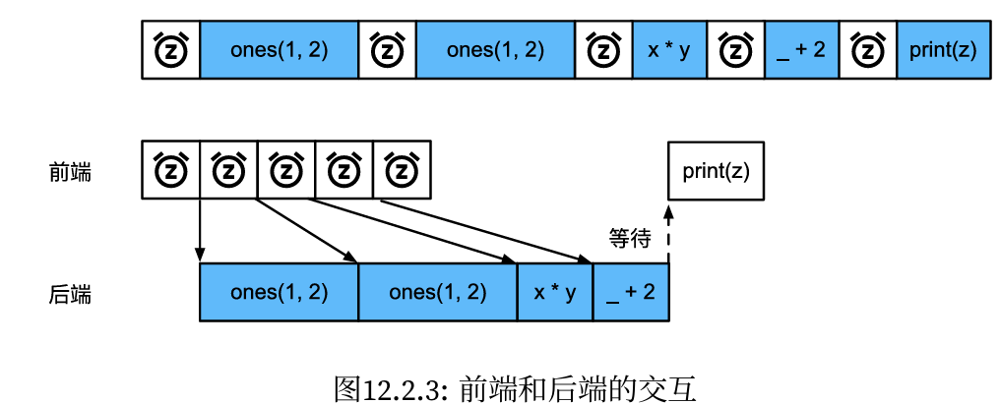

#  
<!--more-->
# 2 异步计算

- Python并不善于编写并行和异步代码. MXNet和TensorFlow之类则采用了一种异步编程（asynchronousprogramming）模型来提高性能，而PyTorch则使用了Python自己的调度器来实现不同的性能权衡。对PyTorch来说GPU操作在默认情况下是异步的。当调用一个使用GPU的函数时，操作会排队到特定的设备上，但不一定要等到以后才执行。这允许我们并行执行更多的计算，包括在CPU或其他GPU上的操作。

## 2.1 通过后端异步处理

- 考虑一个简单问题：生成一个随机矩阵并将其相乘。让我们在NumPy和PyTorch张量中都这样做，看看它们的区别。请注意，PyTorch的tensor是在GPU上定义的。


```python
import os
import subprocess
import numpy
import torch
from torch import nn
from d2l import torch as d2l

# GPU计算热身
device = d2l.try_gpu()
a = torch.ones((1000, 1000), device=device)
b = torch.mm(a,a)

with d2l.Benchmark('numpy'):
    for _ in range(10):
        a = numpy.random.normal(size=(1000, 1000))
        b = numpy.dot(a, a)
with d2l.Benchmark('torch'):
    for _ in range(10):
        a = torch.normal(0, 1, size=(1000, 1000), device=device)
        b = torch.mm(a, a)
```

    numpy: 0.4083 sec
    torch: 0.0030 sec
    

- 通过PyTorch的基准输出比较快了几个数量级。NumPy点积是在CPU上执行的，而PyTorch矩阵乘法是在GPU上执行的，后者的速度要快得多。但巨大的时间差距表明一定还有其他原因。默认情况下，GPU操作在PyTorch中是异步的。强制PyTorch在返回之前完成所有计算，这种强制说明了之前发生的情况：计算是由后端执行，而前端将控制权返回给了Python。


```python
with d2l.Benchmark():
    for _ in range(10):
        a = torch.normal(0, 1, size=(1000, 1000), device=device)
        b = torch.mm(a, a)
    torch.cuda.synchronize(device)
```

    Done: 0.1500 sec
    

- 广义上说，PyTorch有一个用于与用户直接交互的前端（例如通过Python），还有一个由系统用来执行计算的后端。用户可以用各种前端语言编写PyTorch程序，如Python和C++。不管使用的前端编程语言是什么，PyTorch程序的执行主要发生在C++实现的后端。由前端语言发出的操作被传递到后端执行。后端管理自己的线程，这些线程不断收集和执行排队的任务。请注意，要使其工作，后端必须能够跟踪计算图中各个步骤之间的依赖关系。因此，不可能并行化相互依赖的操作。


```python
x = torch.ones((1, 2), device=device)
y = torch.ones((1, 2), device=device)
z = x * y + 2
z
```


    tensor([[3., 3.]], device='cuda:0')





- 每当Python前端线程执行前三条语句中的一条语句时，它只是将任务返回到后端队列。当最后一个语句的结果需要被打印出来时，Python前端线程将等待C++后端线程完成变量z的结果计算。这种设计的一个好处是Python前端线程不需要执行实际的计算。因此，不管Python的性能如何，对程序的整体性能几乎没有影响。



## 2.2 障碍器与阻塞器

## 2.3 改进计算
Python前端线程和C++后端线程之间的简化交互可以概括如下：
    1. 前端命令后端将计算任务y = x + 1插入队列；
    2. 然后后端从队列接收计算任务并执行；
    3. 然后后端将计算结果返回到前端。
假设这三个阶段的持续时间分别为t1,t2,t3。如果不使用异步编程，执行10000次计算所需的总时间约为10000(t1 +t2 +t3)。如果使用异步编程，因为前端不必等待后端为每个循环返回计算结果，执行10000次计算所花费的总时间可以减少到t1+10000t2+t3（假设10000t2 >9999t1）
