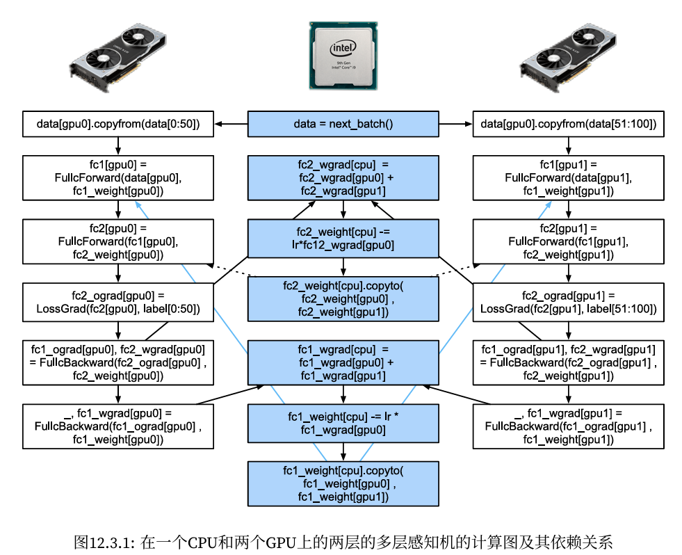

#  
<!--more-->
# 3 自动并行

- 深度学习框架会在后端自动构建计算图。利用计算图，系统可以了解所有依赖关系，并且可以选择性地并行执行多个不相互依赖的任务以提高速度。

- 通常情况下单个操作符将使用所有CPU或单个GPU上的所有计算资源。例如，即使在一台机器上有多个CPU处理器，dot操作符也将使用所有CPU上的所有核心（和线程）。这样的行为同样适用于单个GPU。

## 3.1 基于GPU的并行计算


```python
import torch
class Benchmark:
    '''用于测量运行时间'''
    def __init__(self, description='Done'):
        self.description = description
    def __enter__(self):
        self.timer = d2l.Timer()
        return self
    def __exit__(self, *args):
        print(f'{self.description}: {self.timer.stop():.4f} sec')


def run(x):
    return [x.mm(x) for _ in range(50)]
x_gpu1 = torch.rand(size=(4000, 4000), device='cuda:6')
x_gpu2 = torch.rand(size=(4000, 4000), device='cuda:7')
```

- 现在使用函数来处理数据。通过在测量之前需要预热设备（对设备执行一次传递）来确保缓存的作用不影响最终的结果。torch.cuda.synchronize()函数将会等待一个CUDA设备上的所有流中的所有核心的计算完成。函数接受一个device参数，代表是哪个设备需要同步。如果device参数是None（默认值），它将使用current_device()找出的当前设备。


```python
run(x_gpu1)
run(x_gpu2) # 预热设备
torch.cuda.synchronize('cuda:6')
torch.cuda.synchronize('cuda:7')

with Benchmark("GPU1 time"):
    run(x_gpu1)
    torch.cuda.synchronize('cuda:6')
with Benchmark("GPU2 time"):
    run(x_gpu2)
    torch.cuda.synchronize('cuda:7')
```


    GPU1 time: 0.2816 sec
    GPU2 time: 0.2788 sec


- 如果删除两个任务之间的synchronize语句，系统就可以在两个设备上自动实现并行计算。


```python
with Benchmark("GPU1 & GPU2"):
    run(x_gpu1)
    run(x_gpu2)
    torch.cuda.synchronize()
```


    GPU1 & GPU2: 0.1395 sec


- 在上述情况下，总执行时间小于两个部分执行时间的总和，因为深度学习框架自动调度两个GPU设备上的计算，而不需要用户编写复杂的代码。

## 3.2 并行计算与通信

- 在许多情况下，我们需要在不同的设备之间移动数据，比如在CPU和GPU之间，或者在不同的GPU之间。例如，当执行分布式优化时，就需要移动数据来聚合多个加速卡上的梯度。让我们通过在GPU上计算，然后将结果复制回CPU来模拟这个过程。


```python
def copy_to_cpu(x, non_blocking=False):
    return [y.to('cpu', non_blocking=non_blocking) for y in x]
with Benchmark('在GPU1上运行'):
    y = run(x_gpu1)
    torch.cuda.synchronize()
with Benchmark('复制到CPU'):
    y_cpu = copy_to_cpu(y)
    torch.cuda.synchronize()
```


    在GPU1上运行: 0.0009 sec
    复制到CPU: 1.4409 sec


- 这种方式效率不高。注意到当列表中的其余部分还在计算时，我们可能就已经开始将y的部分复制到CPU了。例如，当计算一个小批量的（反传）梯度时。某些参数的梯度将比其他参数的梯度更早可用。因此，在GPU仍在运行时就开始使用PCI‐Express总线带宽来移动数据是有利的。在PyTorch中，to()和copy_()等函数都允许显式的non_blocking参数，这允许在不需要同步时调用方可以绕过同步。设置non_blocking=True以模拟这个场景。


```python
with Benchmark('在GPU1上运行并复制到CPU'):
    y = run(x_gpu1)
    y_cpu = copy_to_cpu(y, True)
    torch.cuda.synchronize()
```
    在GPU1上运行并复制到CPU: 1.1472 sec


- 两个操作所需的总时间少于它们各部分操作所需时间的总和。请注意，与并行计算的区别是通信操作使用的资源：CPU和GPU之间的总线。事实上，我们可以在两个设备上同时进行计算和通信。如上所述，计算和通信之间存在的依赖关系是必须先计算y[i]，然后才能将其复制到CPU。幸运的是，系统可以在计算y[i]的同时复制y[i-1]，以减少总的运行时间。

- 一个简单的两层多层感知机在CPU和两个GPU上训练时的计算图及其依赖关系的例子，如图所示, 手动调度由此产生的并行程序将是相当痛苦的。这就是基于图的计算后端进行优化的优势所在。


