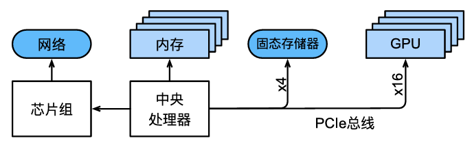
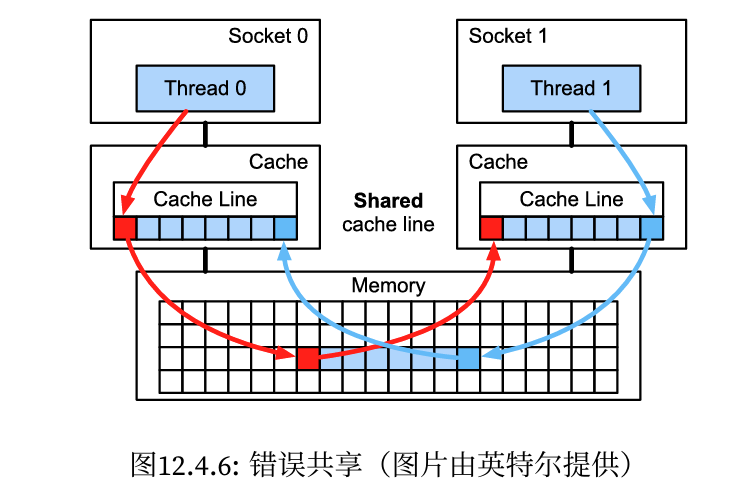

#### 

<!--more-->

# 4 硬件

## 4.1 计算机

-  关键部件 :
  -  一个处理器（也被称为CPU），它除了能够运行操作系统和许多其他功能之外，还能够执行给定的程序. 它通常由8个或更多个核心组成； 
  -  内存（随机访问存储，RAM）用于存储和检索计算结果，如权重向量和激活参数，以及训练数据； 
  -  一个或多个以太网连接，速度从1GB/s到100GB/s不等。在高端服务器上可能用到更高级的互连； 
  -  高速扩展总线（PCIe）用于系统连接一个或多个GPU。服务器最多有8个加速卡，通常以更高级的拓扑方式连接，而桌面系统则有1个或2个加速卡，具体取决于用户的预算和电源负载的大小； 
  -  持久性存储设备，如磁盘驱动器、固态驱动器，在许多情况下使用高速扩展总线连接。它为系统需要的训练数据和中间检查点需要的存储提供了足够的传输速度。 

- 高速扩展总线由直接连接到CPU的多个通道组成，将CPU与大多数组件（网络、GPU和存储）连接在一起。 
- 运行代码时，需要将数据转移到处理器上（CPU或GPU）执行计算，然后将结果从处理器移回到随机访问存储和持久存储器中。因此，为了获得良好的性能，需要确保每一步工作都能无缝链接，而不希望系统中的任何一部分成为主要的瓶颈。例如，如果不能快速加载图像，那么处理器就无事可做。同样地，如果不能快速移动矩阵到CPU（或GPU）上，那么CPU（或GPU）就会无法全速运行。最后，如果希望在网络上同步多台计算机，那么网络就不应该拖累计算速度。一种选择是通信和计算交错进行。 

## 4.1 内存

- 最基本的内存主要用于存储需要随时访问的数据。目前，CPU的内存通常为DDR4类型，每个模块提供20-25Gb/s的带宽。每个模块都有一条64位宽的总线。通常使用成对的内存模块来允许多个通道。CPU有2到4个内存通道，也就是说，它们内存带宽的峰值在40GB/s到100GB/s之间。一般每个通道有两个物理存储体（bank）。

- 第一次读取的成本是后续读取的500倍！请注意，每秒最多可以执行一千万次随机读取。这说明应该尽可能地避免随机内存访问，而是使用突发模式读取和写入。

## 4.3 存储器

- 随机访问存储的一些关键特性是带宽（bandwidth）和延迟（latency）

### 4.3.1 硬盘驱动器(HDD)

- 硬盘驱动器的转速大约为7200RPM（每分钟转数）。它们如果转速再快些，就会由于施加在碟片上的离心力而破碎。在访问磁盘上的特定扇区时，还有一个关键问题：需要等待碟片旋转到位（可以移动磁头，但是无法对磁盘加速）。因此，可能需要8毫秒才能使用请求的数据。

### 4.3.2 固态驱动器(SSD)

- 使用闪存持久地存储信息。这允许更快地访问存储的记录。现代的固态驱动器的IOPs可以达到10万到50万，比硬盘驱动器快3个数量级。而且，它们的带宽可以达到1‐3GB/s，比硬盘驱动器快一个数量级。

  - 固态驱动器以块的方式（256KB或更大）存储信息。块只能作为一个整体来写入，因此需要耗费大量的时间，导致固态驱动器在按位随机写入时性能非常差。而且通常数据写入需要大量的时间还因为块必须被读取、擦除，然后再重新写入新的信息。如今固态驱动器的控制器和固件已经开发出了缓解这种情况的算法。尽管有了算法，写入速度仍然会比读取慢得多，特别是对于QLC（四层单元）固态驱动器。提高性能的关键是维护操作的“队列”，在队列中尽可能地优先读取和写入大的块。

  - 固态驱动器中的存储单元磨损得比较快（通常在几千次写入之后就已经老化了）。磨损程度保护算法能够将退化平摊到许多单元。也就是说，不建议将固态驱动器用于交换分区文件或大型日志文件。

  - 带宽的大幅增加迫使计算机设计者将固态驱动器与PCIe总线相连接，这种驱动器称为NVMe（非易失性内存增强），其最多可以使用4个PCIe通道。在PCIe4.0上最高可达8GB/s。

### 4.3.3 云存储

## 4.4 CPU 

- 中央处理器（centralprocessingunit，CPU）是任何计算机的核心。它们由许多关键组件组成：

  - 处理器核心（processor cores）用于执行机器代码

  - 总线（bus）用于连接不同组件

  - 缓存（cach）相比主内存实现更高的读取带宽和更低的延迟内存访问。

  - 因为高性能线性代数和卷积运算常见于媒体处理和机器学习中，所以几乎所有的现代CPU都包含向量处理单元（vectorprocessingunit）为这些计算提供辅助。

### 4.4.1 微体系结构

### 4.4.2 矢量化

- 深度学习的计算量非常大。因此，为了满足机器学习的需要，CPU需要在一个时钟周期内执行许多操作。这种执行方式是通过向量处理单元实现的。这些处理单元有不同的名称:在ARM上叫做NEON,在x86上被称为AVX2。一个常见的功能是它们能够执行单指令多数据（singleinstructionmultipledata，SIMD）操作。

- 根据体系结构的选择，此类寄存器最长可达512位，最多可组合64对数字。例如，我们可能会将两个数字相乘，然后与第三个数字相加，这也称为乘加融合（fusedmultiply‐add）。Intel的OpenVino就是使用这些处理器来获得可观的吞吐量，以便在服务器级CPU上进行深度学习。

### 4.4.3 缓存

- 添加缓存是一把双刃剑。一方面，它能确保处理器核心不缺乏数据。但同时，它也增加了芯片尺寸，消耗了原本可以用来提高处理能力的面积。此外，缓存未命中的代价可能会很昂贵。考虑最坏的情况，如下图所示, 当处理器1上的线程请求数据时，数据缓存在处理器0上。为了满足获取需要，处理器0需要停止它正在做的事情，将信息写回主内存，然后让处理器1从内存中读取它。在此操作期间，两个处理器都需要等待。与高效的单处理器实现相比，这种代码在多个处理器上运行的速度可能要慢得多。这就是为什么缓存大小（除了物理大小之外）有实际限制的另一个原因。

  

  

## 4.5 GPU和其他加速卡

- 加速卡是为训练还是推断而优化的。对于后者，我们只需要计算网络中的前向传播。而反向传播不需要存储中间数据。还有，我们可能不需要非常精确的计算（FP16或INT8通常就足够了）。对于前者，即训练过程中需要存储所有的中间结果用来计算梯度。而且，累积梯度也需要更高的精度，以避免数值下溢（或溢出）。这意味着最低要求也是FP16（或FP16与FP32的混合精度）。所有这些都需要更快、更大的内存（HBM2或者GDDR6）和更高的处理能力。

...

## 4.6 网络和总线

- PCIe，一种专用总线，用于每个通道点到点连接的高带宽需求（在16通道插槽中的PCIe4.0上高达32GB/s），延迟时间为个位数的微秒（5μs）。PCIe链接非常宝贵。

- 以太网，连接计算机最常用的方式。虽然它比PCIe慢得多，但它的安装成本非常低，而且具有很强的弹性，覆盖的距离也要长得多。低级服务器的典型带宽为1GBit/s。与PCIe类似，以太网旨在连接两个设备，例如计算机和交换机。

- 交换机，一种连接多个设备的方式，该连接方式下的任何一对设备都可以同时执行（通常是全带宽）点对点连接。例如，以太网交换机可能以高带宽连接40台服务器。请注意，交换机并不是传统计算机网络所独有的。甚至PCIe通道也可以是可交换的

- NVLink，是PCIe的替代品，适用于非常高带宽的互连。它为每条链路提供高达300Gbit/s的数据传输速率。服务器GPU（VoltaV100）有六个链路。而消费级GPU（RTX2080Ti）只有一个链路，运行速度也降低到100Gbit/s。建议使用NCCL来实现GPU之间的高速数据传输。