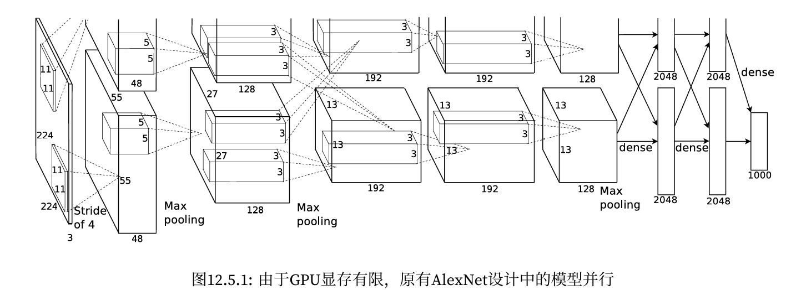
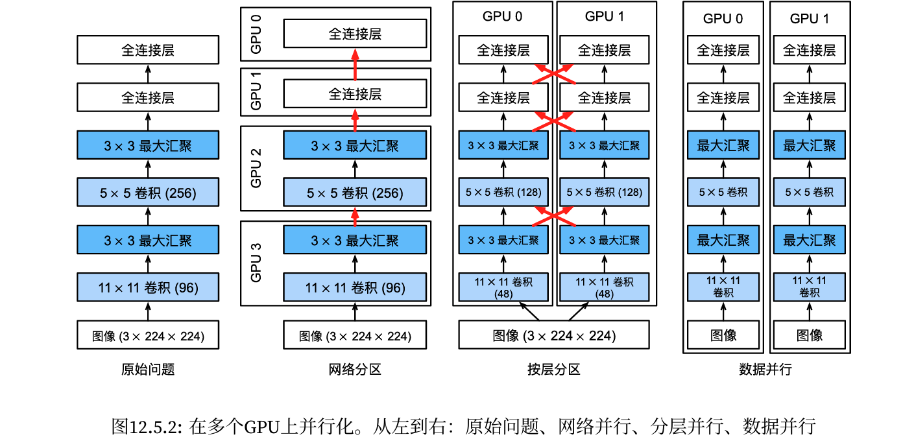
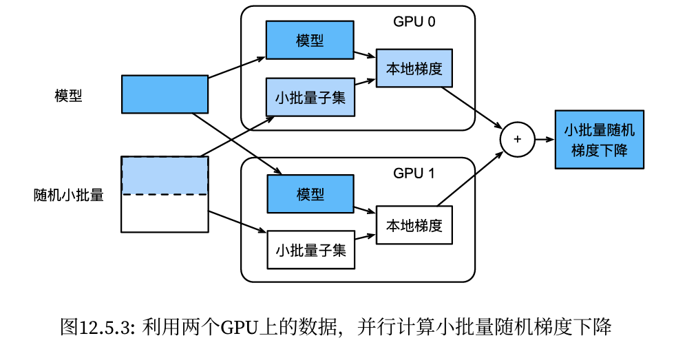

#### 

<!--more-->

# 5 多GPU训练

- 分割数据到多个设备上，并使其能够正常工作呢

## 5.1 问题拆分

- 对于需要分类的小批量训练数据，我们有以下选择

    - 第一种方法，在多个GPU之间拆分网络。也就是说，每个GPU将流入特定层的数据作为输入，跨多个后续层对数据进行处理，然后将数据发送到下一个GPU。与单个GPU所能处理的数据相比，我们可以用更大的网络处理数据。此外，每个GPU占用的显存（memoryfootprint）可以得到很好的控制，虽然它只是整个网络显存的一小部分。

        - 然而，GPU的接口之间需要的密集同步可能是很难办的，特别是层之间计算的工作负载不能正确匹配的时候，还有层之间的接口需要大量的数据传输的时候（例如：激活值和梯度，数据量可能会超出GPU总线的带宽）此外，计算密集型操作的顺序对拆分来说也是非常重要的，其本质仍然是一个困难的问题，目前还不清楚研究是否能在特定问题上实现良好的线性缩放。综上所述，除非存框架或操作系统本身支持将多个GPU连接在一起，否则不建议这种方法。

    - 第二种方法，拆分层内的工作。例如，将问题分散到4个GPU，每个GPU生成16个通道的数据，而不是在单个GPU上计算64个通道。对于全连接的层，同样可以拆分输出单元的数量。如下图, 其策略用于处理显存非常小（当时为2GB）的GPU。当通道或单元的数量不太小时，使计算性能有良好的提升。此外，由于可用的显存呈线性扩展，多个GPU能够处理不断变大的网络。

    
    

        - 然而，我们需要大量的同步或屏障操作（barrieroperation），因为每一层都依赖于所有其他层的结果。此外，需要传输的数据量也可能比跨GPU拆分层时还要大。因此，基于带宽的成本和复杂性，我们同样不推荐这种方法。

    - 最后一种方法，跨多个GPU对数据进行拆分。这种方式下，所有GPU尽管有不同的观测结果，但是执行着相同类型的工作。在完成每个小批量数据的训练之后，梯度在GPU上聚合。这种方法最简单，并可以应用于任何情况，同步只需要在每个小批量数据处理之后进行。也就是说，当其他梯度参数仍在计算时，完成计算的梯度参数就可以开始交换。而且，GPU的数量越多，小批量包含的数据量就越大，从而就能提高训练效率。但是，添加更多的GPU并不能让我们训练更大的模型。




## 5.2 数据并行

- 假设一台机器有k个GPU。给定需要训练的模型，虽然每个GPU上的参数值都是相同且同步的，但是每个GPU都将独立地维护一组完整的模型参数。例如，图演示了在k=2时基于数据并行方法训练模型。




- 一般来说，k个GPU并行训练过程如下：

    - 在任何一次训练迭代中，给定的随机的小批量样本都将被分成k个部分，并均匀地分配到GPU上；

    - 每个GPU根据分配给它的小批量子集，计算模型参数的损失和梯度；

    - 将k个GPU中的局部梯度聚合，以获得当前小批量的随机梯度；

    - 聚合梯度被重新分发到每个GPU中；

    - 每个GPU使用这个小批量随机梯度，来更新它所维护的完整的模型参数集。

- 当在k个GPU上训练时，小批量的大小为k的倍数，这样每个GPU都有相同的工作量，就像只在单个GPU上训练一样。因此，在16‐GPU服务器上可以显著地增加小批量数据量的大小，同时可能还需要相应地提高学习率。还请注意，批量规范化也需要调整，例如，为每个GPU保留单独的批量规范化参数。

## 5.3 定义网络


```python
%matplotlib inline
import torch
from torch import nn
from torch.nn import functional as F
from d2l import torch as d2l

# 初始化模型参数
scale = 0.01
W1 = nn.Parameter(torch.randn(size=(20, 1, 3, 3)) * scale)
b1 = torch.zeros(20)
W2 = nn.Parameter(torch.randn(size=(50, 20, 5, 5)) * scale)
b2 = torch.zeros(50)
W3 = nn.Parameter(torch.randn(size=(800, 128)) * scale)
b3 = torch.zeros(128)
W4 = nn.Parameter(torch.randn(size=(128, 10)) * scale)
b4 = torch.zeros(10)
params = [W1, b1, W2, b2, W3, b3, W4, b4]

# 定义模型
def lenet(X, params):
    h1_conv = F.conv2d(input=X, weight=params[0], bias=params[1])
    h1_activation = F.relu(h1_conv)
    h1 = F.avg_pool2d(input=h1_activation, kernel_size=(2, 2), stride=(2, 2))
    h2_conv = F.conv2d(input=h1, weight=params[2], bias=params[3])
    h2_activation = F.relu(h2_conv)
    h2 = F.avg_pool2d(input=h2_activation, kernel_size=(2, 2), stride=(2, 2))
    h2 = h2.reshape(h2.shape[0], -1)
    h3_linear = torch.mm(h2, params[4]) + params[5]
    h3 = F.relu(h3_linear)
    y_hat = torch.mm(h3, params[6]) + params[7]
    return y_hat

# 交叉熵损失函数
loss = nn.CrossEntropyLoss(reduction='none')
```

## 5.4 数据同步

- 对于高效的多GPU训练，我们需要两个基本操作。首先，我们需要向多个设备分发参数并附加梯度（get_params）如果没有参数，就不可能在GPU上评估网络。

- 第二，需要跨多个设备对参数求和，也就是说，需要一个allreduce函数。


```python
def get_params(params, device):
    new_params = [p.to(device) for p in params]
    for p in new_params:
        p.requires_grad_()
    return new_params

# 通过将模型参数复制到一个GPU
new_params = get_params(params, "cuda:0")
print('b1 权重:', new_params[1])
print('b1 梯度:', new_params[1].grad)
```

    b1 权重: tensor([0., 0., 0., 0., 0., 0., 0., 0., 0., 0., 0., 0., 0., 0., 0., 0., 0., 0., 0., 0.],
           device='cuda:0', requires_grad=True)
    b1 梯度: None
    

- 由于还没有进行任何计算，因此权重参数的梯度仍然为零。

- 假设现在有一个向量分布在多个GPU上，下面的allreduce函数将所有向量相加，并将结果广播给所有GPU。请注意，我们需要将数据复制到累积结果的设备，才能使函数正常工作。


```python
def allreduce(data):
    for i in range(1, len(data)):
        data[0][:] += data[i].to(data[0].device)
    for i in range(1, len(data)):
        data[i][:] = data[0].to(data[i].device)

# 通过在不同设备上创建具有不同值的向量并聚合它们
data = [torch.ones((1,2), device='cuda:0'), torch.ones((1,2), device='cuda:0')]
print('allreduce之前:\n', data[0], data[1])
allreduce(data)
print('allreduce之后:\n', data[0], data[1])
```

    allreduce之前:
     tensor([[1., 1.]], device='cuda:0') tensor([[1., 1.]], device='cuda:0')
    allreduce之后:
     tensor([[2., 2.]], device='cuda:0') tensor([[2., 2.]], device='cuda:0')
    

## 5.5 数据分发

- 我们需要一个简单的工具函数，将一个小批量数据均匀地分布在多个GPU上。例如，有两个GPU时，我们希望每个GPU可以复制一半的数据。因为深度学习框架的内置函数编写代码更方便、更简洁，所以在4×5矩阵上使用它进行尝试。


```python
data = torch.arange(20).reshape(4, 5)
devices = [torch.device('cuda:0'), torch.device('cuda:0')]
split = nn.parallel.scatter(data, devices)
print('input :', data)
print('load into', devices)
print('output:', split)

# 为了方便以后复用，我们定义了可以同时拆分数据和标签的split_batch函数。
#@save
def split_batch(X, y, devices):
    """将`X`和`y`拆分到多个设备上"""
    assert X.shape[0] == y.shape[0]
    return (nn.parallel.scatter(X, devices),
            nn.parallel.scatter(y, devices))
```

    input : tensor([[ 0,  1,  2,  3,  4],
            [ 5,  6,  7,  8,  9],
            [10, 11, 12, 13, 14],
            [15, 16, 17, 18, 19]])
    load into [device(type='cuda', index=0), device(type='cuda', index=0)]
    output: (tensor([[0, 1, 2, 3, 4],
            [5, 6, 7, 8, 9]], device='cuda:0'), tensor([[10, 11, 12, 13, 14],
            [15, 16, 17, 18, 19]], device='cuda:0'))
    

## 5.6 训练


```python
def train_batch(X, y, device_params, devices, lr):
    X_shards, y_shards = split_batch(X, y, devices)
    # 在每个GPU上分别计算损失
    ls = [
        loss(lenet(X_shard, device_W), y_shard).sum()
        for X_shard, y_shard, device_W in zip(
            X_shards, y_shards, device_params)]
    print(ls)
    for l in ls:  # 反向传播在每个GPU上分别执行
        l.backward()
    # 把每个GPU的所有梯度相加，并将其广播到所有GPU
    with torch.no_grad():
        for i in range(len(device_params[0])):
            allreduce([device_params[c][i].grad for c in range(len(devices))])
    # 在每个GPU上分别更新模型参数
    for param in device_params:
        # for p in param:
        #     d2l.sgd(p, lr, X.shape[0])  # 在这里，我们使用全尺寸的小批量
        # print(type(param))
        # print(type(param[0]))
        d2l.sgd(param[0], lr, X.shape[0])  # 在这里，我们使用全尺寸的小批量

def train(num_gpous, batch_size, lr):
    train_iter, test_iter = d2l.load_data_fashion_mnist(batch_size)
    devices = [d2l.try_gpu(i) for i in range(num_gpous)]
    # 将模型参数复制到`num_gpus`个GPU
    device_params = [get_params(params, d) for d in devices]
    num_epochs = 10
    animator = d2l.Animator('epoch', 'test acc', xlim=[1, num_epochs])
    timer = d2l.Timer()
    for epoch in range(num_epochs):
        timer.start()
        for X, y in train_iter:
            train_batch(X, y, device_params, devices, lr)
            torch.cuda.synchronize()
        timer.stop()
        animator.add(epoch + 1, (d2l.evaluate_accuracy_gpu(
            lambda x: lenet(x, device_params[0]), test_iter, devices[0]),))
    print(f'测试精度: {animator.Y[0][-1]:.2f}, {timer.avg():.1f} sec/epoch '
            f'on {str(devices)}')
    
# 单个GPU上的训练
train(num_gpous=1, batch_size=256, lr=0.2)
```
