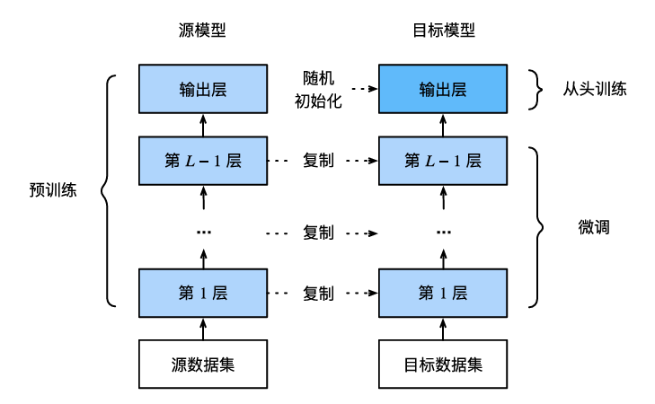

#### 

<!--more-->

# 2 微调


## 2.1 步骤

- 迁移学习中的常见技巧:微调:

    - 在源数据集（例如ImageNet数据集）上预训练神经网络模型，即源模型。

    - 创建一个新的神经网络模型，即目标模型。这将复制源模型上的所有模型设计及其参数（输出层除外）。我们假定这些模型参数包含从源数据集中学到的知识，这些知识也将适用于目标数据集。我们还假设源模型的输出层与源数据集的标签密切相关；因此不在目标模型中使用该层。

    - 向目标模型添加输出层，其输出数是目标数据集中的类别数。然后随机初始化该层的模型参数。

    - 在目标数据集（如椅子数据集）上训练目标模型。输出层将从头开始进行训练，而所有其他层的参数将根据源模型的参数进行微调。




- 当目标数据集比源数据集小得多时，微调有助于提高模型的泛化能力。

## 2.2 热狗识别


```python
%matplotlib inline
import os
import torch
import torchvision
from torch import nn
from d2l import torch as d2l

#@save
d2l.DATA_HUB['hotdog'] = (d2l.DATA_URL + 'hotdog.zip',
                            'fba480ffa8aa7e0febbb511d181409f899b9baa5')

data_dir = d2l.download_extract('hotdog')

train_imgs = torchvision.datasets.ImageFolder(os.path.join(data_dir, 'train'))
test_imgs = torchvision.datasets.ImageFolder(os.path.join(data_dir, 'test'))

# 显示前8个正类样本图片和最后8张负类样本图片。
hotdogs = [train_imgs[i][0] for i in range(8)]
not_hotdogs = [train_imgs[-i - 1][0] for i in range(8)]
d2l.show_images(hotdogs + not_hotdogs, 2, 8, scale=1.4);
```

    Downloading ..\data\hotdog.zip from http://d2l-data.s3-accelerate.amazonaws.com/hotdog.zip...
    


    

    


- 在训练期间，我们首先从图像中裁切随机大小和随机长宽比的区域，然后将该区域缩放为224×224输入图像。

- 在测试过程中，我们将图像的高度和宽度都缩放到256像素，然后裁剪中央224×224区域作为输入。

- 此外，对于RGB（红、绿和蓝）颜色通道，我们分别标准化每个通道


```python
# 通道标准化
normalize = torchvision.transforms.Normalize(
    [0.485, 0.456, 0.406], [0.229, 0.224, 0.225])
train_augs = torchvision.transforms.Compose([
    torchvision.transforms.RandomResizedCrop(224),
    torchvision.transforms.RandomHorizontalFlip(),
    torchvision.transforms.ToTensor(), normalize])
test_augs = torchvision.transforms.Compose([
    torchvision.transforms.Resize(256),
    torchvision.transforms.CenterCrop(224),
    torchvision.transforms.ToTensor(), normalize])
```

### 2.2.1 初始化模型

- 使用在ImageNet数据集上预训练的ResNet‐18作为源模型


```python
pretrained_net = torchvision.models.resnet18(pretrained=True)
```

    c:\Users\admin\miniconda3\envs\d2l\lib\site-packages\torchvision\models\_utils.py:208: UserWarning: The parameter 'pretrained' is deprecated since 0.13 and may be removed in the future, please use 'weights' instead.
      warnings.warn(
    c:\Users\admin\miniconda3\envs\d2l\lib\site-packages\torchvision\models\_utils.py:223: UserWarning: Arguments other than a weight enum or `None` for 'weights' are deprecated since 0.13 and may be removed in the future. The current behavior is equivalent to passing `weights=ResNet18_Weights.IMAGENET1K_V1`. You can also use `weights=ResNet18_Weights.DEFAULT` to get the most up-to-date weights.
      warnings.warn(msg)
    Downloading: "https://download.pytorch.org/models/resnet18-f37072fd.pth" to C:\Users\admin/.cache\torch\hub\checkpoints\resnet18-f37072fd.pth
    100.0%
    

- 预训练的源模型实例包含许多特征层和一个输出层fc。


```python
pretrained_net.fc
```


    Linear(in_features=512, out_features=1000, bias=True)


- 定义目标模型, 成员变量output的参数是随机初始化的，通常需要更高的学习率才能从头开始训练。假设Trainer实例中的学习率为η，我们将成员变量output中参数的学习率设置为10η。


```python
finetune_net = torchvision.models.resnet18(pretrained=True)
finetune_net.fc = nn.Linear(finetune_net.fc.in_features, 2)
nn.init.xavier_uniform_(finetune_net.fc.weight)
```

    c:\Users\admin\miniconda3\envs\d2l\lib\site-packages\torchvision\models\_utils.py:208: UserWarning: The parameter 'pretrained' is deprecated since 0.13 and may be removed in the future, please use 'weights' instead.
      warnings.warn(
    c:\Users\admin\miniconda3\envs\d2l\lib\site-packages\torchvision\models\_utils.py:223: UserWarning: Arguments other than a weight enum or `None` for 'weights' are deprecated since 0.13 and may be removed in the future. The current behavior is equivalent to passing `weights=ResNet18_Weights.IMAGENET1K_V1`. You can also use `weights=ResNet18_Weights.DEFAULT` to get the most up-to-date weights.
      warnings.warn(msg)
    


    Parameter containing:
    tensor([[ 0.0439, -0.0186,  0.0362,  ..., -0.0385, -0.0484,  0.1036],
            [-0.0972,  0.0208, -0.0961,  ..., -0.0462, -0.0286, -0.0326]],
           requires_grad=True)


### 2.2.2 微调模型


```python
# 如果param_group=True，输出层中的模型参数将使用十倍的学习率
def train_fine_tuning(net, learning_rate, batch_size=128, num_epochs=5,
                      param_group=True):
    train_iter = torch.utils.data.DataLoader(torchvision.datasets.ImageFolder(
        os.path.join(data_dir, 'train'), transform=train_augs),
        batch_size, shuffle=True)
    test_iter = torch.utils.data.DataLoader(torchvision.datasets.ImageFolder(
        os.path.join(data_dir, 'test'), transform=test_augs),
        batch_size)
    devices = d2l.try_all_gpus()
    loss = nn.CrossEntropyLoss(reduction="none")
    if param_group:
        params_1x = [param for name, param in net.named_parameters()
                     if name not in ['fc.weight', 'fc.bias']]
        trainer = torch.optim.SGD([{'params': params_1x},
                                   {'params': net.fc.parameters(),
                                    'lr': learning_rate * 10}],
                                  lr=learning_rate, weight_decay=0.001)
    else:
        trainer = torch.optim.SGD(net.parameters(), lr=learning_rate,
                                  weight_decay=0.001)
    d2l.train_ch13(net, train_iter, test_iter, loss, trainer, num_epochs,
                   devices)
```

- 使用较小的学习率，通过微调预训练获得的模型参数。


```python
train_fine_tuning(finetune_net, 5e-5)

```

    loss 0.247, train acc 0.911, test acc 0.939
    407.2 examples/sec on [device(type='cuda', index=0)]
    


    

    


- 为了进行比较，我们定义了一个相同的模型，但是将其所有模型参数初始化为随机值。由于整个模型需要从头开始训练，因此我们需要使用更大的学习率。


```python
scratch_net = torchvision.models.resnet18()
scratch_net.fc = nn.Linear(scratch_net.fc.in_features, 2)
train_fine_tuning(scratch_net, 5e-4, param_group=False)
```

    loss 0.357, train acc 0.853, test acc 0.843
    440.0 examples/sec on [device(type='cuda', index=0)]
    


    

    

