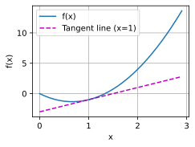
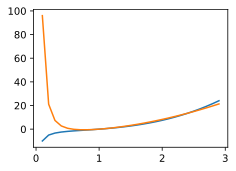

#
<!--more-->
# 4. 微积分
- 拟合模型的任务分解为两个关键问题：
    - 优化（optimization）：用模型拟合观测数据的过程；
    - 泛化（generalization）：数学原理和实践者的智慧，能够指导我们生成出有效性超出用于训练的数据集本身的模型。
## 4.1 导数和微分
- 通常选择对于模型参数可微的损失函数。简而言之，对于每个参数，如果我们把这个参数增加或减少一个无穷小的量，可以知道损失会以多快的速度增加或减少。
- 导数：$f'(x)=\lim\limits_{h\rightarrow 0}\frac{f(x+h)-f(x)}{h}=y^\prime=\frac{dy}{dx}=\frac{df}{dx}=\frac{d}{dx}f(x)=Df(x)=D_x f(x)$
    - 1)常数相乘法则：$(Cf)^\prime=C(f^\prime)$
    - 2)加法法则：$(f+g)^\prime=f^\prime+g^\prime$   
    - 3)乘法法则：$(fg)^\prime=f^\prime g+fg^\prime$
    - 4)除法法则：$(\frac{f}{g})^\prime=\frac{f^\prime g-fg^\prime}{g^2}$ 
- 微分：若$f^\prime(a)$存在，则称$f$在$a$处可微


```python
#将图形嵌入到Notebook中 %matplotlib inline

import os
os.environ["KMP_DUPLICATE_LIB_OK"]="TRUE" #这两行可以解决崩溃的错误
from IPython.display import set_matplotlib_formats
import numpy as np
import matplotlib.pyplot as plt
#from matplotlib_inline import backend_inline
from d2l import torch as d2l

#1 定义一个函数f
def f(x):
    return 3 * x ** 2 - 4 * x

#2 定义f'
def numerical_lim(f, x, h):
    return (f(x + h) - f(x)) / h
    
#一些函数
def use_svg_display(): #@save
    """使用svg格式在Jupyter中显示绘图"""
    set_matplotlib_formats('svg')
def set_figsize(figsize=(3.5, 2.5)): #@save
    """设置matplotlib的图表大小"""
    use_svg_display()
    d2l.plt.rcParams['figure.figsize'] = figsize
#@save
def set_axes(axes, xlabel, ylabel, xlim, ylim, xscale, yscale, legend):
    """设置matplotlib的轴"""
    axes.set_xlabel(xlabel)
    axes.set_ylabel(ylabel)
    axes.set_xscale(xscale)
    axes.set_yscale(yscale)
    axes.set_xlim(xlim)
    axes.set_ylim(ylim)
    if legend:
        axes.legend(legend)
    axes.grid()
#@save
def plot(X, Y=None, xlabel=None, ylabel=None, legend=None, xlim=None,ylim=None, xscale='linear', yscale='linear',fmts=('-', 'm--', 'g-.', 'r:'), figsize=(3.5, 2.5), axes=None):
    """绘制数据点"""
    if legend is None:
        legend = []
    set_figsize(figsize)
    axes = axes if axes else d2l.plt.gca()
    # 如果X有一个轴，输出True

    def has_one_axis(X):
        return (hasattr(X, "ndim") and X.ndim == 1 or isinstance(X, list) and not hasattr(X[0], "__len__"))
    if has_one_axis(X):
        X = [X]
    if Y is None:
        X, Y = [[]] * len(X), X
    elif has_one_axis(Y):
        Y = [Y]
    if len(X) != len(Y):
        X = X * len(Y)
    axes.cla()
    for x, y, fmt in zip(X, Y, fmts):
        if len(x):
            axes.plot(x, y, fmt)
        else:
            axes.plot(y, fmt)
    set_axes(axes, xlabel, ylabel, xlim, ylim, xscale, yscale, legend)

#3 绘制切线
x = np.arange(0, 3, 0.1)
plot(x, [f(x), 2 * x - 3], 'x', 'f(x)', legend=['f(x)', 'Tangent line (x=1)'])
plt.show()
```

    C:\Users\123\AppData\Local\Temp\ipykernel_13552\2373785819.py:22: DeprecationWarning: `set_matplotlib_formats` is deprecated since IPython 7.23, directly use `matplotlib_inline.backend_inline.set_matplotlib_formats()`
      set_matplotlib_formats('svg')
    


    


    


## 4.2 偏导数
- 偏导数：$f(x_1,x_2,...,x_n)$关于$x_i$的偏导数：$\frac{\partial f}{\partial x_i}=\lim\limits_{h\rightarrow 0}\frac{f(x_1,...,x_i+h,...,x_n)-f(x_1,...,x_i,...,x_n)}{h}$

## 4.3 梯度
- 梯度：$\nabla_x f(x)=[\frac{\partial f(x)}{\partial x_1},\frac{\partial f(x)}{\partial x_2},...,\frac{\partial f(x)}{\partial x_n}]^T$
- 一些性质：
    - $\forall A\in R^{m\times n},\nabla_x(Ax)=A^T$
    - $\forall A\in R^{m\times n},\nabla_x(x^TA)=A$
    - $\forall A\in R^{m\times n},\nabla_x(x^TAx)=(A+A^T)x$
    - $\nabla_x||x||_F^2=\nabla_x(x^Tx)=2x$

## 4.4 链式法则
- $y=f(u_1,u_2,...,u_m),u_i=g_i(x_1,x_2,...,x_n),则\frac{\partial y}{\partial x_i}=\sum\limits_{j=1}^m\frac{\partial y}{\partial u_j}\frac{\partial u_j}{\partial x_i}$

## 练习
- 绘制函数$y=X^3-\frac{1}{X}$在x=1处的图像


```python
import matplotlib.pyplot as plt
import numpy as np

def f(x):
    return x**3 - 1/x
x=np.arange(0,3,0.1)
plt.plot(x,f(x))
plt.plot(x,3*x**2+1/x**2-4)
plt.show()
```

    C:\Users\123\AppData\Local\Temp\ipykernel_13552\2157169762.py:5: RuntimeWarning: divide by zero encountered in divide
      return x**3 - 1/x
    C:\Users\123\AppData\Local\Temp\ipykernel_13552\2157169762.py:8: RuntimeWarning: divide by zero encountered in divide
      plt.plot(x,3*x**2+1/x**2-4)
    


    


    

