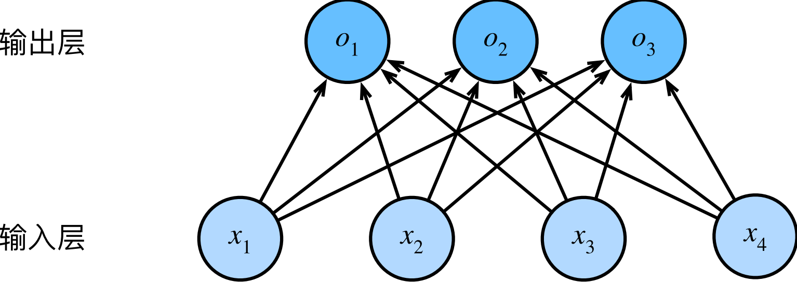

#  
<!--more-->
# 4 softmax回归
## 4.1 分类问题
- 独热编码（one-hot encoding）：$y\in{(1,0,0),(0,1,0),(0,0,1)}$
## 4.2 网络架构
- 为了解决线性模型的分类问题，需要和输出一样多的仿射函数（affine function）。$$o_1=x_1w_{11}+x_2w_{12}+x_3w_{13}+x_4w_{14}+b1$$ $$o_1=x_1w_{21}+x_2w_{22}+x_3w_{23}+x_4w_{24}+b2$$ $$o_1=x_1w_{31}+x_2w_{32}+x_3w_{33}+x_4w_{34}+b3$$

## 4.3 softmax全连接层的参数开销
- $d$个输入和$q$个输出的全连接层，参数开销为$O(dq)$
- 可以将成本减少到$O(\frac{dq}{n})$,n可以灵活指定
## 4.4 softmax运算
- softmax函数能够将未规范化的预测变换为非负数并且总和为1，同时让模型保持可导的性质。
$$\hat{y}_ j= \frac{exp(o_ j)}{ \sum_ {i=1}^ qexp(o_ i)}$$
- 尽管softmax是一个非线性函数，但softmax回归的输出仍然由输入特征的仿射变换决定。因此，softmax回归是一个线性模型（linear model）。
## 4.5 小批量样本的矢量化
- 批量：$\mathbf{X}$；特征维度：$d$；批量大小：$n$；类别数：$q$；

- 批量样本特征：$\mathbf{X}\in\mathbb{R}^{n\times d}$；权重：$\mathbf{W}\in\mathbb{R}^{d\times q}$；偏置：$\mathbf{b}\in\mathbb{R}^{1\times q}$ $$\mathbf{O}=\mathbf{XW}+\mathbf{b}$$ $$\hat{\mathbf{Y}}=\text{softmax}(\mathbf{O})$$
## 4.6 损失函数
- 使用极大似然估计
### 4.6.1 对数似然
- softmax函数输出向量$\hat{\mathbf{Y}}$：x属于各个类别的概率分布（$\hat{y}_1=P(y=猫|x),\hat{y}_2=P(y=狗|x),\hat{y}_3=P(y=鸡|x)$）
- 1）根据最大似然估计，需要最大化观测数据的联合概率。$$P(\mathbf{Y}|\mathbf{X})=\prod_{i=1}^nP(\mathbf{y}^{(i)}|\mathbf{x}^{(i)})$$
    - $\mathbf{y}^{(i)}|\mathbf{x}^{(i)}$：对于样本i，特征向量为：$\mathbf{x}^{(i)}$，标签向量为：$\mathbf{y}^{(i)}$
    - $y_j^{(i)}$：样本i的标签向量中属于类别j的概率
- 2）相当于最小化负对数似然(损失函数)：$$-\log P(\mathbf{Y}|\mathbf{X})=-\sum_{i=1}^n\log P(y^{(i)}|\mathbf{x}^{(i)})=\sum_{i=1}^nl(\mathbf{y}^{(i)},\mathbf{\hat{y}}^{(i)})$$
    - 损失函数为（交叉熵损失 cross-entropy loss）：$$l(\mathbf{y},\mathbf{\hat{y}})=-\sum_{j=1}^qy_j\log\hat{y}_j$$

        由于y是一个长度为q的独热编码向量，所以除了一个项以外的所有项j都消失了。由于所有yˆj都是预测的概率，所以它们的对数永远不会大于0。因此，如果正确地预测实际标签，即如果实际标签P(y | x) = 1，则损失函数不能进一步最小化。注意，这往往是不可能的。例如，数据集中可能存在标签噪声（比如某些样本可能被误标），或输入特征没有足够的信息来完美地对每一个样本分类。？？？

### 4.6.2 softmax及其导数
- 对损失函数：$$ \begin{aligned} l( \mathbf{y}, \mathbf{ \hat{y}}) &= - \sum_ {j=1}^ qy_ j \log \hat{y}_ j \\ &= - \sum_ {j=1}^ qy_ j \log \frac{ \exp(o_ j)}{ \sum_ {i=1}^ q \exp(o_ i)} \\ &= - \sum_ {j=1}^ q(y_ j(o_ j- \log \sum_ {i=1}^ q \exp(o_ i))) \\ &= \sum_ {j=1}^ qy_ j \log \sum_ {i=1}^ q \exp(o_ i)- \sum_ {j=1}^ qy_ jo_ j \\ &= \log \sum_ {i=1}^ q \exp(o_ i)- \sum_ {j=1}^ qy_ jo_ j \end{aligned}$$
- 损失函数对$o_j$的导数(log以e为底)：$$\frac{\partial l(\mathbf{y},\mathbf{\hat{y}})}{\partial o_j}=\frac{\exp(o_j)}{\sum_{i=1}^q\exp(o_i)}-y_j=softmax(o)_j-y_j$$
    - **这与我们在回归中看到的非常相似，其中梯度是观测值y和估计值yˆ之间的差异。这不是巧合，在任何指数族分布模型中对数似然的梯度正是由此得出的。这使梯度计算在实践中变得容易很多。**

### 4.6.3 交叉熵损失
- 对于标签$\mathbf{y}$，我们可以使用与以前相同的表示形式。唯一的区别是，我们现在用一个概率向量表示，如(0.1, 0.2, 0.7)，而不是仅包含二元项的向量(0, 0, 1)。
- 交叉熵损失（分类问题最常用）：$$l(\mathbf{y},\mathbf{\hat{y}})=-\sum_{j=1}^qy_j\log\hat{y}_j$$

## 4.7 信息论基础
- 信息论（information theory）涉及编码、解码、发送以及尽可能简洁地处理信息或数据。
### 4.7.1 熵(entropy)
$$H[P]=-\sum_{j}-P(j)\log P(j)$$
- 量化数据中的信息内容
- 为了对从分布$p$中取样的数据进行编码，至少需要$H[p]$个纳特（nat）对其进行编码。（纳特相当于比特，底数是$e$，1nat= $\frac{1}{\log(2)}$ bit）
### 4.7.2 信息量
- 压缩与预测：如果我们很容易预测下一个数据，那么这个数据就很容易压缩。
- 如果我们不能完全预测每一个事件，那么我们会感到“惊异”。克劳德·香农决定用信息量$-\log P(j)$来量化这种惊异度。在观察一个事件j时，并赋予它（主观）概率 $P(j)$。当我们赋予一个事件较低的概率时，我们的惊异会更大，该事件的信息量也就更大。
- 熵：当分配的概率真正匹配数据生成过程时的信息量的期望。

### 4.7.3 交叉熵
- 如果把熵$H(p)$当作“知道真实概率的人所经历的惊异程度”，那么交叉熵从P到Q，记为H(P, Q)。我们可以把交叉熵想象为“主观概率为Q的观察者在看到根据概率P生成的数据时的预期惊异”。当P = Q时，交叉熵达到最低。在这种情况下，从P到Q的交叉熵是H(P, P) = H(P)。
- 可以从两方面来考虑交叉熵分类目标：（i）最大化观测数据的似然；（ii）最小化传达标签所需的惊异。

## 4.8 模型预测和评估
- 使用预测概率最高的类别作为输出类别。如果预测与实际类别（标签）一致，则预测是正确的。
- 用精度（accuracy）来评估模型的性能。精度=正确个数/总个数
