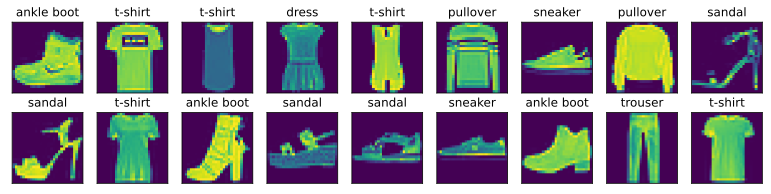

#  
<!--more-->
# 5 图像分类数据集
- MNIST是一个常见图像分类数据集，但过于简单。我们将使用一个更复杂的图像数据集Fashion-MNIST,10个类60000+10000张28*28的灰度图像。


```python
import os
os.environ['KMP_DUPLICATE_LIB_OK'] = 'True'
import torch
import torchvision
from torch.utils import data
from torchvision import transforms
from d2l import torch as d2l
d2l.use_svg_display()

```

## 5.1 读取数据集
- 我们可以通过框架中的内置函数将Fashion-MNIST下载并读取到内存中。


```python
#通过ToTensor实例将图像数据从PIL类型变换成32位浮点数格式,并除以255使得所有像素的数值均在0到1之间
trans= transforms.ToTensor()
mnist_train = torchvision.datasets.FashionMNIST(root="D:/fashionmnist", train=True, transform=trans, download=True)
mnist_test = torchvision.datasets.FashionMNIST(root="D:/fashionmnist", train=False, transform=trans, download=True)

print(len(mnist_train), len(mnist_test))
print(mnist_train[0][0].shape)

# 数字标签->文本标签
def get_fashion_mnist_labels(labels): #@save
    """返回Fashion-MNIST数据集的文本标签。"""
    text_labels = ['t-shirt', 'trouser', 'pullover', 'dress', 'coat',
                   'sandal', 'shirt', 'sneaker', 'bag', 'ankle boot']
    return [text_labels[int(i)] for i in labels]
# 可视化样本
def show_images(imgs, num_rows, num_cols, titles=None, scale=1.5): #@save
    """绘制图像列表。"""
    figsize = (num_cols * scale, num_rows * scale)
    _, axes = d2l.plt.subplots(num_rows, num_cols, figsize=figsize)
    axes = axes.flatten() # 返回一个展平的数组
    for i, (ax, img) in enumerate(zip(axes, imgs)):
        if torch.is_tensor(img):
            # 图片张量
            ax.imshow(img.numpy()) #将图片放在axes的ax位置
        else:
            # PIL图片
            ax.imshow(img)
        ax.axes.get_xaxis().set_visible(False) #不显示x轴
        ax.axes.get_yaxis().set_visible(False)
        if titles:
            ax.set_title(titles[i])
    return axes

# 可视化样本
X, y = next(iter(data.DataLoader(mnist_train, batch_size=18))) #iter()返回一个迭代器
show_images(X.reshape(18, 28, 28), 2, 9, titles=get_fashion_mnist_labels(y));
```

    60000 10000
    torch.Size([1, 28, 28])
    


    


    


## 5.2 读取小批量
- 使用内置数据迭代器，可以随机打乱所有样本


```python
# 读取小批量
batch_size = 256
def get_dataloader_workers(): #@save
    """使用4个进程来读取数据。"""
    return 4
train_iter = data.DataLoader(mnist_train, batch_size, shuffle=True, num_workers=get_dataloader_workers())

#读取数据需要的时间
timer = d2l.Timer()
for X,y in train_iter:
    continue
print(f'{timer.stop():.2f} sec')
```

    3.66 sec
    

## 5.3 整合


```python
#1 读取数据集，返回迭代器
def load_data_fashion_mnist(batch_size, resize=None): #@save
    """下载Fashion-MNIST数据集，然后将其加载到内存中"""
    trans = [transforms.ToTensor()]
    if resize:
        trans.insert(0, transforms.Resize(resize))
    trans = transforms.Compose(trans)
    mnist_train= torchvision.datasets.FashionMNIST(root="D:/fashionmnist", train=True, transform=trans, download=True)
    mnist_test = torchvision.datasets.FashionMNIST(root="D:/fashionmnist", train=False, transform=trans, download=True)
    return (data.DataLoader(mnist_train, batch_size, shuffle=True, num_workers=get_dataloader_workers()), 
            data.DataLoader(mnist_test, batch_size, shuffle=False, num_workers=get_dataloader_workers()))
#2 resize图像大小
train_iter, test_iter = load_data_fashion_mnist(32, resize=64) #resize为64
for X, y in train_iter:
    print(X.shape, X.dtype, y.shape, y.dtype)
    break
```

    torch.Size([32, 1, 64, 64]) torch.float32 torch.Size([32]) torch.int64
    
