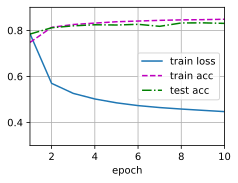
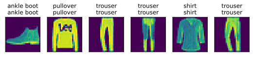

#  
<!--more-->
# 6 softmax回归从零实现


```python
import os
os.environ['KMP_DUPLICATE_LIB_OK'] = 'True'
import torch
from IPython import display
from d2l import torch as d2l

batch_size = 256
train_iter, test_iter = d2l.load_data_fashion_mnist(batch_size)
```

## 6.1 初始化模型参数


```python
num_inputs = 784
num_outputs = 10

W = torch.normal(0, 0.01, size=(num_inputs, num_outputs), requires_grad=True)
b = torch.zeros(num_outputs, requires_grad=True)
```

## 6.2 定义softmax操作
$$ softmax(\mathbf{X})_{ij} = \frac{ \exp(\mathbf{X} _{ij}) } { \sum_k \exp(\mathbf{X} _{ik}) } $$


- 1）对每个项求幂
- 2）对每一行（样本）求和，得到每个样本的规范化常数
- 3）对每一行（样本）各个项除以该常数，确保和为1
- 分母或规范化常数，有时也称为配分函数（其对数称为对数‐配分函数）。


```python
# 定义softmax操作
def softmax(X): #矩阵中的非常大或非常小的元素可能造成数值上溢或下溢，但我们没有采取措施来防止这点。
    X_exp = torch.exp(X)
    partition = X_exp.sum(1, keepdim=True)
    return X_exp / partition # 这里应用了广播机制
```

## 6.3 定义模型


```python
# 定义模型
def net(X):
    return softmax(torch.matmul(X.reshape(-1, W.shape[0]), W) + b)
```

## 6.4 定义损失函数
$$l(y_i,y_i')=-\sum_{j=1}^{q}y_{j}log(\hat{y}_{j})$$


```python
# 定义损失函数
def cross_entropy(y_hat, y): #根据交叉熵公式，yi是一个（0001）的向量，所以对于一个样本，他的交叉熵是：真实类别对应的那个概率求对数
    return -torch.log(y_hat[range(len(y_hat)), y])
```

## 6.5 分类精度


```python
# 计算正确预测的数量
def accuracy(y_hat, y): #@save
    """计算预测正确的数量。"""
    if len(y_hat.shape) > 1 and y_hat.shape[1] > 1:
        y_hat = y_hat.argmax(axis=1) #argmax(axis=1)返回矩阵每行最大值的索引
    cmp = y_hat.type(y.dtype) == y #返回一个bool矩阵
    return float(cmp.type(y.dtype).sum())
# 评估模型的准确率
def evaluate_accuracy(net, data_iter): #@save
    """计算在指定数据集上模型的精度。"""
    if isinstance(net, torch.nn.Module):
        net.eval()  # 将模型设置为评估模式
    metric = Accumulator(2)  # 正确预测数、预测总数
    with torch.no_grad():
        for X, y in data_iter:
            metric.add(accuracy(net(X), y), y.numel()) #y.numel()返回y中元素的个数
    return metric[0] / metric[1]
# 累加器
class Accumulator:  #@save
    """在`n`个变量上累加。"""
    def __init__(self, n):
        self.data = [0.0] * n
    def add(self, *args):
        self.data = [a + float(b) for a, b in zip(self.data, args)]
    def reset(self):
        self.data = [0.0] * len(self.data)
    def __getitem__(self, idx):
        return self.data[idx]

# 由于随机初始化，因此最开始的精度只有大概10%
print(evaluate_accuracy(net, test_iter))
```

    0.1141


## 6.6 训练


```python
#1 训练一个epoch
def train_epoch_ch3(net, train_iter, loss, updater):  #@save
    """训练模型一个迭代周期"""
    # 将模型设置为训练模式
    if isinstance(net, torch.nn.Module):
        net.train()
    # 训练损失总和、训练准确度总和、样本数
    metric = Accumulator(3)
    for X, y in train_iter:
        # 计算梯度并更新参数
        y_hat = net(X)
        l = loss(y_hat, y)
        if isinstance(updater, torch.optim.Optimizer):
            # 使用PyTorch内置的优化器和损失函数
            updater.zero_grad()
            l.mean.backward() #l.mean()返回l中所有元素的均值
            updater.step()
        else:
            # 使用定制的优化器和损失函数
            l.sum().backward() #l.sum()返回l中所有元素的和
            updater(X.shape[0])
        metric.add(float(l.sum()), accuracy(y_hat, y), y.numel()) #记录损失、准确率、样本数
    # 返回训练损失和训练准确率
    return metric[0] / metric[2], metric[1] / metric[2] #因为损失做了sum，所以要除以样本数

#画图程序
class Animator: #@save
    """在动画中绘制数据"""
    def __init__(self, xlabel=None, ylabel=None, legend=None, xlim=None,
                 ylim=None, xscale='linear', yscale='linear',
                 fmts=('-', 'm--', 'g-.', 'r:'), nrows=1, ncols=1,
                 figsize=(3.5, 2.5)):
        # 增量地绘制多条线
        if legend is None:
            legend = []
        d2l.use_svg_display()
        self.fig, self.axes = d2l.plt.subplots(nrows, ncols, figsize=figsize)
        if nrows * ncols == 1:
            self.axes = [self.axes,]
        # 使用lambda函数捕获参数
        self.config_axes = lambda: d2l.set_axes(self.axes[
            0], xlabel, ylabel, xlim, ylim, xscale, yscale, legend)
        self.X, self.Y, self.fmts = None, None, fmts
    def add(self,x,y):
        # 向图表中添加多个数据点
        if not hasattr(y, "__len__"):
            y = [y]
        n = len(y)
        if not hasattr(x, "__len__"):
            x = [x] * n
        if not self.X:
            self.X = [[] for _ in range(n)]
        if not self.Y:
            self.Y = [[] for _ in range(n)]
        for i, (a, b) in enumerate(zip(x, y)):
            if a is not None and b is not None:
                self.X[i].append(a)
                self.Y[i].append(b)
        self.axes[0].cla()
        for x, y, fmt in zip(self.X, self.Y, self.fmts):
            self.axes[0].plot(x, y, fmt)
        self.config_axes()
        display.display(self.fig)
        display.clear_output(wait=True)

#2 训练函数
def train_ch3(net, train_iter, test_iter, loss, num_epochs, updater):  #@save
    """训练模型"""
    animator = Animator(xlabel='epoch', xlim=[1, num_epochs], ylim=[0.3, 0.9],
                        legend=['train loss', 'train acc', 'test acc'])
    for epoch in range(num_epochs):
        train_metrics = train_epoch_ch3(net, train_iter, loss, updater)
        test_acc = evaluate_accuracy(net, test_iter)
        animator.add(epoch + 1, train_metrics + (test_acc,)) #记录epoch,训练损失、训练准确率、测试准确率
    train_loss, train_acc = train_metrics
    assert train_loss < 0.5, train_loss #如果train_loss大于0.5，说明模型训练失败
    assert train_acc <= 1 and train_acc > 0.7, train_acc
    assert test_acc <= 1 and test_acc > 0.7, test_acc

#3 优化器
lr = 0.1
def updater(batch_size):
    return d2l.sgd([W, b], lr, batch_size)

#4 训练
num_epochs = 10
train_ch3(net, train_iter, test_iter, cross_entropy, num_epochs, updater)
```


​    


​    


# 6.7 预测


```python
def predict_ch3(net, test_iter, n=6): #@save
    """预测标签"""
    for X, y in test_iter:
        break
    trues = d2l.get_fashion_mnist_labels(y)
    preds = d2l.get_fashion_mnist_labels(net(X).argmax(axis=1))
    titles = [true + '\n' + pred for true, pred in zip(trues, preds)]
    d2l.show_images(X[0:n].reshape((n, 28, 28)), 1, n, titles=titles[0:n])
predict_ch3(net, test_iter)
```


​    


​    

