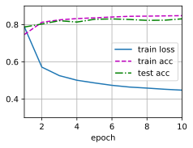

#
<!--more-->
# 7 softmax回归简洁实现


```python
import os
os.environ['KMP_DUPLICATE_LIB_OK']='True'
import torch
from torch import nn
from d2l import torch as d2l

batch_size = 256
train_iter, test_iter = d2l.load_data_fashion_mnist(batch_size)
```

## 7.1 初始化模型参数


```python
#1 初始化模型参数
# pytorch不会隐式地调整输入的形状，因此我们在线性层前定义展平层来调整网络输入的形状
net = nn.Sequential(nn.Flatten(), nn.Linear(28*28, 10))

def init_weights(m):
    if type(m) == nn.Linear:
        nn.init.normal_(m.weight, std=0.01)

net.apply(init_weights)
```


    Sequential(
      (0): Flatten(start_dim=1, end_dim=-1)
      (1): Linear(in_features=784, out_features=10, bias=True)
    )


## 7.2 优化softmax计算
- 为了防止溢出，我们先将每个元素减去该行的最大值（每个$o_k$按常数进行移动不会改变softmax的输出）。$$\begin{aligned} \hat{y}_ j &= \frac{\exp(o_ j)}{ \sum_{i=1}^ q \exp(o_ i)} \\ &= \frac{ \exp(o_ j - \max(o)) \exp( \max(o))}{ \sum_ {i=1}^ q \exp(o_ i - \max(o)) \exp( \max(o))} \\ &= \frac{ \exp(o_ j - \max(o))}{ \sum_ {i=1}^ q \exp(o_ i - \max(o))} \end{aligned}$$
- 有些oj − max(ok)具有较大的负值。由于精度受限，exp(oj − max(ok))将有接近零的值，即下溢（underflow）。这些值可能会四舍五入为零，使$\hat{y}_ j$为零，并且使得$log(\hat{y}_ j )$的值为-inf。反向传播几步后，我们可能会发现自己面对一屏幕可怕的nan结果。
- 通过将softmax和交叉熵结合在一起，可以避免反向传播过程中可能会困扰我们的数值稳定性问题。避免计算$\exp{o_j-\max(o_k)}$,因为log与exp抵消了
 $$\begin{aligned} log( \hat{y}_ j) &= log \left( \frac{ \exp(o_ j - \max(o_ k))}{ \sum_{k=1}^ q \exp(o_ k - \max(o_ k))} \right) \\ &= log( \exp(o_ j -  \max(o_ k))) - log( \sum_ {k=1}^ q \exp(o_ k -  \max(o_ k))) \\ &= o_ j - \max(o_ k) - log( \sum_ {k=1}^ q \exp(o_ k - \max(o_ k))) \end{aligned}$$


```python
#2 损失函数
loss = nn.CrossEntropyLoss(reduction='none') # reduction='none'表示返回每个样本的损失

#3 优化算法
trainer = torch.optim.SGD(net.parameters(), lr=0.1)

#4 训练
num_epochs = 10
d2l.train_ch3(net, train_iter, test_iter, loss, num_epochs, trainer)
```


    


    

