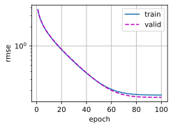
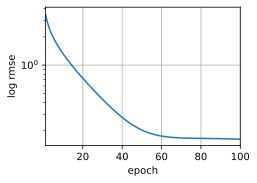

#  
<!--more-->
# 10 kaggle:预测房价
## 10.1 下载和缓存数据集


```python
import hashlib
import os
import tarfile
import zipfile
import requests

#@save
DATA_HUB = dict() #字典，将数据集名称的字符串映射到数据集相关的二元组上，每个二元组包含数据集的url和校验和密钥
DATA_URL = 'http://d2l-data.s3-accelerate.amazonaws.com/' #所有类似的数据集都托管在这个地址上

def download(name, cache_dir=os.path.join('data')): #@save
    """下载一个DATA_HUB中的文件，返回本地文件名。"""
    assert name in DATA_HUB, f"{name}不存在于{DATA_HUB}"
    url, sha1_hash = DATA_HUB[name]
    os.makedirs(cache_dir, exist_ok=True)
    fname = os.path.join(cache_dir, url.split('/')[-1]) #取出url中最后一个/后面的字符串，作为文件名
    if os.path.exists(fname):
        sha1 = hashlib.sha1()
        with open(fname, 'rb') as f:
            while True:
                data = f.read(1048576) # 读取1MB数据
                if not data:
                    break
                sha1.update(data)
        if sha1.hexdigest() == sha1_hash:
            return fname #命中缓存

    print(f'正在从{url}下载{fname}...')
    r = requests.get(url, stream=True, verify= True)
    with open(fname, 'wb') as f:
        f.write(r.content)
    return fname

def download_extract(name, folder=None): #@save
    """下载并解压zip/tar文件"""
    fname = download(name)
    base_dir = os.path.dirname(fname)
    data_dir, ext = os.path.splitext(fname)
    if ext =='.zip':
        fp = zipfile.ZipFile(fname, 'r')
    elif ext in ('.tar', '.gz'):
        fp = tarfile.open(fname, 'r')
    else:
        assert False, '只有zip/tar文件可以被解压缩'
    fp.extractall(base_dir)
    return os.path.join(base_dir, folder) if folder else data_dir

def download_all(): #@save
    """下载DATA_HUB中的所有文件"""
    for name in DATA_HUB:
        download(name)
```

## 10.2 访问和读取数据集


```python

#读入并处理数据
import numpy as np
import pandas as pd
import torch
from torch import nn
from d2l import torch as d2l

DATA_HUB['kaggle_house_train']=( #@save
    DATA_URL + 'kaggle_house_pred_train.csv',
    '585e9cc93e70b39160e7921475f9bcd7d31219ce')
DATA_HUB['kaggle_house_test'] = (#@save
    DATA_URL + 'kaggle_house_pred_test.csv',
    'fa19780a7b011d9b009e8bff8e99922a8ee2eb90')

### 1. 加载数据集
train_data = pd.read_csv(download('kaggle_house_train'))
test_data = pd.read_csv(download('kaggle_house_test'))
#输出维度
print(train_data.shape)
print(test_data.shape)
#输出前四个特征、最后两个特征、标签
print(train_data.iloc[0:4, [0, 1, 2, 3, -3, -2, -1]])
#去掉id列
all_features = pd.concat((train_data.iloc[:,1:-1], test_data.iloc[:,1:]))
```

    正在从http://d2l-data.s3-accelerate.amazonaws.com/kaggle_house_pred_train.csv下载data\kaggle_house_pred_train.csv...
    正在从http://d2l-data.s3-accelerate.amazonaws.com/kaggle_house_pred_test.csv下载data\kaggle_house_pred_test.csv...
    (1460, 81)
    (1459, 80)
       Id  MSSubClass MSZoning  LotFrontage SaleType SaleCondition  SalePrice
    0   1          60       RL         65.0       WD        Normal     208500
    1   2          20       RL         80.0       WD        Normal     181500
    2   3          60       RL         68.0       WD        Normal     223500
    3   4          70       RL         60.0       WD       Abnorml     140000


## 10.3 数据预处理
- 缺失值用均值代替
- 为了将所有特征放到一个共同的尺度上，将特征缩放到均值为0，单位方差：
$$x \leftarrow \frac{x-\mu} \sigma$$
- 标准化数据有两个原因：
    - 方便优化
    - 因为我们不知道哪些特征是相关的，所以我们不想让惩罚分配给一个特征的系数比分配给其他任何特征的系数更大
- 离散值处理：独热编码：如MSZoning列包含值：‘RL’和‘RM’。创建两个新的指标列MSZoning_RL和MSZoning_RM，值为0，1.可以用pandas自动实现


```python
## 2标准化
numeric_features = all_features.dtypes[all_features.dtypes != 'object'].index #取出数值特征的索引
all_features[numeric_features] = all_features[numeric_features].apply(
    lambda x:(x-x.mean())/ x.std()
)
#缺失值设为0
all_features[numeric_features] = all_features[numeric_features].fillna(0)

## 3离散值处理
#‘dummy_na=True’将缺失值也当作合法的特征值并为其创建指示特征
all_features = pd.get_dummies(all_features, dummy_na=True)
print(all_features.shape) #特征数量从79 -> 331

## 3转换为张量
n_train = train_data.shape[0]
train_features = torch.tensor(all_features[:n_train].values, dtype= torch.float32)
test_features = torch.tensor(all_features[n_train:].values, dtype=torch.float32)
train_labels = torch.tensor(
    train_data.SalePrice.values.reshape(-1,1), dtype=torch.float32
)
```

    (2919, 331)


## 10.4 训练
- 先训练一个带有损失平方的线性模型，线性模型可以提供一种健全性检查，以查看数据中是否存在有意义的信息。如果线性模型不能做得比随机猜测更好，那么可能存在数据处理错误。如果一切顺利，线性模型可以作为基线模型（baseline）
- Adam优化器主要吸引力在于对初始学习率不那么敏感


```python
loss= nn.MSELoss()
in_features = train_features.shape[1]
def get_net():
    net = nn.Sequential(nn.Linear(in_features,1))
    return net
```

- 对于误差，更关心相对误差，例如北京房价预测差了10万与阳新放假预测差了10万是不同的。
- 可以用价格预测的对数来衡量差异。将$\sigma for |log y - log \hat y|$转换为$e^{-\sigma} \leq \frac{\hat y}{y} \leq e^{\sigma}$这使得预测价格的对数与真实标签价格的对数之间出现以下均方根误差：
$$\sqrt{\frac1n\sum_{i=1}^n\left(\log y_i-\log\hat{y}_i\right)^2}$$


```python
def log_rmse(net, features, labels):
    # 为了在取对数时进一步稳定该值，将小于1的值设置为1
    clipped_preds = torch.clamp(net(features), 1, float('inf'))
    rmse = torch.sqrt(loss(torch.log(clipped_preds), torch.log(labels)))
    return rmse.item()

def train(net, train_features, train_labels, test_features, test_labels,
          num_epochs, learning_rate, weight_decay, batch_size):
    train_ls, test_ls = [], []
    train_iter = d2l.load_array((train_features,train_labels),batch_size)
    optimizer = torch.optim.Adam(net.parameters(),
                                lr =learning_rate,
                                weight_decay=weight_decay)
    for epoch in range(num_epochs):
        for X,y in train_iter:
                optimizer.zero_grad()
                l = loss(net(X), y)
                l.backward()
                optimizer.step()
        train_ls.append(log_rmse(net, train_features,train_labels))
        if test_labels is not None:
                test_ls.append(log_rmse(net, test_features,test_labels))
    return train_ls, test_ls

```

## 10.5 K折交叉验证
- 有助于模型选择和超参数调整。我们首先需要定义一个函数，在K折交叉验证过程中返回第i折的数据。具体地说，它选择第i个切片作为验证数据，其余部分作为训练数据。每次在K − 1个子集上进行训练，并在剩余的一个子集上进行验证。


```python
def get_k_fold_data(k, i, X, y):
    assert k > 1
    fold_size = X.shape[0] // k
    X_train, y_train = None, None
    for j in range(k):
        idx = slice(j * fold_size, (j + 1) * fold_size)
        X_part, y_part = X[idx, :], y[idx]
        if j ==i:
            X_valid, y_valid = X_part, y_part
        elif X_train is None:
            X_train, y_train = X_part, y_part
        else:
            X_train = torch.cat([X_train, X_part], 0)
            y_train = torch.cat([y_train, y_part], 0)
    return X_train, y_train, X_valid, y_valid
```

- 训练K次，并返回训练和验证误差的平均值


```python
import os
os.environ['KMP_DUPLICATE_LIB_OK'] = 'True'
def k_fold(k, X_train, y_train, num_epochs, learning_rate, weight_decay, batch_size):
    train_l_sum, valid_l_sum = 0, 0
    for i in range(k):
        data = get_k_fold_data(k, i, X_train, y_train)
        net = get_net()
        train_ls, valid_ls = train(net, *data, num_epochs, learning_rate, weight_decay, batch_size)
        train_l_sum += train_ls[-1]
        valid_l_sum += valid_ls[-1]
        if i == 0:
            d2l.plot(list(range(1, num_epochs + 1)), [train_ls, valid_ls],
                     xlabel='epoch', ylabel='rmse',
                     legend=['train', 'valid'], yscale='log')
        print(f'折{i + 1}, 训练log rmse {float(train_ls[-1]):f}, '
              f'验证log rmse {float(valid_ls[-1]):f}')
    return train_l_sum / k, valid_l_sum / k
```

## 10.6 模型选择
- 使用未调优的超参数


```python
k, num_epochs, lr, weight_decay, batch_size=5, 100, 5, 0, 64
train_l, valid_l= k_fold(k, train_features, train_labels,num_epochs,lr,
                         weight_decay, batch_size)
print(f'{k}-折验证：平均训练log rmse：{float(train_l):f},'
      f'平均验证log rmse：{float(valid_l):f}')
```

    折1, 训练log rmse 0.170100, 验证log rmse 0.156652
    折2, 训练log rmse 0.162041, 验证log rmse 0.188112
    折3, 训练log rmse 0.163980, 验证log rmse 0.168341
    折4, 训练log rmse 0.167889, 验证log rmse 0.154215
    折5, 训练log rmse 0.163577, 验证log rmse 0.183105
    5-折验证：平均训练log rmse：0.165517,平均验证log rmse：0.170085

   


​    


## 10.7 提交Kaggle预测
- 使用所有的数据进行训练，将预测保存在csv文件


```python
def train_and_pred(train_features, test_features, train_labels, test_data,
                   num_epochs, lr, weight_decay, batch_size):
    net = get_net()
    train_ls, _ = train(net, train_features, train_labels, None,None,
                        num_epochs, lr, weight_decay, batch_size)
    d2l.plot(np.arange(1, num_epochs+1), [train_ls], xlabel='epoch',
             ylabel='log rmse', xlim=[1, num_epochs], yscale='log')
    print(f'训练log rmse:{float(train_ls[-1]):f}')
    #将网络用于测试集
    preds = net(test_features).detach().numpy()
    # 将其重新格式化以导出到kaggle
    test_data['SalePrice']=pd.Series(preds.reshape(1, -1)[0])
    submission = pd.concat([test_data['Id'], test_data['SalePrice']], axis=1)
    submission.to_csv('submission.csv', index=False)

train_and_pred(train_features, test_features, train_labels,test_data,
               num_epochs, lr, weight_decay, batch_size)
```

    训练log rmse:0.162509




    

