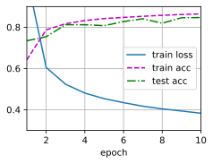
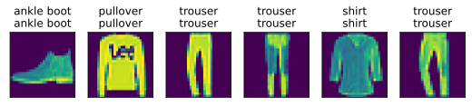

#
<!--more-->
# 2 多层感知机实现


```python
import os
os.environ['KMP_DUPLICATE_LIB_OK'] = 'True'
import torch
from torch import nn
from d2l import torch as d2l

batch_size = 256
train_iter, test_iter = d2l.load_data_fashion_mnist(batch_size)

#1 初始化模型参数
num_inputs, num_outputs, num_hiddens = 28*28, 10, 256
W1 = nn.Parameter(torch.randn(num_inputs, num_hiddens, requires_grad=True) * 0.01)
b1 = nn.Parameter(torch.zeros(num_hiddens, requires_grad=True))
W2 = nn.Parameter(torch.randn(num_hiddens, num_outputs, requires_grad=True) * 0.01)
b2 = nn.Parameter(torch.zeros(num_outputs, requires_grad=True))
params = [W1, b1, W2, b2]

#2 激活函数
def relu(X):
    a = torch.zeros_like(X)
    return torch.max(X, a)

#3 模型
def net(X):
    X = X.reshape(-1, num_inputs)
    H = relu(X @ W1 + b1) # @代表矩阵乘法
    return (H @ W2 + b2)

#4 损失函数
loss = nn.CrossEntropyLoss(reduction='none')

#5 训练
num_epochs, lr = 10, 0.1
updater = torch.optim.SGD(params, lr=lr)
d2l.train_ch3(net, train_iter, test_iter, loss, num_epochs, updater)

#6 预测
d2l.predict_ch3(net, test_iter)
```


    


    


    


    

