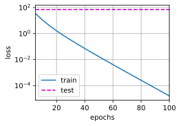
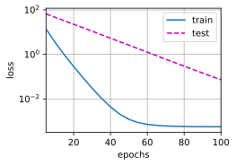
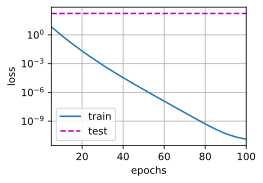
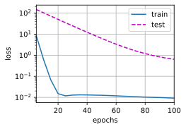

#
<!--more-->

# 5 权重衰减

- 缓解过拟合：
    - 更多数据
    - 正则化技术
- 权重衰减也称$L_2$正则化,通过函数与零的距离来衡量函数的复杂度。如何精确地测量一个函数和零之间的距离呢？一种简单的方法是通过线性函数 f(x) = w⊤x 中的权重向量的某个范数来度量其复杂性，例如$||W||^2$。将权重向量作为惩罚项加入损失函数。原始的损失：
$$L(\mathbf{w},b)=\frac{1}{n}\sum\limits^{n}_{i=1}\frac{1}{2}(\mathbf{w}^T\mathbf{x}^{(1)}+b-y^{(i)})^2$$
- 加入惩罚项
$$L=L(\mathbf{w},b)+\frac{\lambda}{2}||\mathbf{w}||^2$$
- 除以2是为了求导时消掉，让表达式更简单。使用平方范数而不是标准范数（欧几里得距离）是为了便于计算，且它对权重向量的大分量施加了巨大的惩罚，这使得我们的学习算法偏向于在大量特征上均匀分布权重的模型。相比之下，L1惩罚会导致模型将权重集中在一小部分特征上，而将其他
权重清除为零。这称为特征选择（feature selection）
- 加入正则化项后的梯度更新：
$$\mathbf{w} \leftarrow (1-\eta \lambda)\mathbf{w}-\frac{\eta}{| \Beta |}\sum\limits_{ i\in \Beta }\mathbf{x}^{(i)}(\mathbf{w}^T\mathbf{x}^{(i)}+b-y^{(i)})$$
## 5.1 高维线性回归(实现权重衰减)
$$ y= 0.05+ \sum\limits^{d}_{i=1}0.01x_i+\epsilon, \epsilon \in N(0,0.01^2)$$


```python
import os
os.environ['KMP_DUPLICATE_LIB_OK']='True'
import torch
from torch import nn
from d2l import torch as d2l

n_train, n_test, num_inputs, batch_size = 20, 100, 200, 5
true_w, true_b = torch.ones((num_inputs, 1)) * 0.01, 0.05
traind_data = d2l.synthetic_data(true_w, true_b, n_train)
traind_iter = d2l.load_array(traind_data, batch_size)
test_data = d2l.synthetic_data(true_w, true_b, n_test)
test_iter = d2l.load_array(test_data, batch_size, is_train=False)

#1 初始化模型参数
def init_params():
    w = torch.normal(0, 1, size=(num_inputs, 1), requires_grad=True)
    b = torch.zeros(1, requires_grad=True)
    return [w, b]

#2 定义L2范数惩罚
def l2_penalty(w):
    return torch.sum(w.pow(2)) / 2

#3 定义训练代码
def train(lambd):
    w, b = init_params()
    net, loss = lambda X: d2l.linreg(X, w, b), d2l.squared_loss
    num_epochs, lr = 100, 0.003
    animator = d2l.Animator(xlabel='epochs', ylabel='loss', yscale='log', xlim=[5, num_epochs], legend=['train', 'test'])
    for epoch in range(num_epochs):
        for X, y in traind_iter:
            l = loss(net(X), y) + lambd * l2_penalty(w) #计算损失后加上L2范数惩罚项
            l.sum().backward()
            d2l.sgd([w, b], lr, batch_size)
        if (epoch + 1) % 5 == 0:
            animator.add(epoch + 1, (d2l.evaluate_loss(net, traind_iter, loss), d2l.evaluate_loss(net, test_iter, loss)))
    print('w的L2范数是：', torch.norm(w).item())

#4 测试
train(lambd=0) #没有使用权重衰减
```

    w的L2范数是： 12.524763107299805




    


```python
train(lambd=3) #使用权重衰减
```

    w的L2范数是： 0.3719361424446106




    


## 5.2 简洁实现
- 通常将权重衰减集成到优化算法中，以便与任何损失函数结合使用，并允许在不增加任何额外的计算开销的情况下向算法中添加权重衰减。


```python
def train_concise(wd):
    net = nn.Sequential(nn.Linear(num_inputs, 1))
    for param in net.parameters():
        param.data.normal_()
    loss = nn.MSELoss(reduction='none')
    num_epochs, lr = 100, 0.003
    # 偏置参数没有衰减
    trainer = torch.optim.SGD([
        { "params": net[0].weight, 'weight_decay': wd}, 
        { "params": net[0].bias}], lr=lr)
    animator = d2l.Animator(xlabel='epochs', ylabel='loss', yscale='log', xlim=[5, num_epochs], legend=['train', 'test'])
    for epoch in range(num_epochs):
        for X, y in traind_iter:
            trainer.zero_grad()
            l = loss(net(X), y).mean()
            trainer.zero_grad()
            l.backward()
            trainer.step()
        if (epoch + 1) % 5 == 0:
            animator.add(epoch + 1, (d2l.evaluate_loss(net, traind_iter, loss), d2l.evaluate_loss(net, test_iter, loss)))
    print('w的L2范数：', net[0].weight.norm().item())

train_concise(0)
```

    w的L2范数： 12.297795295715332




    


```python
train_concise(3)
```

    w的L2范数： 0.40956297516822815




    

