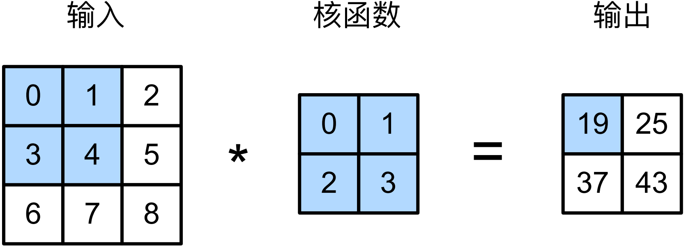

#  
<!--more-->
# 2 图像卷积
## 2.1 互相关运算
- 卷积层表达的运算其实是相关运算（cross-correlation），而不是卷积运算。在卷积层中，输入张量与核张量通过互相关运算产生输出张量。


- 计算0 × 0 + 1 × 1 + 3 × 2 + 4 × 3 = 19
- 假设输入：$n_h \times n_w$，卷积核：$k_h \times k_w$，输出：$n_h - k_h + 1 \times n_w - k_w + 1$


```python
import torch
from torch import nn
from d2l import torch as d2l

# 二维卷积
def corr2d(X, K): #@save
    '''计算二维互相关运算'''
    h, w = K.shape
    Y = torch.zeros((X.shape[0] - h + 1, X.shape[1] - w +1))
    for i in range(Y.shape[0]): #卷积核横向移动多少次
        for j in range(Y.shape[1]): #卷积核纵向移动多少次
            Y[i,j] = (X[i:i+h, j:j+w] * K).sum()
    return Y
X = torch.tensor([[0.0, 1.0, 2.0], [3.0, 4.0, 5.0], [6.0, 7.0, 8.0]])
K = torch.tensor([[0.0, 1.0], [2.0, 3.0]])
print(corr2d(X, K))
```

    tensor([[19., 25.],
            [37., 43.]])
    

## 2.2 卷积层
- 卷积层对输入和卷积核权重进行互相关运算，并加上偏置后产生输出。
- 卷积层需要学习的参数是卷积核权重和偏置。
- 对于卷积核为h × w的卷积层，也成为h × w卷积层。


```python
# 卷积层
class Conv2D(nn.Module):
    def __init__(self, kernel_size) -> None:
        super().__init__()
        self.weight = nn.Parameter(torch.rand(kernel_size))
        self.bias = nn.Parameter(torch.zeros(1))
    def forward(self, x):
        return corr2d(x, self.weight) + self.bias
```

## 2.3 图像中目标的边缘检测
- 卷积层的一个应用：通过找到像素变化的位置，检测图像中不同颜色的边缘。


```python
X = torch.ones((6,8))
X[:, 2:6] = 0 #黑白图像，中间四列为黑色，其余为白色
print(X)
K = torch.tensor([[1.0, -1.0]]) #1*2卷积核，如果水平向量的两元素相同，则输出0，否则输出非1
Y = corr2d(X,K)
print(Y)
#将X转置后，无法检测出水平边缘
Y2 = corr2d(X.t(), K)
print(Y2)
```

    tensor([[1., 1., 0., 0., 0., 0., 1., 1.],
            [1., 1., 0., 0., 0., 0., 1., 1.],
            [1., 1., 0., 0., 0., 0., 1., 1.],
            [1., 1., 0., 0., 0., 0., 1., 1.],
            [1., 1., 0., 0., 0., 0., 1., 1.],
            [1., 1., 0., 0., 0., 0., 1., 1.]])
    tensor([[ 0.,  1.,  0.,  0.,  0., -1.,  0.],
            [ 0.,  1.,  0.,  0.,  0., -1.,  0.],
            [ 0.,  1.,  0.,  0.,  0., -1.,  0.],
            [ 0.,  1.,  0.,  0.,  0., -1.,  0.],
            [ 0.,  1.,  0.,  0.,  0., -1.,  0.],
            [ 0.,  1.,  0.,  0.,  0., -1.,  0.]])
    tensor([[0., 0., 0., 0., 0.],
            [0., 0., 0., 0., 0.],
            [0., 0., 0., 0., 0.],
            [0., 0., 0., 0., 0.],
            [0., 0., 0., 0., 0.],
            [0., 0., 0., 0., 0.],
            [0., 0., 0., 0., 0.],
            [0., 0., 0., 0., 0.]])
    

## 2.4 学习卷积核
- 构造一个卷积层，随机初始化卷积核，通过计算Y与卷积层输出的平方误差更新。


```python
conv2d = nn.Conv2d(1,1,kernel_size=(1,2), bias=False) #忽略偏置，通道数为1
X = X.reshape((1,1,6,8)) #batch_size, channel, height, width
Y = Y.reshape((1,1,6,7)) #卷积后输出会缩小
lr = 3e-2 # 学习率

for i in range(10):
    Y_hat = conv2d(X)
    l = (Y_hat - Y) ** 2
    conv2d.zero_grad()
    l.sum().backward()
    # 迭代卷积核
    conv2d.weight.data[:] -= lr * conv2d.weight.grad #w=w-lr*grad
    if (i+1) % 2 == 0:
        print(f'epoch{i+1}, loss{l.sum():.3f}')
# 跌倒多次后，误差已经足够低，查看卷积核权重
print(conv2d.weight.data)
```

    epoch2, loss12.452
    epoch4, loss3.237
    epoch6, loss1.013
    epoch8, loss0.363
    epoch10, loss0.140
    tensor([[[[ 0.9478, -1.0233]]]])
    

## 2.5 互相关和卷积
- 卷积运算与互相关运算差别不大，只需要水平和垂直翻转二维卷积核张量，然后对输入张量进行互相关运算。
## 2.6 特征映射和感受野
- 输出的卷积层有时被称为特征映射（feature map），因为它可以被视为一个输入映射到下一层的空间维度的转换器。
- 在卷积神经网络中，对于某一层的任意元素x，其感受野（receptivefield）是指在前向传播期间可能影响x计算的所有元素（来自所有先前层）
- 感受野可能大于输入的实际大小。如图，如果在后面再加一个2×2的卷积层，输出就是1×1，但是感受野是3×3（原始输入）。
