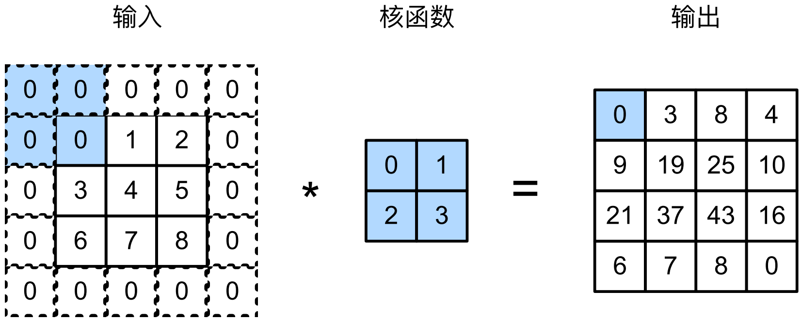
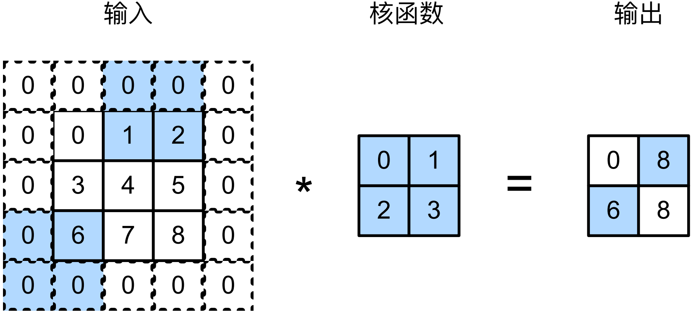

#
<!--more-->
# 3 填充和步幅
- 卷积的输出形状取决于输入形状和卷积核。
- 填充：卷积后图像越来越小，会丢失原始图像的边界信息。
- 步幅：我们希望大幅降低图像的高度和宽度。
## 3.1 填充（padding）
- 在输入图像的边界填充元素（通常是0）


- 通常卷积核的高度和宽度为奇数（如果为偶数，则上下填充的层数会差1）
- 对于任何二维张量X，当：
    - 卷积核大小为奇数
    - 所有边的padding层数相等
    - 输出与输入具有相同高度和宽度
    
    有：输出Y[i,j]是通过以输入X[i,j]为中心，与卷积核进行互相关计算得到的。


```python
import torch
from torch import nn

def comp_conv2d(conv2d, X):
    X = X.reshape((1,1) + X.shape) #(1,1): 扩展两个维度：batch和channel。得到(1,1,8,8)
    Y = conv2d(X)
    return Y.reshape(Y.shape[2:]) #省略前两个维度：batch和channel
conv2d = nn.Conv2d(1,1,kernel_size=3,padding=1)
X = torch.rand(size=(8,8)) #输入8*8
s = comp_conv2d(conv2d, X).shape #输出8*8
print(s)
```

    torch.Size([8, 8])
    

- 当高度和宽度不同时，可以填充不同的高度和宽度，使用5*3的卷积核，高度宽度填充为2和1


```python
conv2d = nn.Conv2d(1,1,kernel_size=(5,3),padding=(2,1))
s = comp_conv2d(conv2d, X).shape
print(s)
```

    torch.Size([8, 8])
    

## 3.2 步幅（stride）
- 有时为了高效计算或是缩减采样次数
- 卷积核每次滑动的行数和列数


- 输入：$n_h \times n_w$，卷积核：$k_h \times k_w$，填充：$p_h \times p_w$，步幅：$s_h \times s_w$
- 输出：$o_h \times o_w$，$o_h = \lfloor \frac{n_h + p_h - k_h}{s_h} + 1 \rfloor$，$o_w = \lfloor \frac{n_w + p_w - k_w}{s_w} + 1 \rfloor$
- 如果我们设置了$p_h = k_h - 1$和$p_w = k_w - 1$
    - 那么输出形状将简化为$\lfloor \frac{n_h + s_h - 1}{s_h} \rfloor \times \lfloor \frac{n_w + s_w - 1}{s_w} \rfloor$
    - 如果输入的高度和宽度（$n_h$和$n_w$）可以被步幅整除，那么输出：$\frac{n_h}{s_h} \times \frac{n_w}{s_w}$
- 实践中，我们很少使用不一致的padding和stride


```python
# 缩小一倍
conv2d = nn.Conv2d(1,1,kernel_size=3,padding=1,stride=2)
s = comp_conv2d(conv2d, X).shape
print(s)

conv2d = nn.Conv2d(1,1,kernel_size=(3,5),padding=(0,1),stride=(3,4))
s = comp_conv2d(conv2d, X).shape
print(s)
```

    torch.Size([4, 4])
    torch.Size([2, 2])
    
