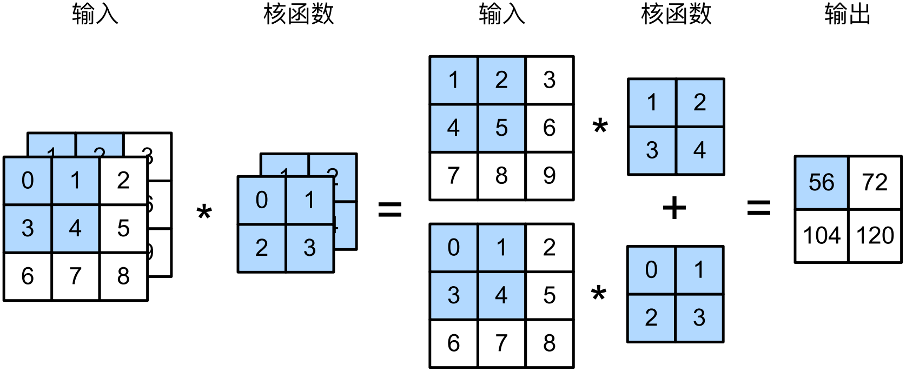
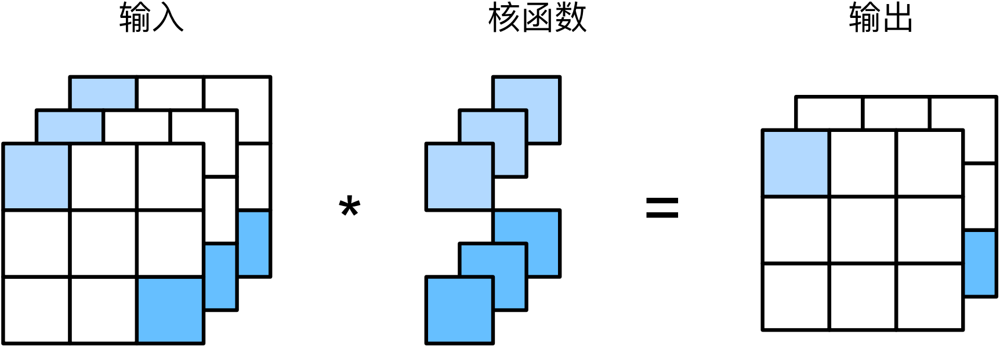

#  
<!--more-->
# 4 多输入多输出通道
## 4.1 多输入通道
- 对每个通道分别进行互现观运算，然后按通道相加



```python
import torch
from d2l import torch as d2l

def corr2d_multi_in(X,K):
    # 先遍历X和K的第0个维度（channel），再把它们加在一起
    return sum(d2l.corr2d(x,k) for x,k in zip(X,K))

# 验证上图
X = torch.tensor([[[0.0,1.0,2.0],[3.0,4.0,5.0],[6.0,7.0,8.0]],
                  [[1.0,2.0,3.0],[4.0,5.0,6.0],[7.0,8.0,9.0]]])
K = torch.tensor([[[0.0,1.0],[2.0,3.0]],[[1.0,2.0],[3.0,4.0]]])
y = corr2d_multi_in(X,K)
print(y)
```

    tensor([[ 56.,  72.],
            [104., 120.]])
    

## 4.2 多输出通道
- 在流行的网络架构中，随着层数的加深，通常会增加输出通道的维数，通过减少空间分辨率以获得更大的通道深度。
- 可以将每个通道看作对不同特征的响应。而现实可能更为复杂，因为每个通道不是独立学习的，而是为了共同使用而优化的。
- 输入通道数$c_i$，输出通道数$c_o$
    - 对于一个输入通道：卷积核：$c_i \times k_h \times k_w$，卷积后相加获得一个二维张量。
    - 卷积核：$c_o \times c_i \times k_h \times k_w$输出通道$c_o$


```python
def corr2d_multi_in_out(X,K):
    # 迭代K的第0个维度，每次都对输入X执行互相关运算
    # 最后将所有结果叠加在一起
    return torch.stack([corr2d_multi_in(X,k) for k in K],0)
K = torch.stack((K,K+1,K+2),0) #构造一个具有3输出通道的卷积核
print(K.shape)
s = corr2d_multi_in_out(X,K)
print(s)
```

    torch.Size([3, 2, 2, 2])
    tensor([[[ 56.,  72.],
             [104., 120.]],
    
            [[ 76., 100.],
             [148., 172.]],
    
            [[ 96., 128.],
             [192., 224.]]])
    

## 4.3 1x1卷积层
- 1x1卷积失去了卷积层特有的能力（在高度和宽度维度上，识别相邻元素间相互作用的能力。）其实1x1卷积的唯一计算发生在通道上。


- 可以将1x1卷积层看作在每个像素位置应用的全连接层，以$c_i$个输入值转换成$c_o$个输出。
- 使用全连接层实现1x1卷积


```python
def corr2d_multi_in_out_1x1(X,K):
    c_i, h, w = X.shape
    c_o = K.shape[0]
    X = X.reshape((c_i, h*w))
    K = K.reshape((c_o,c_i))
    # 全连接层中的矩阵乘法
    Y = torch.matmul(K,X)
    return Y.reshape((c_o,h,w))
```

- 上述函数相当于corr2d_multi_in_out函数


```python
X = torch.normal(0,1,(3,3,3))
K = torch.normal(0,1,(2,3,1,1))
Y1 = corr2d_multi_in_out_1x1(X,K)
Y2 = corr2d_multi_in_out(X,K)
assert float(torch.abs(Y1 - Y2).sum()) < 1e-6
```
