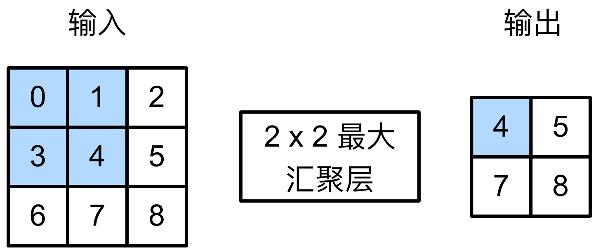

#  
<!--more-->
# 5 汇聚层
- 处理图像时，我们希望逐渐降低隐藏表示的空间分辨率、聚集信息，这样随着层数的增加，每个神经元对其敏感的感受野（输入）就越大。
- 机器学习任务通常会跟全局图像的问题有关，所以最后一层的神经元应该对整个输入的全局敏感。通过逐渐聚合信息，生成越来越粗糙的映射，最终实现学习全局表示的目标，同时将卷积图层的所有优势保留在中间层。
- 当检测较底层的特征时，我们通常希望这些特征保持某种程度上的平移不变性。
- 汇聚层（pooling）层可以：降低卷积层对位置的敏感性，同时降低对空间采样表示的敏感性。
## 5.1 最大汇聚层和平均汇聚层
- 汇聚层使用一个类似卷积核的窗口在输入上滑动，计算方式：计算汇聚窗口中所有元素的最大值或平均值。



```python
import torch
from torch import nn
from d2l import torch as d2l

def pool2d(X, pool_size, mode='max'):
    p_h, p_w = pool_size
    Y = torch.zeros((X.shape[0] - p_h+1, X.shape[1] - p_w+1)) #输出的形状
    for i in range(Y.shape[0]):
        for j in range(Y.shape[1]):
            if mode == 'max':
                Y[i,j] = X[i:i+p_h,j:j+p_w].max()
            elif mode == 'avg':
                Y[i,j] = X[i:i+p_h,j:j+p_w].mean()
    return Y

X = torch.tensor([[0.0, 1.0, 2.0], [3.0, 4.0, 5.0], [6.0, 7.0, 8.0]])
print(pool2d(X, (2, 2)))
print(pool2d(X,(2,2),'avg'))
```

    tensor([[4., 5.],
            [7., 8.]])
    tensor([[2., 3.],
            [5., 6.]])
    

## 5.2 填充和步幅


```python
#4维输入张量
X = torch.arange(16, dtype=torch.float32).reshape((1,1,4,4))
print(X)
```

    tensor([[[[ 0.,  1.,  2.,  3.],
              [ 4.,  5.,  6.,  7.],
              [ 8.,  9., 10., 11.],
              [12., 13., 14., 15.]]]])
    

- 默认情况下，步幅与窗口大小相同。


```python
pool2d = nn.MaxPool2d(3)
print(pool2d(X))
```

    tensor([[[[10.]]]])
    

- 手动设定padding和stride


```python
pool2d = nn.MaxPool2d(3,padding=1, stride=2)
print(pool2d(X))

pool2d = nn.MaxPool2d((2,3), stride=(2,3), padding=(0,1))
print(pool2d(X))
```

    tensor([[[[ 5.,  7.],
              [13., 15.]]]])
    tensor([[[[ 5.,  7.],
              [13., 15.]]]])
    

## 5.3 多通道
- 在处理多通道数据时，pooling层在每个输入通道上单独运算（与卷积不同）
- pooling层的输出通道数与输入通道数相同


```python
# 构建一个2通道的输入
X = torch.cat((X,X+1),1) #在channel维度上连接，相当于增加一个通道
print(X)
pool2d = nn.MaxPool2d(3, padding=1, stride=2)
print(pool2d(X)) #输出通道依然是2

```

    tensor([[[[ 0.,  1.,  2.,  3.],
              [ 4.,  5.,  6.,  7.],
              [ 8.,  9., 10., 11.],
              [12., 13., 14., 15.]],
    
             [[ 1.,  2.,  3.,  4.],
              [ 5.,  6.,  7.,  8.],
              [ 9., 10., 11., 12.],
              [13., 14., 15., 16.]]]])
    tensor([[[[ 5.,  7.],
              [13., 15.]],
    
             [[ 6.,  8.],
              [14., 16.]]]])
    
