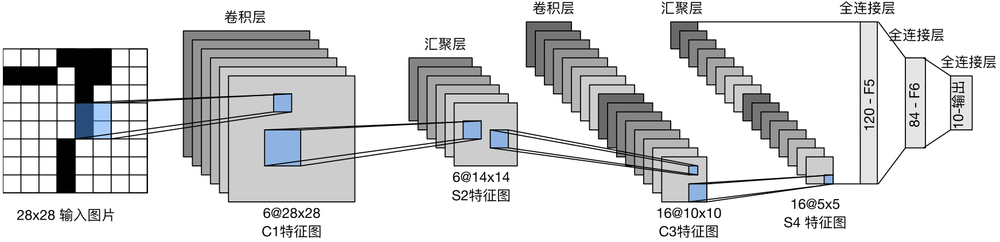
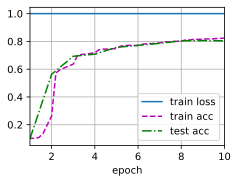

#  
<!--more-->
# 6 卷积神经网络（LeNet）
## 6.1 LeNet
- LeNet-5由两个部分组成：
    - 卷积编码器：由两个卷积层组成
    - 全连接层密集块：由三个全连接层组成
- 每个卷积块中基本单位是：
    - 卷积层（5x5卷积核）
    - sigmoid激活函数
    - 平均池化层
- 这些层将输入映射到多个二维特征输出，通常同时增加通道的数量
    - 第一个卷积层有6个输出通道
    - 第二个卷积层有16个输出通道
    - 每个2x2pooling操作（stride=2）通过空间下采样将维数减少4倍


- 为了将卷积块的输出传递给稠密块，我们必须在小批量中展平每个样本，因此需要将四维输入转换成二维输入全连接层。
- LeNet的稠密块有三个全连接层，分别有120、84、10个输出。


```python
import torch
from torch import nn
from d2l import torch as d2l
import os
os.environ["KMP_DUPLICATE_LIB_OK"]  =  "TRUE"

net = nn.Sequential(
    nn.Conv2d(1,6,kernel_size=5,padding=2), nn.Sigmoid(), #通道1->6, 5x5卷积核
    nn.AvgPool2d(kernel_size=2, stride=2), #2x2池化, 步长2
    nn.Conv2d(6, 16, kernel_size=5), nn.Sigmoid(), #通道6->16, 5x5卷积核
    nn.AvgPool2d(kernel_size=2, stride=2), #2x2池化, 步长2
    nn.Flatten(), #展平
    nn.Linear(16*5*5, 120), nn.Sigmoid(), #全连接层
    nn.Linear(120, 84), nn.Sigmoid(), #全连接层
    nn.Linear(84,10) #全连接层
)

# 在每一层打印输出的形状
X = torch.rand(size=(1,1,28,28), dtype= torch.float32)
for layer in net:
    X = layer(X)
    print(layer.__class__.__name__ , 'output shape:\t', X.shape)
```

    Conv2d output shape:	 torch.Size([1, 6, 28, 28])
    Sigmoid output shape:	 torch.Size([1, 6, 28, 28])
    AvgPool2d output shape:	 torch.Size([1, 6, 14, 14])
    Conv2d output shape:	 torch.Size([1, 16, 10, 10])
    Sigmoid output shape:	 torch.Size([1, 16, 10, 10])
    AvgPool2d output shape:	 torch.Size([1, 16, 5, 5])
    Flatten output shape:	 torch.Size([1, 400])
    Linear output shape:	 torch.Size([1, 120])
    Sigmoid output shape:	 torch.Size([1, 120])
    Linear output shape:	 torch.Size([1, 84])
    Sigmoid output shape:	 torch.Size([1, 84])
    Linear output shape:	 torch.Size([1, 10])

## 6.2 模型训练

- 在Fashion-MNIST上训练


```python
batch_size = 256
train_iter, test_iter = d2l.load_data_fashion_mnist(batch_size=batch_size)

# 计算精度
def evaluate_accuracy_gpu(net, data_iter, device=None): #@save
    '''使用GPU计算模型在数据集上的精度'''
    if isinstance(net, nn.Module):
        if not device:
            device = next(iter(net.parameters())).device #网络的参数所在的设备
    # 正确预测的数量,总预测的数量
    metric = d2l.Accumulator(2) #返回两个值：正确预测的数量，总预测的数量
    with torch.no_grad():
        for X,y in data_iter: #将数据和标签复制到设备上
            if isinstance(X, list):
                X = [x.to(device) for x in X]
            else:
                X = X.to(device)
            y = y.to(device)
            metric.add(d2l.accuracy(net(X), y), y.numel())
    return metric[0] / metric[1]

# 训练
#@save
def train_ch6(net, train_iter, test_iter, num_epochs, lr, device):
    '''使用GPU训练模型'''
    # 1初始化权重
    def init_weights(m):
        if type(m) == nn.Linear or type(m) == nn.Conv2d:
            nn.init.xavier_uniform_(m.weight)
    net.apply(init_weights) #初始化权重

    # 2将模型复制到设备上
    print('training on', device)
    net.to(device)

    # 3优化器、损失、动画
    optimizer = torch.optim.SGD(net.parameters(), lr=lr)
    loss = nn.CrossEntropyLoss()
    animator = d2l.Animator(xlabel='epoch', xlim=[1, num_epochs],
                            legend=['train loss', 'train acc', 'test acc'])
    timer, num_batches = d2l.Timer(), len(train_iter) #计时器

    # 4训练
    for epoch in range(num_epochs):
        # 训练损失之和，训练准确率之和， 样本数
        metric = d2l.Accumulator(3) #计算一个epoch的训练损失之和，训练准确率之和， 样本数
        net.train()
        for i,(X,y) in enumerate(train_iter):
            timer.start()
            optimizer.zero_grad() #梯度清零
            X, y = X.to(device), y.to(device) #将数据和标签复制到设备上
            y_hat = net(X) #前向传播
            l = loss(y_hat,y) #计算损失
            l.backward() #反向传播
            optimizer.step() #更新参数
            with torch.no_grad():
                # 添加样本，计算损失，计算准确率
                metric.add(1*X.shape[0], d2l.accuracy(y_hat, y), X.shape[0])
            timer.stop()
            train_l = metric[0] / metric[2] #平均损失
            train_acc = metric[1] / metric[2] #平均准确率
            if (i+1) % (num_batches // 5) == 0 or i == num_batches -1:
                animator.add(epoch + (i+1) / num_batches, (train_l, train_acc, None))
        test_acc = evaluate_accuracy_gpu(net, test_iter)
        animator.add(epoch+1, (None,None,test_acc))
    print(f'loss {train_l:.3f}, train acc{train_acc:.3f},test acc{test_acc:.3f}')
    print(f'{metric[2] * num_epochs / timer.sum():.1f} examples/sec on {str(device)}')

lr, num_epochs = 0.9, 10
train_ch6(net, train_iter, test_iter, num_epochs, lr, d2l.try_gpu())
```

    loss 1.000, train acc0.824,test acc0.804
    6523.3 examples/sec on cpu





