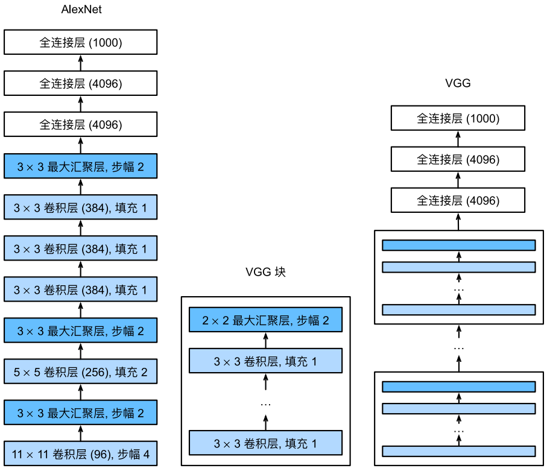
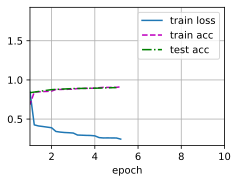

#  
<!--more-->
# 2 使用块的网络（VGG）
## 2.1 VGG块
- 经典卷积神经网络的基本组成部分是如下序列：
    1. 带填充以保持分辨率的卷积层
    2. 非线性激活函数，如ReLU
    3. 汇聚层，如最大汇聚层


```python
import torch
from torch import nn
from d2l import torch as d2l

def vgg_block(num_convs, in_channels, out_channels):
    layers = []
    for _ in range(num_convs):
        layers.append(nn.Conv2d(in_channels, out_channels, kernel_size=3, padding=1))
        layers.append(nn.ReLU())
        in_channels = out_channels
    layers.append(nn.MaxPool2d(kernel_size=2, stride=2))
    return nn.Sequential(*layers)
```

## 2.2 VGG网络
- 从AlexNet到VGG，它们本质上都是块设计。


- 原始VGG网络有5个卷积块，前两个块各有一个卷积层，后三个块各包含两个卷积层，因此共有8个卷积层。
- 第一个模块有64输出通道，每个后续模块将输出通道翻倍，直到该数字达到512.
- 由于该网络使用8个卷积层和3个全连接层，因此它通常被称为VGG-11。


```python
# 指定了每个VGG块里卷积层个数和输出通道数。
conv_arch = ((1, 64), (1, 128), (2, 256), (2, 512), (2, 512))

def vgg(conv_arch):
    conv_blks = []
    in_channels = 1
    # 卷积层部分
    for (num_convs, out_channels) in conv_arch:
        conv_blks.append(vgg_block(num_convs, in_channels, out_channels))
        in_channels = out_channels
    return nn.Sequential(
        *conv_blks, nn.Flatten(),
        # 全连接层部分
        nn.Linear(out_channels*7*7, 4096), nn.ReLU(), nn.Dropout(0.5), #为啥要*7：因为经过五个块后图像变成了7*7
        nn.Linear(4096, 4096), nn.ReLU(), nn.Dropout(0.5),
        nn.Linear(4096, 10)
    )
net = vgg(conv_arch)
```

- 查看输出形状


```python
X = torch.randn(size=(1, 1, 224, 224))
for blk in net:
    X = blk(X)
    print(blk.__class__.__name__,'output shape:\t', X.shape)
```

    Sequential output shape:	 torch.Size([1, 64, 112, 112])
    Sequential output shape:	 torch.Size([1, 128, 56, 56])
    Sequential output shape:	 torch.Size([1, 256, 28, 28])
    Sequential output shape:	 torch.Size([1, 512, 14, 14])
    Sequential output shape:	 torch.Size([1, 512, 7, 7])
    Flatten output shape:	 torch.Size([1, 25088])
    Linear output shape:	 torch.Size([1, 4096])
    ReLU output shape:	 torch.Size([1, 4096])
    Dropout output shape:	 torch.Size([1, 4096])
    Linear output shape:	 torch.Size([1, 4096])
    ReLU output shape:	 torch.Size([1, 4096])
    Dropout output shape:	 torch.Size([1, 4096])
    Linear output shape:	 torch.Size([1, 10])
    

## 2.3 训练模型
- 由于VGG比AlexNet计算量更大，因此我们构建了一个通道数较少的网络，用于训练Fashion-MNIST数据集


```python
import os
os.environ["KMP_DUPLICATE_LIB_OK"] = "TRUE"
ratio = 4
small_conv_arch = [(pair[0], pair[1] // ratio) for pair in conv_arch] #卷积层个数和输出通道数
net = vgg(small_conv_arch)

lr, num_epochs, batch_size = 0.05, 10, 128
train_iter, test_iter = d2l.load_data_fashion_mnist(batch_size, resize=224)
d2l.train_ch6(net, train_iter, test_iter, num_epochs, lr, d2l.try_gpu())
```


    



