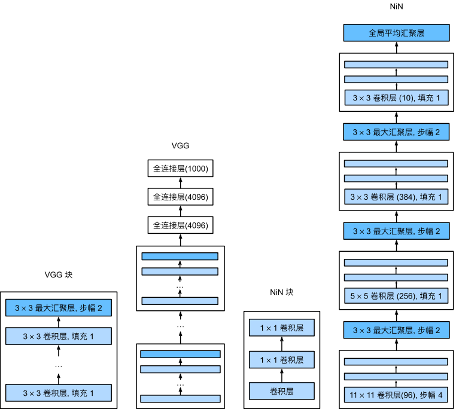
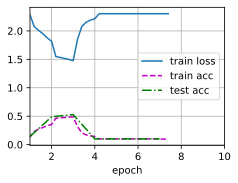

#  
<!--more-->
# 3 网络中的网络（NiN）
- LeNet、AlexNet和VGG都有一个共同设计模式：
    - 通过一系列的卷积层与汇聚层来提取空间结构特征；然后通过全连接层对特征的表征进行处理。AlexNet和VGG对LeNet的改进主要在于如何扩大和加深这两个模块。
- 如果使用了全连接层，可能会完全放弃表征的空间结构。网络中的网络（NiN）提供了一个非常简单的解决方案：在每个像素的通道上分别使用多层感知机
## 3.1 NiN块
- NiN的想法是在每个像素位置（针对每个高度和宽度）应用一个全连接层。如果我们将权重连接到每个空间位置，我们可以将其视为1 × 1卷积层，或作为在每个像素位置上独立作用的全连接层。
- 从另一个角度看，即将空间维度中的每个像素视为单个样本，将通道维度视为不同特征（feature）。


- NiN块以一个普通卷积层开始，后面是两个1 × 1的卷积层。这两个1 × 1卷积层充当带有ReLU激活函数的逐像素全连接层。第一层的卷积窗口形状通常由用户设置。随后的卷积窗口形状固定为1 × 1。


```python
import torch
from torch import nn
from d2l import torch as d2l

def nin_block(in_channels, out_channels, kernel_size, strides, padding):
    return nn.Sequential(
        nn.Conv2d(in_channels, out_channels, kernel_size, strides, padding),
        nn.ReLU(),
        nn.Conv2d(out_channels, out_channels, kernel_size=1), nn.ReLU(),
        nn.Conv2d(out_channels, out_channels, kernel_size=1), nn.ReLU()
    )
```

## 3.2 NiN模型
- NiN使用窗口形状为11×11、5×5和3×3的卷积层，输出通道数量与AlexNet中的相同。每个NiN块后有一个最大汇聚层，汇聚窗口形状为3 × 3，步幅为2。
- NiN和AlexNet之间的一个显著区别是NiN完全取消了全连接层。相反，NiN使用一个NiN块，其输出通道数等于标签类别的数量。最后放一个全局平均汇聚层（global average pooling layer），生成一个对数几率（logits）。
- NiN设计的一个优点是，它显著减少了模型所需参数的数量。然而，在实践中，这种设计有时会增加训练模型的时间。


```python
net = nn.Sequential(
    nin_block(1, 96, kernel_size=11, strides=4, padding=0),
    nn.MaxPool2d(3, stride=2),
    nin_block(96, 256, kernel_size=5, strides=1, padding=2),
    nn.MaxPool2d(3, stride=2),
    nin_block(256, 384, kernel_size=3, strides=1, padding=1),
    nn.MaxPool2d(3, stride=2),
    nn.Dropout(0.5),
    # 标签类别数是10
    nin_block(384, 10, kernel_size=3, strides=1, padding=1),
    nn.AdaptiveAvgPool2d((1,1)),
    # 将四维输出转换成二维输出，其形状为（batch_size, 10）
    nn.Flatten()
)
```

- 查看形状


```python
X = torch.rand(size=(1,1,224,224))
for layer in net:
    X = layer(X)
    print(layer.__class__.__name__,'output shape:\t',X.shape)
```

    Sequential output shape:	 torch.Size([1, 96, 54, 54])
    MaxPool2d output shape:	 torch.Size([1, 96, 26, 26])
    Sequential output shape:	 torch.Size([1, 256, 26, 26])
    MaxPool2d output shape:	 torch.Size([1, 256, 12, 12])
    Sequential output shape:	 torch.Size([1, 384, 12, 12])
    MaxPool2d output shape:	 torch.Size([1, 384, 5, 5])
    Dropout output shape:	 torch.Size([1, 384, 5, 5])
    Sequential output shape:	 torch.Size([1, 10, 5, 5])
    AdaptiveAvgPool2d output shape:	 torch.Size([1, 10, 1, 1])
    Flatten output shape:	 torch.Size([1, 10])
    

## 3.3 训练模型


```python
import os
os.environ['KMP_DUPLICATE_LIB_OK'] = 'TRUE'
lr, num_epochs, batch_size = 0.1, 10, 128
train_iter, test_iter = d2l.load_data_fashion_mnist(batch_size, resize=224)
d2l.train_ch6(net, train_iter, test_iter, num_epochs, lr, d2l.try_gpu())
```


    



