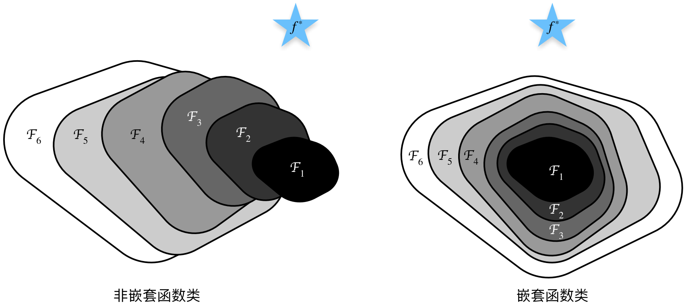
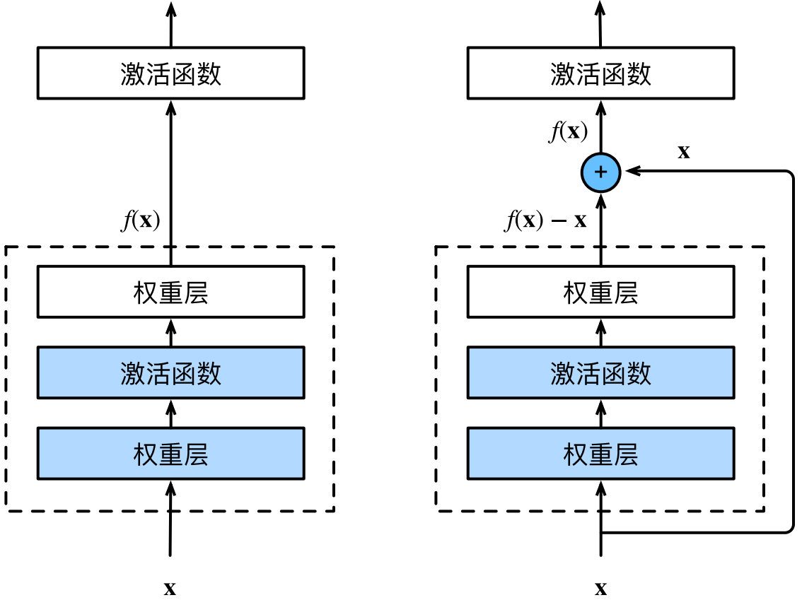
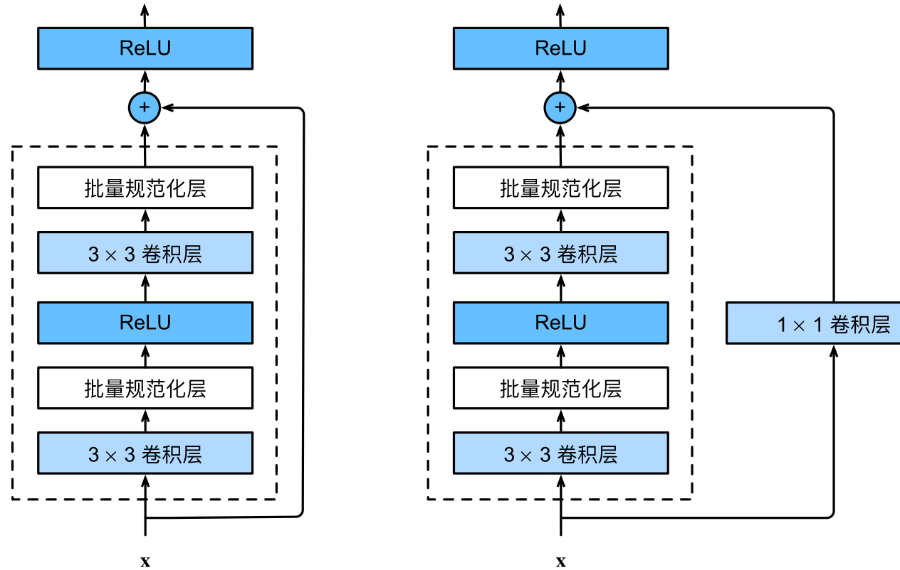
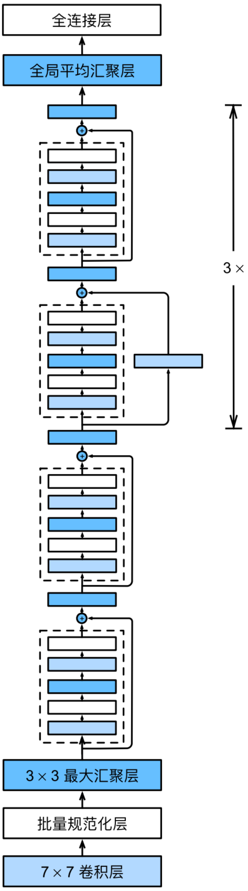
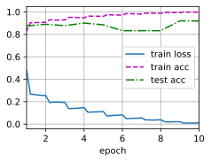

#  
<!--more-->
# 6 残差网络（ResNet）
- 随着我们设计越来越深的网络，深刻理解“新添加的层如何提升神经网络的性能”变得至关重要。更重要的是设计网络的能力，在这种网络中，添加层会使网络更具表现力，为了取得质的突破，我们需要一些数学基础知识。
## 6.1 函数类
- 假设神经网络：$\mathcal{F}$，它包括学习率和其他超参数设置。对于所有$f \in \mathcal{F}$，存在一些参数集（如权重和偏置），这些参数可以通过在合适的数据集上进行训练而获得。
- 假设$f^ *$是我们的目标函数，我们希望找到一个函数$f_ {\mathcal{F}}^ * \in \mathcal{F}$，使$f_ {\mathcal{F}}^ * \approx f^ *$。
- 给定一个具有$\mathbf{X}$特征和$\mathbf{y}$标签的数据集，我们可以通过解决以下优化问题来找到他：
$$f_ {\mathcal{F}}^ * = \arg \min _{f \in \mathcal{F}} L(\mathbf{X}, \mathbf{y}, f)$$
- 如何找到一个$f_ {\mathcal{F}^ `}^ *$，使比$f_ {\mathcal{F}}^ *$更接近$f^ *$？只有当较复杂的函数类包含较小的函数类时，我们才能确保提高它们的性能。左边，虽然F3比F1更接近f∗，但F6却离的更远了。右侧的嵌套函数（nested function）类F1 ⊆ . . . ⊆ F6，我们可以避免上述问题。


- 对于深度神经网络，如果我们能将新添加的层训练成恒等映射（identity function）f(x) = x，新模型和原模型将同样有效。同时，由于新模型可能得出更优的解来拟合训练数据集，因此添加层似乎更容易降低训练误差。
- 残差网络的核心思想是：每个附加层都应该更容易地包含原始函数作为其元素之一。
## 6.2 残差块
- 输入为x，希望学出的理想映射为f(x)。左图虚线框中的部分需要直接拟合出该映射f(x)，而右图虚线框中的部分则需要拟合出残差映射f(x) − x。我们只需将 图右图虚线框内上方的加权运算（如仿射）的权重和偏置参数设成0，那么f(x)即为恒等映射。当理想映射f(x)极接近于恒等映射时，残差映射也易于捕捉恒等映射的细微波动。


- resnet沿用vgg完整的3 x 3卷积层设计。残差块里首先有2个有相同输出通道数的3 × 3卷积层。每个卷积层后接一个批量规范化层和ReLU激活函数。然后我们通过跨层数据通路，跳过这2个卷积运算，将输入直接加在最后的ReLU激活函数前。这样的设计要求2个卷积层的输出与输入形状一样，从而使它们可以相加。如果想改变通道数，就需要引入一个额外的1 × 1卷积层来将输入变换成需要的形状后再做相加运算。



```python
import torch
from torch import nn
from torch.nn import functional as F
from d2l import torch as d2l

class Residual(nn.Module): #@save
    def __init__(self, input_channels, num_channels, use_1x1conv=False, strides=1):
        super().__init__()
        self.conv1 = nn.Conv2d(input_channels, num_channels, kernel_size=3, padding=1, stride=strides)
        self.conv2 = nn.Conv2d(num_channels, num_channels, kernel_size=3, padding=1)
        if use_1x1conv: #通道数有改变
            self.conv3 = nn.Conv2d(input_channels, num_channels, kernel_size=1, stride=strides)
        else:
            self.conv3 = None
        self.bn1 = nn.BatchNorm2d(num_channels)
        self.bn2 = nn.BatchNorm2d(num_channels)
    def forward(self, X):
        Y = F.relu(self.bn1(self.conv1(X)))
        Y = self.bn2(self.conv2(Y))
        if self.conv3:
            X = self.conv3(X)
        Y += X
        return F.relu(Y)
    
# 输入和输出形状一致的情况
blk = Residual(3,3)
X = torch.rand(4,3,6,6)
Y = blk(X)
print(Y.shape) #(4,3,6,6)

# 增加输出通道，减少输出的高和宽
blk = Residual(3,6, use_1x1conv=True, strides=2)
print(blk(X).shape) #(4,6,3,3)

```

    torch.Size([4, 3, 6, 6])
    torch.Size([4, 6, 3, 3])
    

## 6.3 ResNet模型
- 前两层跟GoogLeNet中的一样：在输出通道数为64、步幅为2的7 × 7卷积层后，接步幅为2的3 × 3的最大汇聚层。不同之处在于ResNet每个卷积层后增加了批量规范化层。


```python
b1 = nn.Sequential(nn.Conv2d(1, 64, kernel_size=7, stride=2, padding=3),
                    nn.BatchNorm2d(64), nn.ReLU(),
                    nn.MaxPool2d(kernel_size=3, stride=2, padding=1)
                    )
```

- GoogLeNet在后面接了4个由Inception块组成的模块。ResNet则使用4个由残差块组成的模块，每个模块使用若干个同样输出通道数的残差块。第一个模块的通道数同输入通道数一致。由于之前已经使用了步幅为2的最大汇聚层，所以无须减小高和宽。之后的每个模块在第一个残差块里将上一个模块的通道数翻倍，并将高和宽减半。


```python
def resnet_block(input_channels, num_channels, num_residuals, first_block=False):
    blk = []
    for i in range(num_residuals):
        if i == 0 and not first_block:
            blk.append(Residual(input_channels, num_channels, use_1x1conv=True, strides=2))
        else:
            blk.append(Residual(num_channels, num_channels))
    return blk
```

- 接着在ResNet加入所有残差块，这里每个模块使用2个残差块。


```python
b2 = nn.Sequential(*resnet_block(64, 64, 2, first_block=True))
b3 = nn.Sequential(*resnet_block(64, 128, 2))
b4 = nn.Sequential(*resnet_block(128, 256, 2))
b5 = nn.Sequential(*resnet_block(256, 512, 2))
```

- 最后，与GoogLeNet一样，在ResNet中加入全局平均汇聚层，以及全连接层输出。
- 每个模块有4个卷积层（不包括恒等映射的1 × 1卷积层）。加上第一个7 × 7卷积层和最后一个全连接层，共有18层。因此，这种模型通常被称为ResNet‐18。
- 虽然ResNet的主体架构跟GoogLeNet类似，但ResNet架构更简单，修改也更方便。这些因素都导致了ResNet迅速被广泛使用。



```python
net = nn.Sequential(b1, b2, b3, b4, b5,
                    nn.AdaptiveAvgPool2d((1,1)),
                    nn.Flatten(), nn.Linear(512, 10)
                    )

```

- 查看形状。分辨率降低，通道数量增加，直到全局平均汇聚层聚集所有特征。


```python
X = torch.rand(size=(1, 1, 224, 224))
for layer in net:
    X = layer(X)
    print(layer.__class__.__name__,'output shape:\t', X.shape)

```

    Sequential output shape:	 torch.Size([1, 64, 56, 56])
    Sequential output shape:	 torch.Size([1, 64, 56, 56])
    Sequential output shape:	 torch.Size([1, 128, 28, 28])
    Sequential output shape:	 torch.Size([1, 256, 14, 14])
    Sequential output shape:	 torch.Size([1, 512, 7, 7])
    AdaptiveAvgPool2d output shape:	 torch.Size([1, 512, 1, 1])
    Flatten output shape:	 torch.Size([1, 512])
    Linear output shape:	 torch.Size([1, 10])
    

## 6.4 训练
- 在Fashion‐MNIST数据集上训练ResNet。


```python
import os
os.environ['KMP_DUPLICATE_LIB_OK'] = 'TRUE'

lr, num_epochs, batch_size = 0.05, 10, 256
train_iter, test_iter = d2l.load_data_fashion_mnist(batch_size, resize=96)
d2l.train_ch6(net, train_iter, test_iter, num_epochs, lr, d2l.try_gpu())
```

    loss 0.011, train acc 0.997, test acc 0.919
    52.9 examples/sec on cpu
    


    



