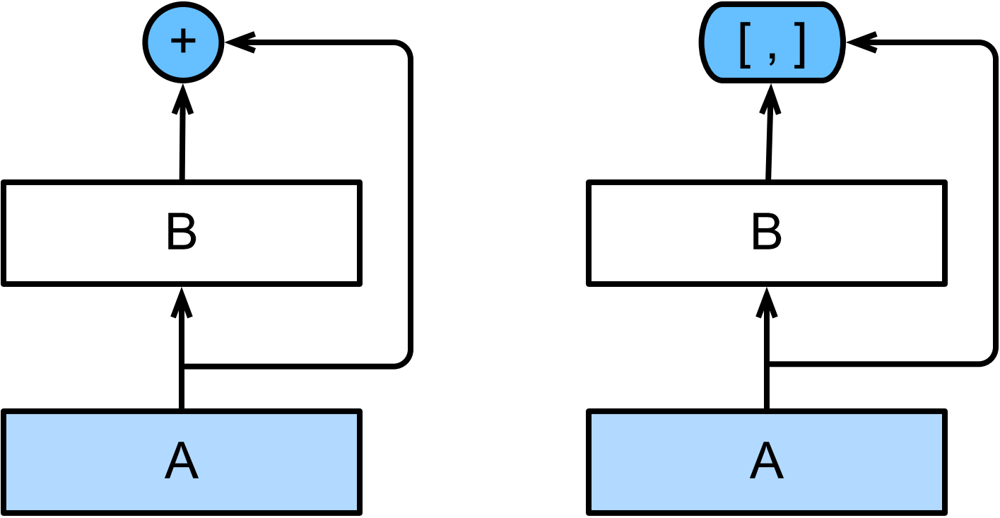
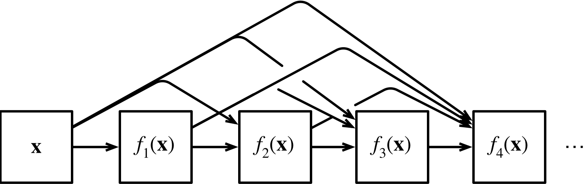
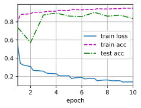

#  
<!--more-->
# 7 稠密连接网络（DenseNet）
- ResNet极大地改变了如何参数化深层网络中函数的观点。稠密连接网络（DenseNet）在某种程度上是ResNet的逻辑扩展。
## 7.1 从ResNet到DenseNet
- 泰勒展开式（Taylor expansion），把这个函数分解成越来越高阶的项。在x接近0时:
$$f(x) = f(0) + f'(0)x + \frac{f''(0)}{2!}x^ 2 + \frac{f'''(0)}{3!}x^ 3 + \cdots$$
- ResNet将函数展开为：一个简单的线性项和一个复杂的非线性项。
$$f(x) = x + g(x)$$
- DenseNet将$f$拓展成超过两部分: ResNet和DenseNet的关键区别在于，DenseNet输出是连接（用图中的[, ]表示）而不是如ResNet的简单相加。


$$ x \rightarrow [x, f_ 1(x), f_ 2([x, f_ 1(x)]), f_ 3([x, f_ 1(x), f_ 2([x, f_ 1(x)])]), \ldots]$$
- 最后，将这些展开式结合到多层感知机中，再次减少特征的数量。我们不需要添加术语，而是将它们连接起来。DenseNet这个名字由变量之间的“稠密连接”而得来，最后一层与之前的所有层紧密相连。


- DenseNet主要由2部分构成：稠密块（dense block）和过渡层（transition layer）。前者定义如何连接输入和输出，而后者则控制通道数量，使其不会太复杂。
## 7.2 稠密块
- DenseNet使用了ResNet改良版的“批量规范化、激活和卷积”架构


```python
import torch
from torch import nn
from d2l import torch as d2l

# 卷积块
def conv_block(input_channels, num_channels):
    return nn.Sequential(
                        nn.BatchNorm2d(input_channels), nn.ReLU(),
                        nn.Conv2d(input_channels, num_channels, kernel_size=3, padding=1)
                        )
```

- 一个稠密块由多个卷积块组成，每个卷积块使用相同数量的输出通道。然而，在前向传播中，我们将每个卷积块的输入和输出在通道维上连结。


```python
class DenseBlock(nn.Module):
    def __init__(self, num_convs, input_channels, num_channels):
        super(DenseBlock, self).__init__()
        layer = []
        for i in range(num_convs):
            layer.append(conv_block(
                num_channels * i + input_channels, num_channels))
        self.net = nn.Sequential(*layer)
    def forward(self, X):
        for blk in self.net:
            Y = blk(X)
            # 连接通道维度上每个块的输入和输出
            X = torch.cat((X, Y), dim=1)
        return X

```

- 定义一个有2个输出通道数为10的DenseBlock。使用通道数为3的输入时，我们会得到通道数为3 + 2 × 10 = 23的输出。卷积块的通道数控制了输出通道数相对于输入通道数的增长，因此也被称为增长率（growth rate）。


```python
blk = DenseBlock(2, 3, 10)
X = torch.randn(4, 3, 8, 8)
Y = blk(X)
Y.shape
```


    torch.Size([4, 23, 8, 8])


## 7.3 过渡层
- 由于每个稠密块都会带来通道数的增加，使用过多则会过于复杂化模型。过渡层可以用来控制模型复杂度。它通过1 × 1卷积层来减小通道数，并使用步幅为2的平均汇聚层减半高和宽，从而进一步降低模型复杂度。


```python
def transition_block(input_channels, num_channels):
    return nn.Sequential(
                        nn.BatchNorm2d(input_channels), nn.ReLU(),
                        nn.Conv2d(input_channels, num_channels, kernel_size=1),
                        nn.AvgPool2d(kernel_size=2, stride=2)
                        )

```

- 使用通道数为10的过渡层。此时输出的通道数减为10，高和宽均减半。


```python
blk = transition_block(23, 10)
print(blk(Y).shape)
```

    torch.Size([4, 10, 4, 4])
    

## 7.4 DenseNet模型
- DenseNet首先使用同ResNet一样的单卷积层和最大汇聚层。


```python
b1 = nn.Sequential(
                    nn.Conv2d(1, 64, kernel_size=7, stride=2, padding=3),
                    nn.BatchNorm2d(64), nn.ReLU(),
                    nn.MaxPool2d(kernel_size=3, stride=2, padding=1)
                    )

```

- 类似于ResNet使用的4个残差块，DenseNet使用的是4个稠密块。与ResNet类似，我们可以设置每个稠密块使用多少个卷积层。这里我们设成4，从而与ResNet‐18保持一致。稠密块里的卷积层通道数（即增长率）设为32，所以每个稠密块将增加128个通道。
- 在每个模块之间，ResNet通过步幅为2的残差块减小高和宽，DenseNet则使用过渡层来减半高和宽，并减半通道数。


```python
# num_channels为当前的通道数
num_channels, growth_rate = 64, 32
num_convs_in_dense_blocks = [4, 4, 4, 4]
blks = []
for i, num_convs in enumerate(num_convs_in_dense_blocks):
    blks.append(DenseBlock(num_convs, num_channels, growth_rate))
    # 上一个稠密块的输出通道数
    num_channels += num_convs * growth_rate
    # 在稠密块之间添加一个转换层，使通道数量减半
    if i != len(num_convs_in_dense_blocks) - 1:
        blks.append(transition_block(num_channels, num_channels // 2))
        num_channels = num_channels // 2
```

- 与ResNet类似，最后接上全局汇聚层和全连接层来输出结果。


```python
net = nn.Sequential(
                    b1, *blks,
                    nn.BatchNorm2d(num_channels), nn.ReLU(),
                    nn.AdaptiveAvgPool2d((1, 1)),
                    nn.Flatten(),
                    nn.Linear(num_channels, 10)
                    )
```

## 7.5 训练
- 由于这里使用了比较深的网络，本节里我们将输入高和宽从224降到96来简化计算。


```python
import os
os.environ["KMP_DUPLICATE_LIB_OK"] = "TRUE"
lr, num_epochs, batch_size = 0.1, 10, 256
train_iter, test_iter = d2l.load_data_fashion_mnist(batch_size, resize=96)
d2l.train_ch6(net, train_iter, test_iter, num_epochs, lr, d2l.try_gpu())

```

    loss 0.140, train acc 0.948, test acc 0.835
    34.7 examples/sec on cpu
    


    



