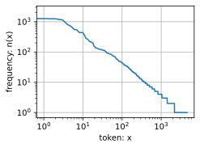
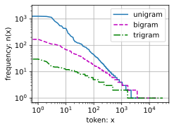
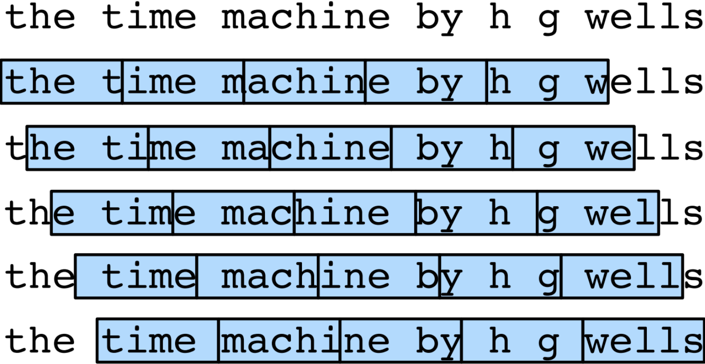

#  
<!--more-->
# 3 语言模型和数据集
- 假设长度为T的文本序列中的词元依次为$x_ 1$,$x_ 2$,...,$x_ T$。$x_ t$可以被认为是文本序列在时间步t处的观测或标签。语言模型（language model）的目标是估计序列的联合概率：
$$P(x_ 1,x_ 2,...,x_ T)$$
- 只需要一次抽取一个词元$x_t ~ P(x_t|x_ {t-1},...,x_ 1)$，一个理想的语言模型就能够基于模型本身生成自然文本。只需要基于前面的对话片断中的文本，就足以生成一个有意义的对话。
## 3.1 学习语言模型
- 我们面对的问题是如何对一个文档，甚至是一个词元序列进行建模。
$$P(x_ 1,x_ 2,...,x_ T) = \prod_ { t = 1 }^ T P(x_ t|x_ 1,x_ 2,...,x_ {t-1})$$

- 例如，包含了四个单词的一个文本序列的概率是：
$$P(deep, learning, is, fun) = P(deep)P(learning|deep)P(is|deep, learning)P(fun|deep, learning, is)$$


- 为了训练语言模型，我们需要计算单词的概率，以及给定前面几个单词后出现某个单词的条件概率。这些概率本质上就是语言模型的参数。
- 假设训练数据集是一个大型的文本语料库。训练数据集中词的概率可以根据给定词的相对词频来计算。例如，可以将估计值$\hat P(deep)$计算为任何以单词“deep”开头的句子的概率，或“deep”在数据集中的出现次数。接下来，我们可以尝试估计：
$$\hat P(learning|deep) = \frac{n(deep, learning)}{n(deep)}$$

- 其中$n(deep,learning)$是' deep learning'连续出现的次数。由于连续单词对“deep learning”的出现频率要低得多，所以估计这类单词正确的概率要困难得多。许多合理的三个单词组合可能是存在的，但是在数据集中却找不到。
- 一种常见的策略是执行某种形式的拉普拉斯平滑（Laplace smoothing）：在所有计数中添加一个小常量。用n表示训练集中的单词总数，用m表示唯一单词的数量。此解决方案有助于处理单元素问题：
$$\begin{aligned} \hat P(x) & = \frac{n(x) + \frac{ \epsilon_1 }{m}}{n + \epsilon_1} \\ \hat P(x'|x) & = \frac{ n(x,x' ) + \epsilon_2 \hat P(x') }{n(x) + \epsilon_2} \\ \hat P(x''|x,x') & = \frac{ n(x,x',x'') + \epsilon_3 \hat P(x'') }{n(x,x') + \epsilon_3} \end{aligned}$$

- 其中$\epsilon$是一个超参数，当$\epsilon = 0$时，不应用平滑；当$\epsilon$接近正无穷时，$\hat P(x)$接近均匀分布 $\frac{1}{m}$。
- 这样的模型很容易变得无效，首先，我们需要存储所有的计数；其次，这完全忽略了单词的意思。例如，“猫”（cat）和“猫科动物”（feline）可能出现在相关的上下文中，但是想根据上下文调整这类模型其实是相当困难的。最后，长单词序列大部分是没出现过的，因此一个模型如果只是简单地统计先前“看到”的单词序列频率，那么模型面对这种问题肯定是表现不佳的。

## 3.2 马尔可夫模型与n元语法
- 如果$P(x_ {t+1} | X_ t, \cdots, x_ 1) = P(x_ {t+1} | x_ t)$,则序列上的分布满足一阶马尔可夫性质。阶数越高，对应的依赖关系就越长。这种性质推导出了许多可以应用于序列建模的近似公式：
$$\begin{aligned} P(x_ 1,x_ 2,x_ 3,x_ 4) & = P(x_ 1)P(x_ 2)P(x_ 3)P(x_ 4|x_ 3) \\ P(x_ 1,x_ 2,x_ 3,x_ 4) & = P(x_ 1)P(x_ 2|x_ 1)P(x_ 3|x_ 2)P(x_ 4|x_ 3) \\ P(x_ 1,x_ 2,x_ 3,x_ 4) & = P(x_ 1)P(x_ 2|x_ 1)P(x_ 3|x_ 1,x_ 2)P(x_ 4|x_ 2,x_ 3) \end{aligned}$$

- 涉及一个、两个和三个变量的概率公式分别被称为 一元语法（unigram）、二元语法（bigram）和三元语法（trigram）模型。

## 3.3 自然语言统计
- 在真实数据上如果进行自然语言统计。根据数据集构建词表，并打印前10个最常用的（频率最高的）单词。


```python
import random
import torch
from d2l import  torch as d2l

tokens = d2l.tokenize(d2l.read_time_machine())
# 因为每个文本行不一定是一个句子或一个段落，因此我们把所有文本行拼接到一起
corpus = [token for line in tokens for token in line]
vocab = d2l.Vocab(corpus)
vocab.token_freqs[:10]
```


    [('the', 2261),
     ('i', 1267),
     ('and', 1245),
     ('of', 1155),
     ('a', 816),
     ('to', 695),
     ('was', 552),
     ('in', 541),
     ('that', 443),
     ('my', 440)]


- 最流行的词看起来很无聊，这些词通常被称为停用词（stop words），因此可以被过滤掉。还有个明显的问题是词频衰减的速度相当地快。例如，最常用单词的词频对比，第10个还不到第1个的1/5。
- 词频图：


```python
import os
os.environ["KMP_DUPLICATE_LIB_OK"]="TRUE"
freqs = [freq for token, freq in vocab.token_freqs]
d2l.plot(freqs, xlabel='token: x', ylabel='frequency: n(x)', xscale='log', yscale='log')
```


    



- 将前几个单词作为例外消除后，剩余的所有单词大致遵循双对数坐标图上的一条直线。这意味着单词的频率满足齐普夫定律即第i个最常用单词的频率ni为：
$$ n_ i \propto \frac{1}{i^ \alpha}$$

- 等价于：
$$ \log(n_ i) = - \alpha \log(i) + c$$

- 这告诉我们想要通过计数统计和平滑来建模单词是不可行的，因为这样建模的结果会大大高估尾部单词的频率，也就是所谓的不常用单词。
- 我们来看看二元语法的频率是否与一元语法的频率表现出相同的行为方式。


```python
bigram_tokens = [pair for pair in zip(corpus[:-1], corpus[1:])] #[0,1,2] + [1,2,3] = [(0,1),(1,2),(2,3)]
bigram_vocab = d2l.Vocab(bigram_tokens)
bigram_vocab.token_freqs[:10]
```


    [(('of', 'the'), 309),
     (('in', 'the'), 169),
     (('i', 'had'), 130),
     (('i', 'was'), 112),
     (('and', 'the'), 109),
     (('the', 'time'), 102),
     (('it', 'was'), 99),
     (('to', 'the'), 85),
     (('as', 'i'), 78),
     (('of', 'a'), 73)]


- 发现在十个最频繁的词对中，有九个是由两个停用词组成的，只有一个与“the time”有关。
- 三元语法：


```python
trigram_tokens = [triple for triple in zip(corpus[:-2], corpus[1:-1], corpus[2:])]
trigram_vocab = d2l.Vocab(trigram_tokens)
trigram_vocab.token_freqs[:10]
```


    [(('the', 'time', 'traveller'), 59),
     (('the', 'time', 'machine'), 30),
     (('the', 'medical', 'man'), 24),
     (('it', 'seemed', 'to'), 16),
     (('it', 'was', 'a'), 15),
     (('here', 'and', 'there'), 15),
     (('seemed', 'to', 'me'), 14),
     (('i', 'did', 'not'), 14),
     (('i', 'saw', 'the'), 13),
     (('i', 'began', 'to'), 13)]


- 直观地对比三种模型中的词元频率：一元语法、二元语法和三元语法。


```python
bigram_freqs = [freq for token, freq in bigram_vocab.token_freqs]
trigram_freqs = [freq for token, freq in trigram_vocab.token_freqs]
d2l.plot([freqs, bigram_freqs, trigram_freqs], xlabel='token: x', 
         ylabel='frequency: n(x)', xscale='log', yscale='log',
         legend=['unigram', 'bigram', 'trigram'])
```


    



- 我们发现：
    - 除了一元语法词，单词序列似乎也遵循齐普夫定律
    - 词表中n元组的数量并没有那么大，这说明语言中存在相当多的结构，这些结构给了我们应用模型的希望
    - 很多n元组很少出现，这使得拉普拉斯平滑非常不适合语言建模。作为代替，我们将使用基于深度学习的模型。

## 3.4 读取长序列数据
- 由于序列数据本质上是连续的，因此我们在处理数据时需要解决这个问题。一种方法：当序列变得太长而不能被模型一次性全部处理时，我们可能希望拆分这样的序列方便模型读取。
- 总体策略：
    - 假设我们将使用神经网络来训练语言模型，模型中的网络一次处理具有预定义长度（例如n个时间步）的一个小批量序列。现在的问题是如何随机生成一个小批量数据的特征和标签以供读取。
    - 由于文本序列可以是任意长的，任意长的序列可以被我们划分为具有相同时间步数的子序列。训练时，这样的小批量子序列将被输入到模型中。如下图n=5，每个时间步的词元对应于一个字符，可以选择任意偏移量来指示初始位置
    
    
    - 选择图中的哪一个呢？都差不多。如果我们只选择一个偏移量，那么用于训练网络的、所有可能的子序列的覆盖范围将是有限的。因此，我们可以从随机偏移量开始划分序列，以同时获得覆盖性（coverage）和随机性（randomness）。如何实现随机采样（random sampling）和顺序分区（sequential partitioning）策略。

### 3.4.1 随机采样
- 对于语言建模，目标是基于到目前为止我们看到的词元来预测下一个词元，因此标签是移位了一个词元的原始序列。
- 每次从数据中随机生成一个小批量。batch_size指定了每个小批量中子序列样本的数目，num_steps是每个子序列中预定义的时间步数(n)。


```python
def seq_data_iter_random(corpus, batch_size, num_steps): #@save
    '''使用随机抽样生成一个小批量子序列'''
    # 从随机偏移量开始对序列进行分区，随机范围包括num_steps -1
    corpus = corpus[random.randint(0, num_steps -1):]
    # 减去1，是因为我们需要考虑标签
    num_subseqs = (len(corpus) -1) // num_steps # 多少个子序列
    # 长度为num_steps的子序列的起始索引
    initial_indices = list(range(0, num_subseqs*num_steps, num_steps))
    # 在随机抽样的迭代过程中，来自两个相邻的、随机的、小批量的子序列不一定在原始序列上相邻
    random.shuffle(initial_indices)

    def data(pos):
        # 返回从pos开始的长度为num_steps的序列
        return corpus[pos: pos + num_steps]
    
    num_batches = num_subseqs // batch_size # 将整个数据集分成多少个batch
    for i in range(0, batch_size*num_batches, batch_size):
        # initial_indices包含子序列的随机起始索引
        initial_indices_per_batch = initial_indices[i: i + batch_size] # 每个batch的起始索引
        X = [data(j) for j in initial_indices_per_batch] # 获得batch_size个子序列
        Y = [data(j + 1) for j in initial_indices_per_batch]
        yield torch.tensor(X), torch.tensor(Y)
```

- 生成一个从0到34的序列。batch_size=2，num_steps=5。可以生成(35-1)/5=6个子序列对，6/2=3个小批量。


```python
my_seq = list(range(35))
for X,Y in seq_data_iter_random(my_seq, batch_size=2, num_steps=5):
    print('X: ', X, '\nY: ', Y)
```

    X:  tensor([[ 7,  8,  9, 10, 11],
            [27, 28, 29, 30, 31]]) 
    Y:  tensor([[ 8,  9, 10, 11, 12],
            [28, 29, 30, 31, 32]])
    X:  tensor([[12, 13, 14, 15, 16],
            [ 2,  3,  4,  5,  6]]) 
    Y:  tensor([[13, 14, 15, 16, 17],
            [ 3,  4,  5,  6,  7]])
    X:  tensor([[22, 23, 24, 25, 26],
            [17, 18, 19, 20, 21]]) 
    Y:  tensor([[23, 24, 25, 26, 27],
            [18, 19, 20, 21, 22]])
    

### 3.4.2 顺序分区
- 迭代过程中，除了对原始序列可以随机抽样外，我们还可以保证两个相邻的小批量中的子序列在原始序列上也是相邻的。


```python
def seq_data_iter_sequential(corpus, batch_size, num_steps): #@save
    '''使用顺序分区生成一个小批量子序列'''
    # 从随机偏移量开始划分序列
    offset = random.randint(0, num_steps)
    num_tokens = ((len(corpus) - offset - 1) // batch_size) * batch_size # 可用于训练的tokens数量
    Xs = torch.tensor(corpus[offset: offset + num_tokens])
    Ys = torch.tensor(corpus[offset + 1: offset + 1 + num_tokens])
    Xs, Ys = Xs.reshape(batch_size, -1), Ys.reshape(batch_size, -1)
    print('Xs：',Xs)
    num_batches = Xs.shape[1] // num_steps # batch_size是子序列个数，不是token个数
    for i in range(0, num_steps*num_batches, num_steps):
        X = Xs[:, i: i+num_steps] #一个batch里面包含token数：num_steps*batch_size
        Y = Ys[:, i: i+num_steps]
        yield X, Y

for X,Y in seq_data_iter_sequential(my_seq, batch_size=2, num_steps=5):
    print('X: ', X, '\nY: ', Y)
```

    Xs： tensor([[ 2,  3,  4,  5,  6,  7,  8,  9, 10, 11, 12, 13, 14, 15, 16, 17],
            [18, 19, 20, 21, 22, 23, 24, 25, 26, 27, 28, 29, 30, 31, 32, 33]])
    X:  tensor([[ 2,  3,  4,  5,  6],
            [18, 19, 20, 21, 22]]) 
    Y:  tensor([[ 3,  4,  5,  6,  7],
            [19, 20, 21, 22, 23]])
    X:  tensor([[ 7,  8,  9, 10, 11],
            [23, 24, 25, 26, 27]]) 
    Y:  tensor([[ 8,  9, 10, 11, 12],
            [24, 25, 26, 27, 28]])
    X:  tensor([[12, 13, 14, 15, 16],
            [28, 29, 30, 31, 32]]) 
    Y:  tensor([[13, 14, 15, 16, 17],
            [29, 30, 31, 32, 33]])
    

- 将两个采样函数包装到一个类中，以便稍后可以将其用作数据迭代器。


```python
class SeqDataLoader: #@save
    '''加载序列数据的迭代器'''
    def __init__(self, batch_size, num_steps, use_random_iter, max_tokens):
        if use_random_iter:
            self.data_iter_fn = d2l.seq_data_iter_random
        else:
            self.data_iter_fn = d2l.seq_data_iter_sequential
        self.corpus, self.vocab = d2l.load_corpus_time_machine(max_tokens)
        self.batch_size, self.num_steps = batch_size, num_steps
    
    def __iter__(self):
        return self.data_iter_fn(self.corpus, self.batch_size, self.num_steps)
    
# 定义函数，同时返回数据迭代器和词表，因此可以与其他带有load_data前缀的函数（如d2l.load_data_fashion_mnist）类似地使用。
def load_data_time_machine(batch_size, num_steps, #@save
                           use_random_iter=False, max_tokens=10000):
    '''返回时光机数据集的迭代器和词表'''
    data_iter = SeqDataLoader(batch_size, num_steps, use_random_iter, max_tokens)
```
