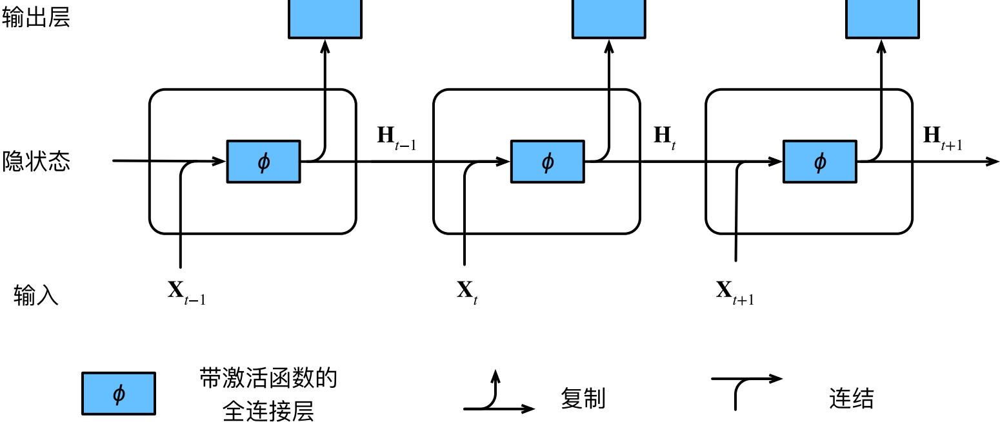
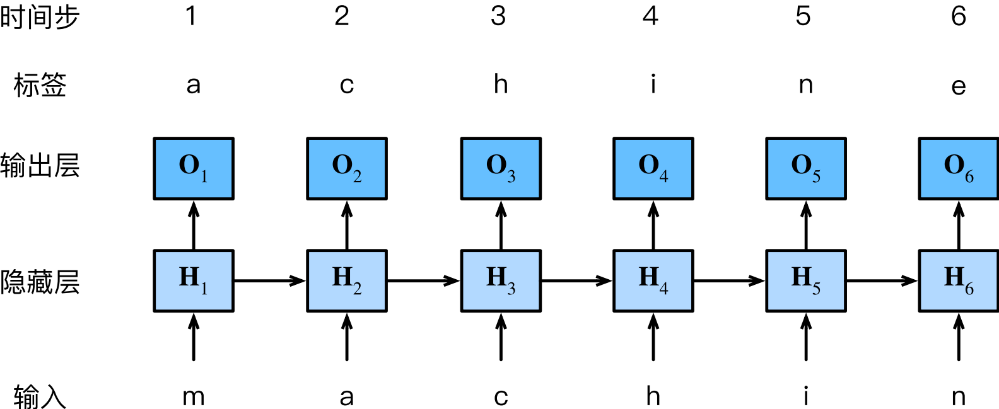

#  
<!--more-->
# 4 循环神经网络
- n元语法模型中，单词$x_ t$在时间步t的条件概率仅取决于前面n − 1个单词。对于时间步t − (n − 1)之前的单词，如果我们想将其可能产生的影响合并到$x_ t$上，需要增加n，然而模型参数的数量也会随之呈指数增长，因为词表$V$需要存储$|V|^ n$个数字，因此与其将$P(x_ t| x_ {t-1}, \cdots , x_ {t-n+1})$模型化，不如使用隐变量模型：
$$P(x_ t | x_ {t-1}, \cdots , x_ 1) \approx P(x_ t | h_ {t-1})$$

- $h_ {t-1}$是隐状态（hidden state），也称为隐藏变量（hidden variable），它存储了到时间步t − 1的序列信息。通常，我们可以基于当前输入xt和先前隐状态ht−1 来计算时间步t处的任何时间的隐状态：
$$h_ t = f(x_ t, h_ {t-1})$$

- 对于函数$f$，隐变量模型不是近似值。毕竟$h_ t$是可以仅仅存储到目前为止观察到的所有数据，然而这样的操作可能会使计算和存储的代价都变得昂贵。
- 隐藏层和隐状态指的是两个截然不同的概念。隐藏层是在从输入到输出的路径上（以观测角度来理解）的隐藏的层，而隐状态则是在给定步骤所做的任何事情（以技术角度来定义）的输入，并且这些状态只能通过先前时间步的数据来计算。
## 4.1 无隐状态的神经网络
- 对于只有单隐藏层的多层感知机，设隐藏层的激活函数为$\phi$，给定一个小批量样本$\mathbf{X} \in \mathbb{R}^{n \times d}$，其中$n$是批量大小，$d$是输入维度，隐藏层的输出为：
$$\mathbf{H} = \phi(\mathbf{X} \mathbf{W}_ {xh} + \mathbf{b}_ h)$$

- 其中，隐藏层权重$\mathbf{W}_ {xh} \in \mathbb{R}^{d \times h}$，隐藏层偏置$\mathbf{b}_ h \in \mathbb{R}^{1 \times h}$，$h$是隐藏单元的个数。然后将隐藏变量$\mathbf{H}$作为输出层的输入，输出层的输出为：
$$\mathbf{O} = \mathbf{H} \mathbf{W}_ {hq} + \mathbf{b}_ q$$

- 其中，$\mathbf{O}$是输出变量。如果是分类问题，可以用$\text{softmax}(\mathbf{O})$来计算输出类别的概率分布。

## 4.2 有隐状态的循环神经网络
- 假设我们在时间步t有小批量输入$\mathbf{X}_ t \in \mathbb{R}^{n \times d}$（样本数为n，$\mathbf{X}_ t$的每一行对应于来自该序列的时间步t处的一个样本。
- 用$\mathbf{H}_ t \in \mathbb{R}^{n \times h}$表示时间步t的隐藏变量。与mlp不同的是，我们在这里保存了前一个时间步的隐藏变量$\mathbf{H}_ {t-1}$，并引入了一个新的权重参数$\mathbf{W}_ {hh} \in \mathbb{R}^{h \times h}$来描述如何在当前时间步中使用前一个时间步的隐藏变量。
- 当前时间步隐藏变量由当前时间步的输入与前一个时间步的隐藏变量一起计算得出：
$$\mathbf{H}_ t = \phi(\mathbf{X}_ t \mathbf{W}_ {xh} + \mathbf{H}_ {t-1} \mathbf{W}_ {hh} + \mathbf{b}_ h)$$

- 与之前的相比，多了一项$\mathbf{H}_ {t-1} \mathbf{W}_ {hh}$，这一项描述了如何利用前一个时间步的隐藏变量。从相邻时间步的隐藏变量$\mathbf{H}_ {t}$和$\mathbf{H}_ {t-1}$之间的关系可知，这些变量捕获并保留了序列直到其当前时间步的历史信息，因此这样的隐藏变量被称为隐状态（hidden state）。由于在当前时间步中，隐状态使用的定义与前一个时间步中使用的定义相同，因此上式的计算是循环的。于是基于循环计算的隐状态神经网络被命名为 循环神经网络（recurrent neural network）。在循环神经网络中执行上式计算的层称为循环层。
- 有许多不同的方法可以构建循环神经网络，由上式定义的隐状态的循环神经网络是非常常见的一种。对于时间步t，输出层的输出类似于多层感知机中的计算：
$$\mathbf{O}_ t = \mathbf{H}_ t \mathbf{W}_ {hq} + \mathbf{b}_ q$$

- 循环神经网络的参数包括:
    - 隐藏层权重：$\mathbf{W}_ {xh} \in \mathbb{R}^{d \times h}$，$\mathbf{W}_ {hh} \in \mathbb{R}^{h \times h}$
    - 隐藏层偏置：$\mathbf{b}_ h \in \mathbb{R}^{1 \times h}$
    - 输出层权重：$\mathbf{W}_ {hq} \in \mathbb{R}^{h \times q}$
    - 输出层偏置：$\mathbf{b}_ q \in \mathbb{R}^{1 \times q}$
    - 在不同的时间步，循环神经网络也总是使用这些模型参数。因此，循环神经网络的参数开销不会随着时间步的增加而增加。
- 下图展示了循环神经网络在三个相邻时间步的计算逻辑。



- 在任意时间步t，隐状态的计算可以被视为：
    1. 拼接当前时间步t的输入$\mathbf{X}_ t$和前一个时间步t−1的隐状态$\mathbf{H}_ {t-1}$；
    2. 将拼接的结果送入一个带有激活函数$\phi$的全连接层。全连接层的输出是当前时间步t的隐状态$\mathbf{H}_ t$；
- 在上图中，模型参数是$\mathbf{W}_ {xh}$和$\mathbf{W}_ {hh}$的拼接，以及$\mathbf{b}_ h$的偏置。$\mathbf{H}_ t$参与计算$\mathbf{H}_ {t+1}$，同时将$\mathbf{H}_ t$送入全连接输出层，计算$\mathbf{O}_ t$。

- 公式中的$\mathbf{X}_ t \mathbf{W}_ {xh} + \mathbf{H}_ {t-1} \mathbf{W}_ {hh}$相当于将$\mathbf{X}_ t$和$\mathbf{H}_ {t-1}$的列连接起来，然后与$\mathbf{W}_ {xh}$和$\mathbf{W}_ {hh}$的拼接做矩阵乘法。


```python
import torch
from d2l import torch as d2l

X, W_xh = torch.normal(0, 1, (3, 1)), torch.normal(0, 1, (1, 4)) # X: (3, 1), W_xh: (1, 4)
H, W_hh = torch.normal(0, 1, (3, 4)), torch.normal(0, 1, (4, 4)) # H: (3, 4), W_hh: (4, 4)
s1 = torch.matmul(X, W_xh) + torch.matmul(H, W_hh)
s2 = torch.matmul(torch.cat((X, H), 1), torch.cat((W_xh, W_hh), 0))
print(s1)
print(s2)
```

    tensor([[ 1.6472,  0.7583,  0.6199, -1.7095],
            [ 3.6499, -3.2390, -0.4522, -3.4590],
            [ 0.1226, -0.8202, -0.3588, -1.6686]])
    tensor([[ 1.6472,  0.7583,  0.6199, -1.7095],
            [ 3.6499, -3.2390, -0.4522, -3.4590],
            [ 0.1226, -0.8202, -0.3588, -1.6686]])
    

## 4.3 基于循环神经网络的字符级语言模型
- 设：batch_size=1, 批量中的文本为“machine”。使用字符级语言模型而不是单词级。使用当前的和先前的字符预测下一个字符：



- 输入序列和标签序列分别为“machin”和“achine”。在训练过程中，我们对每个时间步的输出层的输出进行softmax操作，然后利用交叉熵损失计算模型输出和标签之间的误差。

## 4.4 困惑度（Perplexity）
- 如何度量语言模型的质量，考虑一下由不同的语言模型给出的对“It is raining ⋯”的续写：
    1. “It is raining outside”（外面下雨了）；
    2. “It is raining banana tree”（香蕉树下雨了）；
    3. “It is raining piouw;kcj pwepoiut”（piouw;kcj pwepoiut下雨了）。
- 1显然是最合乎情理。2则要糟糕得多，因为其产生了一个无意义的续写。尽管如此，至少该模型已经学会了如何拼写单词，以及单词之间的某种程度的相关性。3表明了训练不足的模型是无法正确地拟合数据的。
- 可以通过计算序列的似然概率来度量模型的质量。然而这是一个难以理解、难以比较的数字。毕竟，较短的序列比较长的序列更有可能出现。
- 如果想要压缩文本，我们可以根据当前词元集预测的下一个词元。一个更好的语言模型应该能让我们更准确地预测下一个词元。因此，它应该允许我们在压缩序列时花费更少的比特。所以我们可以通过一个序列中所有的n个词元的交叉熵损失的平均值来衡量：
$$ \frac{1}{n} \sum_{t=1}^ n -\log P(x_ t | x_ {t-1}, \cdots , x_ 1)$$

- 其中P由语言模型给出，将上式做指数处理得到更常用的困量：困惑度（perplexity）
    - 困惑度可以理解为：下一个词元的实际选择数的调和平均数
    - 最好情况下，模型总是完美地估计标签词元的概率为1。在这种情况下，模型的困惑度为1。
    - 最坏情况下，模型总是预测标签词元的概率为0。在这种情况下，困惑度为正无穷。
    - 在基线上，该模型的预测是词表的所有可用词元上的均匀分布。在这种情况下，困惑度等于词表中唯一词元的数量。事实上，如果我们在没有任何压缩的情况下存储序列，这将是我们能做的最好的编码方式。因此，这种方式提供了一个重要的上限，而任何实际模型都必须超越这个上限。

