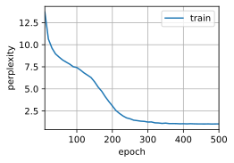
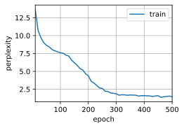

#  
<!--more-->
# 5 循环神经网络从零开始实现
- 读取数据集


```python
import os
os.environ['KMP_DUPLICATE_LIB_OK']='True'
import math
import torch
from torch import nn
from torch.nn import functional as F
from d2l import torch as d2l

batch_size, num_steps = 32, 35
train_iter, vocab = d2l.load_data_time_machine(batch_size, num_steps)
```

## 5.1 独热编码
- 在train_iter中，每个词元都表示为一个数字索引，将这些索引直接输入神经网络可能会使学习变得困难。我们通常将每个词元表示为更具表现力的特征向量。最简单的表示称为独热编码（one‐hot encoding）。
    - 将每个索引映射为相互不同的单位向量：假设词表中不同词元的数目为N（即len(vocab)），词元索引的范围为0到N − 1。
    - 如果词元的索引是整数i，那么我们将创建一个长度为N的全0向量，并将第i处的元素设置为1。此向量是原始词元的一个独热向量。


```python
# 索引为0和2的独热向量
F.one_hot(torch.tensor([0, 2]), len(vocab))
```


    tensor([[1, 0, 0, 0, 0, 0, 0, 0, 0, 0, 0, 0, 0, 0, 0, 0, 0, 0, 0, 0, 0, 0, 0, 0,
             0, 0, 0, 0],
            [0, 0, 1, 0, 0, 0, 0, 0, 0, 0, 0, 0, 0, 0, 0, 0, 0, 0, 0, 0, 0, 0, 0, 0,
             0, 0, 0, 0]])


- 每次采样的小批量数据形状是二维张量：（batch_size, num_steps）。one_hot函数将这样一个小批量数据转换成三维张量，张量的最后一个维度等于词表大小（len(vocab)）。我们经常转换输入的维度，以便获得形状为（时间步数，批量大小，词表大小）的输出。这将使我们能够更方便地通过最外层的维度，一步一步地更新小批量数据的隐状态。


```python
X = torch.arange(10).reshape((2, 5))
F.one_hot(X.T, 28).shape
```


    torch.Size([5, 2, 28])


## 5.2 初始化模型参数
- 隐藏单元数num_hiddens是一个可调的超参数。当训练语言模型时，输入和输出来自相同的词表。因此，它们具有相同的维度，即词表的大小。


```python
def get_params(vocab_size, num_hiddens, device):
    num_inputs = num_outputs = vocab_size

    def normal(shape):
        return torch.randn(size=shape, device=device) * 0.01
    
    # 隐藏层参数
    W_xh = normal((num_inputs, num_hiddens))
    W_hh = normal((num_hiddens, num_hiddens))
    b_h = torch.zeros(num_hiddens, device=device)
    # 输出层参数
    W_hq = normal((num_hiddens, num_outputs))
    b_q = torch.zeros(num_outputs, device=device)
    # 附加梯度
    params = [W_xh, W_hh, b_h, W_hq, b_q]
    for param in params:
        param.requires_grad_(True)
    return params
```

## 5.3 循环神经网络模型
- 为了定义循环神经网络模型，我们首先需要一个init_rnn_state函数在初始化时返回隐状态。这个函数的返回是一个张量，张量全用0填充，形状为（批量大小，隐藏单元数）。


```python
def init_rnn_state(batch_size, num_hiddens, device):
    return (torch.zeros((batch_size, num_hiddens), device=device), )
```

- 如何在一个时间步内计算隐状态和输出。循环神经网络模型通过inputs最外层的维度实现循环，以便逐时间步更新小批量数据的隐状态H。这里使用tanh函数作为激活函数。当元素在实数上满足均匀分布时，tanh函数的平均值为0。


```python
def rnn(inputs, state, params):
    # `inputs`的形状：(`时间步数量`, `批量大小`, `词表大小`)
    W_xh, W_hh, b_h, W_hq, b_q = params
    H, = state
    outputs = []
    # `X`的形状：(`批量大小`, `词表大小`)
    for X in inputs:
        H = torch.tanh(torch.mm(X, W_xh) + torch.mm(H, W_hh) + b_h)
        Y = torch.mm(H, W_hq) + b_q
        outputs.append(Y)
    return torch.cat(outputs, dim=0), (H,)
```

- 创建一个类来包装这些函数，并存储从零开始实现的循环神经网络模型的参数。


```python
class RNNModelScratch: #@save
    """从零开始实现的循环神经网络模型"""
    def __init__(self, vocab_size, num_hiddens, device, get_params, init_state, forward_fn):
        self.vocab_size, self.num_hiddens = vocab_size, num_hiddens
        self.params = get_params(vocab_size, num_hiddens, device)
        self.init_state, self.forward_fn = init_state, forward_fn

    def __call__(self, X, state):
        X = F.one_hot(X.T, self.vocab_size).type(torch.float32)
        return self.forward_fn(X, state, self.params)

    def begin_state(self, batch_size, device):
        return self.init_state(batch_size, self.num_hiddens, device)
```

- 检查输出是否具有正确的形状。例如，隐状态的维数是否保持不变。


```python
num_hiddens = 512
net = RNNModelScratch(len(vocab), num_hiddens, d2l.try_gpu(), get_params, init_rnn_state, rnn)
state = net.begin_state(X.shape[0], d2l.try_gpu())
Y, new_state = net(X.to(d2l.try_gpu()), state)
Y.shape, len(new_state), new_state[0].shape

```


    (torch.Size([10, 28]), 1, torch.Size([2, 512]))


## 5.4 预测
- 定义预测函数来生成prefix之后的新字符，在循环遍历prefix中的开始字符时，我们不断地将隐状态传递到下一个时间步，但是不生成任何输出。这被称为预热（warm‐up）期，因为在此期间模型会自我更新（例如，更新隐状态），但不会进行预测。预热期结束后，隐状态的值通常比刚开始的初始值更适合预测，从而预测字符并输出它们。


```python
def predict_ch8(prefix, num_preds, net, vocab, device):  #@save
    """在`prefix`后面生成新字符。"""
    state = net.begin_state(batch_size=1, device=device)
    outputs = [vocab[prefix[0]]]
    get_input = lambda: torch.tensor([outputs[-1]], device=device).reshape((1, 1))
    for y in prefix[1:]:  # 预热期
        _, state = net(get_input(), state)
        outputs.append(vocab[y])
    for _ in range(num_preds):  # 预测`num_preds`步
        y, state = net(get_input(), state)
        outputs.append(int(y.argmax(dim=1).reshape(1)))
    return ''.join([vocab.idx_to_token[i] for i in outputs])
```

- 测试predict_ch8函数。我们将前缀指定为time traveller，并基于这个前缀生成10个后续字符。鉴于我们还没有训练网络，它会生成荒谬的预测结果。


```python
predict_ch8('time traveller ', 10, net, vocab, d2l.try_gpu())
```


    'time traveller uvf uvf uv'


## 5.5 梯度裁剪
- 对于长度为T的序列，我们在迭代中计算这T个时间步上的梯度，将会在反向传播过程中产生长度为O(T)的矩阵乘法链。当T较大时，它可能导致数值不稳定，例如可能导致梯度爆炸或梯度消失。因此，循环神经网络模型往往需要额外的方式来支持稳定训练。
- 当解决优化问题时，我们对模型参数采用更新步骤。假定在向量形式的$\mathbf{x}$中，或者在小批量数据的负梯度g方向上。假设学习率$\eta$>0,，在一次迭代中，我们将$\mathbf{x}$更新为$\mathbf{x}-\eta \mathbf{g}$。如果我们进一步假设目标函数f表现良好，即函数f在常数L下是利普希茨连续的（Lipschitz continuous）。也就是说，对于任$u$和$v$，我们有：
$$|f(\mathbf{ x } - f(\mathbf{ y })| \leq L||\mathbf{ x } - \mathbf{ y }||$$

- 在这种情况下，我们可以安全地假设：如果我们通过$\eta \mathbf{ g }$更新参数向量，则：
$$|f(\mathbf{ x } - f(\mathbf{ x - \eta \mathbf{ g } })| \leq L \eta ||\mathbf{ g }||$$

- 这意味着我们不会观察到超过$L \eta ||\mathbf{ g }||$的变化。这既是坏事也是好事。坏的方面，它限制了取得进展的速度；好的方面，它限制了事情变糟的程度，尤其当我们朝着错误的方向前进时。
- 有时梯度可能很大，优化算法可能无法收敛。我们可以通过降低学习率$\eta$来解决这个问题。但是如果我们很少得到大的梯度呢？在这种情况下，这种做法似乎毫无道理。一个流行的替代方案是通过将梯度$\mathbf{ g }$投影回给定半径(例如$\theta$)的球来裁剪梯度：
$$\mathbf{ g } \leftarrow \text{ min }(1, \frac{\theta}{||\mathbf{ g }||}) \mathbf{ g }$$

- 通过这样做，我们知道梯度范数永远不会超过$\theta$，并且更新后的梯度完全与$\mathbf{ g }$的原始方向对齐。这是梯度裁剪的基本思想。它还有一个值得拥有的副作用，即限制任何给定的小批量数据（以及其中任何给定的样本）对参数向量的影响，这赋予了模型一定程度的稳定性。梯度裁剪提供了一个快速修复梯度爆炸的方法，虽然它并不能完全解决问题，但它是众多有效的技术之一。
- 定义一个函数来裁剪模型的梯度，计算了所有模型参数的梯度的范数。


```python
def grad_clipping(net, theta): #@save
    """裁剪梯度。"""
    if isinstance(net, nn.Module):
        params = [p for p in net.parameters() if p.requires_grad]
    else:
        params = net.params
    norm = torch.sqrt(sum(torch.sum((p.grad**2)) for p in params))
    if norm > theta:
        for param in params:
            param.grad[:] *= theta / norm
```

## 5.6 训练
- 定义一个函数在一个迭代周期内训练模型。它有三个不同之处。
    - 序列数据的不同采样方法（随机采样和顺序分区）将导致隐状态初始化的差异。
    - 更新模型参数之前裁剪梯度。这样的操作的目的是，即使训练过程中某个点上发生了梯度爆炸，也能保证模型不会发散。
    - 用困惑度来评价模型。这样的度量确保了不同长度的序列具有可比性。
- 当使用顺序分区时，我们只在每个迭代周期的开始位置初始化隐状态。由于下一个小批量数据中的第i个子序列样本与当前第i个子序列样本相邻，因此当前小批量数据最后一个样本的隐状态，将用于初始化下一个小批量数据第一个样本的隐状态。这样，存储在隐状态中的序列的历史信息可以在一个迭代周期内流经相邻的子序列。然而，在任何一点隐状态的计算，都依赖于同一迭代周期中前面所有的小批量数据，这使得梯度计算变得复杂。为了降低计算量，在处理任何一个小批量数据之前，我们先分离梯度，使得隐状态的梯度计算总是限制在一个小批量数据的时间步内。
- 当使用随机抽样时，因为每个样本都是在一个随机位置抽样的，因此需要为每个迭代周期重新初始化隐状态。updater是更新模型参数的常用函数。它既可以是从头开始实现的d2l.sgd函数，也可以是深度学习框架中内置的优化函数。


```python
#@save
def train_epoch_ch8(net, train_iter, loss, updater, device, use_random_iter):
    """训练模型一个迭代周期（定义见第8章）。"""
    state, timer = None, d2l.Timer()
    metric = d2l.Accumulator(2)  # 训练损失之和, 词元数量
    for X, Y in train_iter:
        if state is None or use_random_iter:
            # 在第一个迭代周期，随机初始化隐藏状态
            state = net.begin_state(batch_size=X.shape[0], device=device)
        else:
            if isinstance(net, nn.Module) and not isinstance(state, tuple):
                # `state`对于`nn.GRU`是个张量
                state.detach_()
            else:
                # `state`对于`nn.LSTM`或对于我们从零开始实现的模型是个张量
                for s in state:
                    s.detach_()
        y = Y.T.reshape(-1)
        X, y = X.to(device), y.to(device)
        y_hat, state = net(X, state)
        l = loss(y_hat, y.long()).mean()
        if isinstance(updater, torch.optim.Optimizer):
            updater.zero_grad()
            l.backward()
            grad_clipping(net, 1)
            updater.step()
        else:
            l.backward()
            grad_clipping(net, 1)
            # 因为已经调用了`mean`函数
            updater(batch_size=1)
        metric.add(l * y.numel(), y.numel())
    return math.exp(metric[0] / metric[1]), metric[1] / timer.stop()
```

- 循环神经网络模型的训练函数既支持从零开始实现，也可以使用高级API来实现。


```python
#@save
def train_ch8(net, train_iter, vocab, lr, num_epochs, device, use_random_iter=False):
    """训练模型。"""
    loss = nn.CrossEntropyLoss()
    animator = d2l.Animator(xlabel='epoch', ylabel='perplexity',
                            legend=['train'], xlim=[10, num_epochs])
    # 初始化
    if isinstance(net, nn.Module):
        updater = torch.optim.SGD(net.parameters(), lr)
    else:
        updater = lambda batch_size: d2l.sgd(net.params, lr, batch_size)
    predict = lambda prefix: predict_ch8(prefix, 50, net, vocab, device)
    # 训练和预测
    for epoch in range(num_epochs):
        ppl, speed = train_epoch_ch8(net, train_iter, loss, updater, device, use_random_iter)
        if (epoch + 1) % 10 == 0:
            print(predict('time traveller'))
            animator.add(epoch + 1, [ppl])
    print(f'困惑度 {ppl:.1f}, {speed:.1f} 词元/秒 {str(device)}')
    print(predict('time traveller'))
    print(predict('traveller'))
```

- 训练循环神经网络模型。因为我们在数据集中只使用了10000个词元，所以模型需要更多的迭代周期来更好地收敛。


```python
num_epochs, lr = 500, 1
train_ch8(net, train_iter, vocab, lr, num_epochs, d2l.try_gpu())
```

    困惑度 1.0, 28075.0 词元/秒 cpu
    time traveller for so it will be convenient to speak of himwas e
    travelleryou can show black is white by argument said filby
    


    



- 检查使用随机抽样方法的结果。


```python
net = RNNModelScratch(len(vocab), num_hiddens, d2l.try_gpu(), get_params, init_rnn_state, rnn)
train_ch8(net, train_iter, vocab, lr, num_epochs, d2l.try_gpu(), use_random_iter=True)
```

    困惑度 1.4, 27814.1 词元/秒 cpu
    time travellerit s against reason said filbycan a cube that does
    travelleryou can show black is white by argument said filby
    


    



