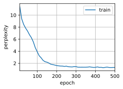

#  
<!--more-->
# 6 循环神经网络的简洁实现


```python
import torch
from torch import nn
from torch.nn import functional as F
from d2l import torch as d2l

batch_size, num_steps = 32, 35
train_iter, vocab = d2l.load_data_time_machine(batch_size, num_steps)
```

## 6.1 定义模型
- 我们构造一个具有256个隐藏单元的单隐藏层的循环神经网络层rnn_layer。


```python
num_hiddens = 256
rnn_layer = nn.RNN(len(vocab), num_hiddens)
```

- 使用张量来初始化隐状态，它的形状是（隐藏层数，批量大小，隐藏单元数）。


```python
state = torch.zeros((1, batch_size, num_hiddens))
state.shape
```


    torch.Size([1, 32, 256])


- 通过一个隐状态和一个输入，我们就可以用更新后的隐状态计算输出。rnn_layer的“输出”（Y）不涉及输出层的计算：它是指每个时间步的隐状态，这些隐状态可以用作后续输出层的输入。


```python
X = torch.rand(size=(num_steps, batch_size, len(vocab)))
Y, state_new = rnn_layer(X, state)
Y.shape, state_new.shape
```


    (torch.Size([35, 32, 256]), torch.Size([1, 32, 256]))


- 为一个完整的循环神经网络模型定义了一个RNNModel类。注意，rnn_layer只包含隐藏的循环层，我们还需要创建一个单独的输出层。


```python
#@save
class RNNModel(nn.Module):
    """循环神经网络模型"""
    def __init__(self, rnn_layer, vocab_size, **kwargs):
        super(RNNModel, self).__init__(**kwargs)
        self.rnn = rnn_layer
        self.vocab_size = vocab_size
        self.num_hiddens = self.rnn.hidden_size
        # 如果RNN是双向的（之后将介绍），num_directions应该是2，否则应该是1
        if not self.rnn.bidirectional:
            self.num_directions = 1
            self.linear = nn.Linear(self.num_hiddens, self.vocab_size)
        else:
            self.num_directions = 2
            self.linear = nn.Linear(self.num_hiddens * 2, self.vocab_size)

    def forward(self, inputs, state):
        X = F.one_hot(inputs.T.long(), self.vocab_size)
        X = X.to(torch.float32)
        Y, state = self.rnn(X, state)
        # 全连接层首先将Y的形状改为(num_steps * batch_size, num_hiddens)
        # 它的输出形状是(num_steps * batch_size, vocab_size)
        output = self.linear(Y.reshape((-1, Y.shape[-1])))
        return output, state
    
    def begin_state(self, device, batch_size=1):
        if not isinstance(self.rnn, nn.LSTM):
            # `nn.GRU` 以张量作为隐藏状态
            return torch.zeros((self.num_directions * self.rnn.num_layers,
                                batch_size, self.num_hiddens), device=device)
        else:
            # `nn.LSTM` 包含两个隐藏状态
            return (torch.zeros((self.num_directions * self.rnn.num_layers,
                                 batch_size, self.num_hiddens), device=device),
                    torch.zeros((self.num_directions * self.rnn.num_layers,
                                 batch_size, self.num_hiddens), device=device))
```

## 6.2 训练与预测


```python
device = d2l.try_gpu()
net = RNNModel(rnn_layer, vocab_size=len(vocab))
net = net.to(device)
d2l.predict_ch8('time traveller', 10, net, vocab, device)
```


    'time travelleruttwwputtw'


- 效果不好，训练：


```python
import os
os.environ["KMP_DUPLICATE_LIB_OK"] = "TRUE"
num_epochs, lr = 500, 1
d2l.train_ch8(net, train_iter, vocab, lr, num_epochs, device)
```

    perplexity 1.3, 93581.6 tokens/sec on cpu
    time travellerit would be relarkably oole pare whe grove to trov
    traveller after the pars of ate that ink of the incand sce 





- 与上一节相比，由于深度学习框架的高级API对代码进行了更多的优化，该模型在较短的时间内达到了较低的困惑度。
