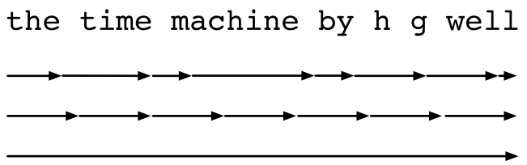
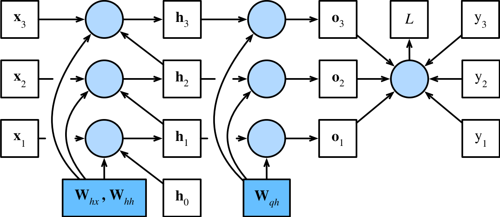

#  
<!--more-->
# 7 通过时间反向传播
- 对于梯度爆炸或梯度消失，以及需要对循环神经网络分离梯度。例如，我们在序列上调用了detach函数。为了能够快速构建模型并了解其工作原理，本节将更深入地探讨序列模型反向传播的细节，以及相关的数学原理。

- 循环神经网络中的前向传播相对简单。通过时间反向传播（backpropagation through time，BPTT）实际上是循环神经网络中反向传播技术的一个特定应用。它要求我们将循环神经网络的计算图一次展开一个时间步，以获得模型变量和参数之间的依赖关系。然后，基于链式法则，应用反向传播来计算和存储梯度。由于序列可能相当长，因此依赖关系也可能相当长。例如，某个1000个字符的序列，其第一个词元可能会对最后位置的词元产生重大影响。这在计算上是不可行的（它需要的时间和内存都太多了），并且还需要超过1000个矩阵的乘积才能得到非常难以捉摸的梯度。这个过程充满了计算与统计的不确定性。

## 7.1 循环神经网络的梯度分析
- 从一个循环神经网络的简化模型开始，此模型忽略了隐状态的特性及其更新方式的细节。这里的数学表示没有像过去那样明确地区分标量、向量和矩阵，因为这些细节对于分析并不重要

- 我们将时间步t的隐状态表示为$h_ t$，输入表示为$x_ t$，输出表示为$o_ t$。输入和隐状态可以拼接后与隐藏层中的一个权重变量相乘。。因此，我们分别使用$w_ h$和$w_ o$来表示隐藏层和输出层的权重。每个时间步的隐状态和输出可以写为：
$$ \begin{aligned} h_ t &= f(x_t, h_{t-1}, w_h),\\ o_ t &= g(h_ t, w_o), \end{aligned} $$

- 其中f和g分别是隐藏层和输出层的变换。因此，我们有一个链$ \{ \dots , (x_ {t-1}, h_ {t-1}, o_ {t-1}), (x_ t, h_ t, o_ t),  \dots \}$，它们通过循环计算彼此依赖。前向传播相当简单，一次一个时间步的遍历三元组$(x_ t, h_ t, o_ t)$，然后通过一个目标函数在所有T个时间步内评估输出$o_ t$和对应的标签$y_ t$之间的误差:
$$ L(x_ 1, \dots, x_ T, y_ 1, \dots, y_ T, w_ h, w_ o) = \frac{1}{T} \sum_ {t=1} ^ T l(o_ t, y_ t). $$

- 对于反向传播，问题则有点棘手，特别是当我们计算目标函数L关于参数wh的梯度时。具体来说，按照链式法则：
$$ \begin{aligned} \frac{\partial L}{\partial w_ h} &= \frac{1}{T} \sum_ {t=1} ^ T \frac{\partial l(o_ t, y_ t)}{\partial w_ h} \\ &= \frac{1}{T} \sum_ {t=1} ^ T \frac{\partial l(o_ t, y_ t)}{\partial o_ t} \frac{\partial g(h_ t, w_ o)}{\partial h_ t} \frac{\partial h_ t}{\partial w_ h}. \end{aligned} $$

- 其中第一项和第二项很容易计算，而第三项$ \frac{\partial h_ t}{\partial w_ h}$则相当复杂。因为我们需要循环地计算参数$w_ h$对$h_ t$的影响，因为$h_ t = f(x_t, h_{t-1}, w_h)$，所以$h_ t$既依赖于$h_ {t-1}$又依赖于$w_ h$，其中$h_ {t-1}$的计算也依赖于$w_ h$。因此，使用链式法则产生：
$$ \frac{\partial h_ t}{\partial w_ h} = \frac{\partial f(x_ t, h_ {t-1}, w_ h)}{\partial w_ h} + \frac{\partial f(x_ t, h_ {t-1}, w_ h)}{\partial h_ {t-1}} \frac{\partial h_ {t-1}}{\partial w_ h}.  $$

- 为了导出上述梯度，假设我们有三个序列$ \{ a_ t \} $，$ \{ b_ t \} $，$ \{ c_ t \} $，当t=1,2,...时，序列满足$a_ 0 = 0$，且$a_ t = b_ t + c_ t a_ {t-1}$。对于$t \geq 1$，我们有：
$$ a_ t = b_ t + \sum_ {i=1} ^ {t-1}(\prod_ {j=i+1} ^ t c_ j) b_ i $$

- 不妨基于下列公式替换$a_ t$、$b_ t$和$c_ t$:
$$ \begin{aligned} a_ t &= \frac{\partial h_ t}{\partial w_ h},\\ b_ t &= \frac{\partial f(x_ t, h_ {t-1}, w_ h)}{\partial w_ h},\\ c_ t &= \frac{\partial f(x_ t, h_ {t-1}, w_ h)}{\partial h_ {t-1}}, \end{aligned} $$

- 通过：
$$ \frac{\partial h_ t}{\partial w_ h} = \frac{\partial f(x_ t, h_ {t-1}, w_ h)}{\partial w_ h} + \frac{\partial f(x_ t, h_ {t-1}, w_ h)}{\partial h_ {t-1}} \frac{\partial h_ {t-1}}{\partial w_ h}.  $$

$$ a_ t = b_ t + c_ t a_ {t-1} $$

$$ a_ t = b_ t + \sum_ {i=1} ^ {t-1}(\prod_ {j=i+1} ^ t c_ j) b_ i $$

- 移除循环计算：
$$ \frac{\partial h_ t}{\partial w_ h} = \frac{\partial f(x_ t, h_ {t-1}, w_ h)}{\partial w_ h} + \sum_ {i=1} ^ {t-1}(\prod_ {j=i+1} ^ t \frac{\partial f(x_ j, h_ {j-1}, w_ h)}{\partial h_ {j-1}}) \frac{\partial f(x_ i, h_ {i-1}, w_ h)}{\partial w_ h}. (7)  $$

- 虽然我们可以使用链式法则递归地计算$\frac{\partial h_ t}{\partial w_ h}$，但当t很大时这个链就会变得很长。我们需要想想办法来处理这一问题.

### 7.1.1 完全计算
- 显然，我们可以计算<a href="#goto7">（7）</a>中的全部总和，然而，这样的计算非常缓慢，并且可能会发生梯度爆炸，因为初始条件的微小变化就可能会对结果产生巨大的影响。也就是说，我们可以观察到类似于蝴蝶效应的现象，即初始条件的很小变化就会导致结果发生不成比例的变化。这对于我们想要估计的模型而言是非常不可取的。毕竟，我们正在寻找的是能够很好地泛化高稳定性模型的估计器。因此，在实践中，这种方法几乎从未使用过。

### 7.1.2 截断时间步
- 或者，我们可以在τ步后截断<a href="#goto7">（7）</a>中的求和计算。例如之前的梯度裁剪。这会带来真实梯度的近似，只需将求和终止为$\frac{ \partial h_ {t - \tau}}{\partial w_ h}$。在实践中，这种方式工作得很好。它通常被称为截断的通过时间反向传播。这样做导致该模型主要侧重于短期影响，而不是长期影响。这在现实中是可取的，因为它会将估计值偏向更简单和更稳定的模型。

### 7.1.3 随机截断
- 我们可以用一个随机变量替换$\frac{\partial h_ t }{\partial w_ h}$，该随机变量在预期中是正确的，但是会截断序列。这个随机变量是通过使用序列 $\xi_ t$来实现的，序列预定义了$0 \leq \pi_ t \leq 1$，其中$P (\xi_ t = 0 ) = 1 - \pi_ t$，且$P (\xi_ t = \pi_ t ^ {-1}) = \pi_ t$，因此$E [ \xi_ t ] = 1$。我们使用它来替换<a href="#goto7">（7）</a>中的梯度$\frac{\partial h_ t}{\partial w_ h}$得到：
$$ z_ t = \frac{\partial f(x_ t, h_ {t-1}, w_ h)}{\partial w_ h} + \xi_ t \frac{\partial f(x_ t, h_ {t-1}, w_ h)}{\partial h_ {t-1}} \frac{\partial h_ {t-1}}{\partial w_ h}. $$

- 从$\xi_ t$的定义中推导出来$E [ z_ t ] = \frac{\partial h_ t}{\partial w_ h}$。每当$ \xi_ t = 0 $时，递归计算终止在这个t时间步。这导致了不同长度序列的加权和，其中长序列出现的很少，所以将适当地加大权重。

### 7.1.4 比较策略

- 第一行采用随机截断，方法是将文本划分为不同长度的片断；
- 第二行采用常规截断，方法是将文本分解为相同长度的子序列。这也是我们在循环神经网络实验中一直在做的；
- 第三行采用通过时间的完全反向传播，结果是产生了在计算上不可行的表达式。
- 虽然随机截断在理论上具有吸引力，但很可能是由于多种因素在实践中并不比常规截断更好。首先，在对过去若干个时间步经过反向传播后，观测结果足以捕获实际的依赖关系。其次，增加的方差抵消了时间步数越多梯度越精确的事实。第三，我们真正想要的是只有短范围交互的模型。因此，模型需要的正是截断的通过时间反向传播方法所具备的轻度正则化效果。

## 7.2 通过时间反向传播的细节
- 如何计算目标函数相对于所有分解模型参数的梯度。为了保持简单，我们考虑一个没有偏置参数的循环神经网络，其在隐藏层中的激活函数使用恒等映射（$\phi(x) = x$）。对于时间步t，设单个样本的输入及其对应的标签分别为$\mathbf{ x }_ t \in \mathbb{ R }^{d} $和$y_ t $。计算隐状态$ \mathbf{ h }_ t \in \mathbb{ R }^{h} $和输出$ \mathbf{ o }_ t \in \mathbb{ R }^{q} $的公式如下：
$$ \begin{aligned} \mathbf{ h }_ t &= \mathbf{ W }_ { hx } \mathbf{ x }_ t + \mathbf{ W }_ { hh } \mathbf{ h }_ { t-1},\\ \mathbf{ o }_ t &= \mathbf{ W }_ { qh } \mathbf{ h }_ t. \end{aligned} $$

- 其中权重参数为$\mathbf{ W }_ { hx } \in \mathbb{ R }^{h \times d} $，$\mathbf{ W }_ { hh } \in \mathbb{ R }^{h \times h} $和$\mathbf{ W }_ { qh } \in \mathbb{ R }^{q \times h} $。用$l(\mathbf{ o }_ t, y_ t) $表示时间步t处（即从序列开始起的超过T个时间步）的损失函数，则我们的目标函数的总体损失是：
$$ L = \frac{1}{T} \sum_ {t=1} ^ T l(\mathbf{ o }_ t, y_ t). $$

- 为了在循环神经网络的计算过程中可视化模型变量和参数之间的依赖关系，我们可以为模型绘制一个计算图：例如，时间步3的隐状态$ \mathbf{ h }_ 3 $的计算依赖于模型参数$\mathbf{ W }_ { hx } $和$\mathbf{ W }_ { hh } $，以及最终时间步的隐状态$ \mathbf{ h }_ 2 $和当前时间步的输入$ \mathbf{ x }_ 3 $。

- 未着色的方框表示变量，着色的方框表示参数，圆表示运算符。模型参数是：$\mathbf{ W }_ { hx } $，$\mathbf{ W }_ { hh } $和$\mathbf{ W }_ { qh } $。通常，训练该模型需要对这些参数进行梯度计算：$ \frac{\partial L}{\partial \mathbf{ W }_ { hx } } $，$ \frac{\partial L}{\partial \mathbf{ W }_ { hh } } $和$ \frac{\partial L}{\partial \mathbf{ W }_ { qh } } $。根据上图的依赖关系，我们可以沿箭头的相反方向遍历计算图，依次计算和存储梯度。为了灵活地表示链式法则中不同形状的矩阵、向量和标量的乘法，我们继续使用prod运算符。

- 首先，在任意时间步t，目标函数关于模型输出的微分计算是相当简单的：
$$ \frac{\partial L}{\partial \mathbf{ o }_ t} = \frac{1}{T} \frac{\partial l(\mathbf{ o }_ t, y_ t)}{\partial \mathbf{ o }_ t}. $$

- 现在，我们可以计算目标函数关于输出层中参数$\mathbf{ W }_ { qh } $的梯度：$ \frac{\partial L}{\partial \mathbf{ W }_ { qh } } $。由上图可知，目标函数L通过$\mathbf{ o }_ 1, \ldots, \mathbf{ o }_ T $依赖于$\mathbf{ W }_ { qh } $。根据链式法则，我们得到：
$$ \begin{aligned} \frac{\partial L}{\partial \mathbf{ W }_ { qh } } &= \sum_ {t=1} ^ T prod \left( \frac{\partial L}{\partial \mathbf{ o }_ t}, \frac{\partial \mathbf{ o }_ t}{\partial \mathbf{ W }_ { qh } } \right) \\ &= \sum_ {t=1} ^ T  \frac{\partial L}{\partial \mathbf{ o }_ t} \mathbf{ h }_ t ^ T . \end{aligned} $$

- 其中$ \frac{ \partial L}{\partial \mathbf{ o }_ t} $已经在上面计算过了。接下来，在最后的时间步T，目标函数L仅通过$\mathbf{ o }_ T $依赖于隐状态$\mathbf{ h }_ T $。因此，使用链式法可以很容易地得到梯度$ \frac{ \partial L}{\partial \mathbf{ h }_ T} $：
$$ \begin{aligned} \frac{\partial L}{\partial \mathbf{ h }_ T} &= prod \left( \frac{\partial L}{\partial \mathbf{ o }_ T}, \frac{\partial \mathbf{ o }_ T}{\partial \mathbf{ h }_ T} \right) \\ &= \mathbf{ W }_ { qh } ^ T \frac{\partial L}{\partial \mathbf{ o }_ T}. \end{aligned} （13） $$

- 当目标函数L通过$\mathbf{ h }_ { t+1 } $和$\mathbf{ o }_ t $依赖于$\mathbf{ h }_ t $时，对任意时间步t < T来说都变得更加棘手。根据链式法则，隐状态的梯度$ \frac{ \partial L}{\partial \mathbf{ h }_ t} $在任何时间步骤t < T时都可以递归地计算为：
$$ \begin{aligned} \frac{\partial L}{\partial \mathbf{ h }_ t} &= prod \left( \frac{\partial L}{\partial \mathbf{ h }_ { t+1 }}, \frac{\partial \mathbf{ h }_ { t+1 }}{\partial \mathbf{ h }_ t} \right) + prod \left( \frac{\partial L}{\partial \mathbf{ o }_ t}, \frac{\partial \mathbf{ o }_ t}{\partial \mathbf{ h }_ t} \right) \\ &= \mathbf{ W }_ { hh } ^ T \frac{\partial L}{\partial \mathbf{ h }_ { t+1 }} + \mathbf{ W }_ { qh } ^ T \frac{\partial L}{\partial \mathbf{ o }_ t}. \end{aligned} （14） $$

- 为了进行分析，对于任何时间步1 ≤ t ≤ T展开递归计算得:
$$ \frac{\partial L}{\partial \mathbf{ h }_ t} = \sum_ {i=t} ^ T \left( \mathbf{ W }_ { hh } ^ T \right) ^ {T-i} \mathbf{ W }_ { qh } ^ T \frac{\partial L}{\partial \mathbf{ o }_ { T+t-i }}. $$

- 从上式看到，这个简单的线性例子已经展现了长序列模型的一些关键问题：它陷入到$ \mathbf{ W }_ { hh } ^ T $的潜在的非常大的幂。在这个幂中，小于1的特征值将会消失，大于1的特征值将会发散。这在数值上是不稳定的，表现形式为梯度消失或梯度爆炸。解决此问题的一种方法是按照计算方便的需要截断时间步长的尺寸。实际上，这种截断是通过在给定数量的时间步之后分离梯度来实现的。

- 最后，上图表明：目标函数L通过隐状态$\mathbf{ h }_ 1, \ldots, \mathbf{ h }_ T $依赖于隐藏层中的模型参数$\mathbf{ W }_ { hx } $和$\mathbf{ W }_ { hh } $。为了计算有关这些参数的梯度$ \frac{ \partial L}{\partial \mathbf{ W }_ { hx } } $和$ \frac{ \partial L}{\partial \mathbf{ W }_ { hh } } $，我们应用链式规则得：
$$ \begin{aligned} \frac{\partial L}{\partial \mathbf{ W }_ { hx } } &= \sum_ {t=1} ^ T prod \left( \frac{\partial L}{\partial \mathbf{ h }_ t}, \frac{\partial \mathbf{ h }_ t}{\partial \mathbf{ W }_ { hx } } \right) = \sum_ {t=1} ^ T \frac{\partial L}{\partial \mathbf{ h }_ t} \mathbf{ x }_ t ^ T, \\ \frac{\partial L}{\partial \mathbf{ W }_ { hh } } &= \sum_ {t=1} ^ T prod \left( \frac{\partial L}{\partial \mathbf{ h }_ t}, \frac{\partial \mathbf{ h }_ t}{\partial \mathbf{ W }_ { hh } } \right) = \sum_ {t=1} ^ T \frac{\partial L}{\partial \mathbf{ h }_ t} \mathbf{ h }_ { t-1 } ^ T. \end{aligned} $$

- 其中$ \frac{ \partial L}{\partial \mathbf{ h }_ t} $是由<a href="#goto13">（13）</a>和<a href="#goto14">（14）</a>递归计算得到的，是影响数值稳定性的关键量。

- 由于通过时间反向传播是反向传播在循环神经网络中的应用方式，所以训练循环神经网络交替使用前向传播和通过时间反向传播。通过时间反向传播依次计算并存储上述梯度。具体而言，存储的中间值会被重复使用，以避免重复计算，例如存储$ \frac{ \partial L}{\partial \mathbf{ h }_ t} $，以便在计算$ \frac{ \partial L}{\partial \mathbf{ W }_ { hx } } $和$ \frac{ \partial L}{\partial \mathbf{ W }_ { hh } } $时重复使用。
