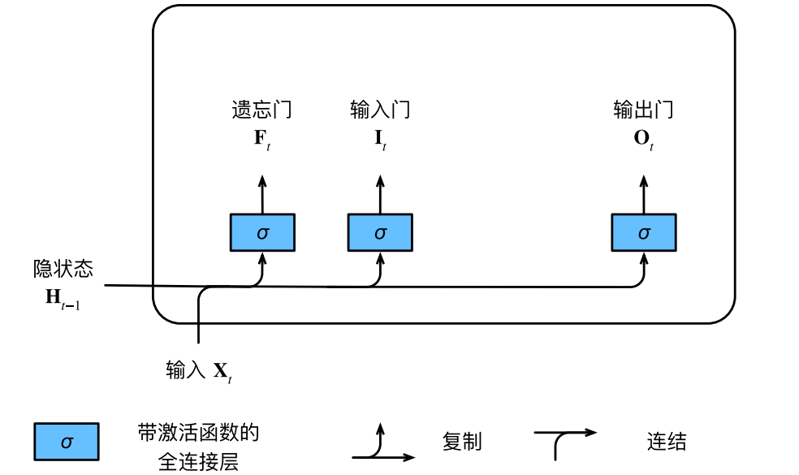
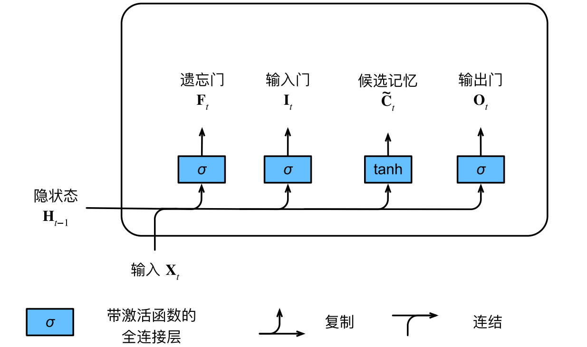
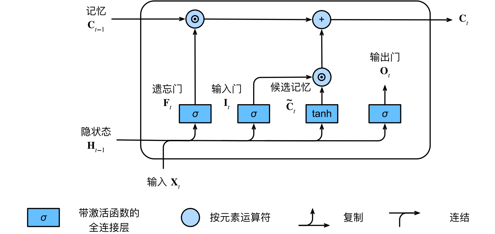
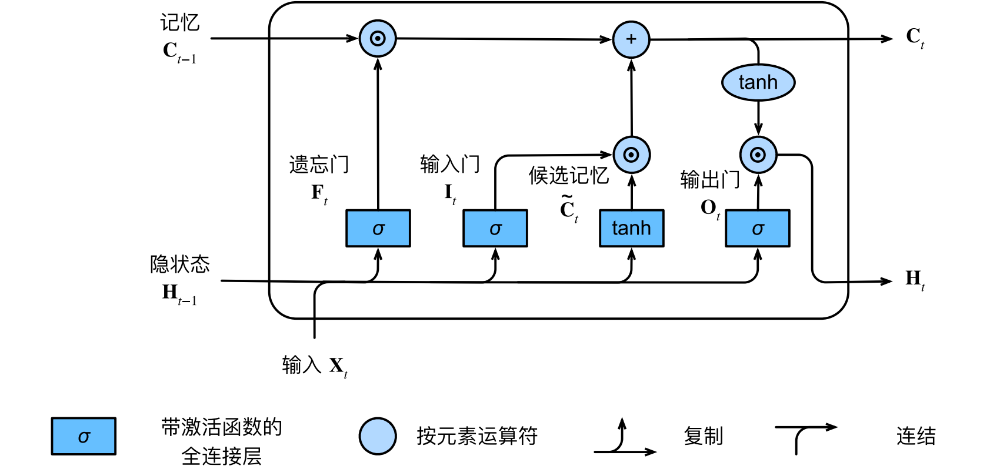
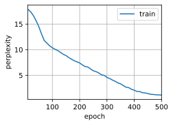
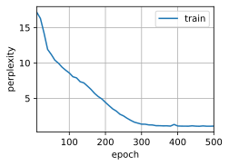

#  
<!--more-->
# 2 长短期记忆网络（LSTM）

- 隐变量模型存在着长期信息保存和短期输入缺失的问题。解决这一问题的最早方法之一是长短期存储器（long short‐term memory，LSTM）。它有许多与门控循环单元一样的属性。LSTM的设计比门控循环单元稍微复杂一些。

## 2.1 门控记忆元

- LSTM的设计灵感来自于计算机的逻辑门，它引入了记忆元（memory cell），或简称为单元（cell）。有些文献认为记忆元是隐状态的一种特殊类型，它们与隐状态具有相同的形状，其设计目的是用于记录附加的信息。
- 为了控制记忆元，我们需要许多门。
    - 其中一个门用来从单元中输出条目，我们将其称为输出门（output gate）。
    - 另外一个门用来决定何时将数据读入单元，我们将其称为输入门（input gate）。
    - 我们还需要一种机制来重置单元的内容，由遗忘门（forget gate）来管理，这种设计的动机与门控循环单元相同，能够通过专用机制决定什么时候记忆或忽略隐状态中的输入。

### 2.1.1 输入门、遗忘门和输出门

- 同样将$\mathbf{X}_t$和$\mathbf{H}_{t-1}$送入LSTM门中，如下图：它们由三个具有sigmoid激活函数的全连接层处理，以计算输入门、遗忘门和输出门的值。




- 假设有h个隐藏单元，批量大小为n，输入数为d：

$$ \begin{aligned} \mathbf{ I } _ { t } & = \sigma \left( \mathbf{ X } _ { t } \mathbf{ W } _ { xi } + \mathbf{ H } _ { t - 1 } \mathbf{ W } _ { hi } + \mathbf{ b } _ { i } \right) \\ \mathbf{ F } _ { t } & = \sigma \left( \mathbf{ X } _ { t } \mathbf{ W } _ { xf } + \mathbf{ H } _ { t - 1 } \mathbf{ W } _ { hf } + \mathbf{ b } _ { f } \right) \\ \mathbf{ O } _ { t } & = \sigma \left( \mathbf{ X } _ { t } \mathbf{ W } _ { xo } + \mathbf{ H } _ { t - 1 } \mathbf{ W } _ { ho } + \mathbf{ b } _ { o } \right) \end{aligned} $$

### 2.1.2 候选记忆元

- 候选记忆元（candidate memory cell）$\tilde{C}_ t \in \mathbb{R} ^ { n \times h }$的计算与上面描述的三个门的计算类似，但是使用tanh函数作为激活函数，函数的值范围为(−1, 1):

$$ \tilde{ C } _ { t } = \tanh \left( \mathbf{ X } _ { t } \mathbf{ W } _ { xc } + \mathbf{ H } _ { t - 1 } \mathbf{ W } _ { hc } + \mathbf{ b } _ { c } \right) $$




### 2.1.3 记忆元

- 为了控制输入和遗忘（或跳过），输入门$ \mathbf{ I } _ { t } $控制采用多少来自候选记忆元$ \tilde{ C } _ { t } $的新数据，遗忘门$ \mathbf{ F } _ { t } $控制保留多少旧记忆元$ \mathbf{ C } _ { t - 1 } $的内容。使用按元素乘法，得出：

$$ \mathbf{ C } _ { t } = \mathbf{ F } _ { t } \odot \mathbf{ C } _ { t - 1 } + \mathbf{ I } _ { t } \odot \tilde{ C } _ { t } $$

- 如果遗忘门始终为1且输入门始终为0，则过去的记忆元$ \mathbf{ C } _ { t - 1 } $将一直通过时间步传递到当前时间步。引入这种设计是为了缓解梯度消失问题，并更好地捕获序列中的长距离依赖关系。计算记忆元的流程图:




### 2.1.4 隐状态

- 输出门控制隐状态的计算：

$$ \mathbf{ H } _ { t } = \mathbf{ O } _ { t } \odot \tanh \left( \mathbf{ C } _ { t } \right) $$

- 只要输出门接近1，我们就能够有效地将所有记忆信息传递给预测部分，而对于输出门接近0，我们只保留记忆元内的所有信息，而不需要更新隐状态。




## 2.2 从零开始实现

- 加载数据集


```python
import torch
from torch import nn
from d2l import torch as d2l

batch_size, num_steps = 32, 35
train_iter, vocab = d2l.load_data_time_machine(batch_size, num_steps)
```

### 2.2.1 初始化模型参数

- 超参数num_hiddens定义隐藏单元的数量。我们按照标准差0.01的高斯分布初始化权重，并将偏置项设为0。


```python
def get_lstm_params(vocab_size, num_hiddens, device):
    num_inputs = num_outputs = vocab_size

    def normal(shape):
        return torch.randn(size=shape, device=device) * 0.01

    def three():
        return (normal((num_inputs, num_hiddens)),
                normal((num_hiddens, num_hiddens)),
                torch.zeros(num_hiddens, device=device))

    W_xi, W_hi, b_i = three()  # 输入门参数
    W_xf, W_hf, b_f = three()  # 遗忘门参数
    W_xo, W_ho, b_o = three()  # 输出门参数
    W_xc, W_hc, b_c = three()  # 候选记忆细胞参数
    # 输出层参数
    W_hq = normal((num_hiddens, num_outputs))
    b_q = torch.zeros(num_outputs, device=device)
    # 附加梯度
    params = [W_xi, W_hi, b_i, W_xf, W_hf, b_f, W_xo, W_ho, b_o, W_xc, W_hc, b_c, W_hq, b_q]
    for param in params:
        param.requires_grad_(True)
    return params
```

### 2.2.2 定义模型

- 长短期记忆网络的隐状态需要返回一个额外的记忆元，单元的值为0，形状为（批量大小，隐藏单元数）。


```python
def init_lstm_state(batch_size, num_hiddens, device):
    return (torch.zeros((batch_size, num_hiddens), device=device),
            torch.zeros((batch_size, num_hiddens), device=device))
```

- 只有隐状态才会传递到输出层，而记忆元$ \mathbf{ C } _ { t } $不参与输出层的计算。


```python
def lstm(inputs, state, params):
    [W_xi, W_hi, b_i, W_xf, W_hf, b_f, W_xo, W_ho, b_o, W_xc, W_hc, b_c, W_hq, b_q] = params
    (H, C) = state
    outputs = []
    for X in inputs:
        I = torch.sigmoid((X @ W_xi) + (H @ W_hi) + b_i)
        F = torch.sigmoid((X @ W_xf) + (H @ W_hf) + b_f)
        O = torch.sigmoid((X @ W_xo) + (H @ W_ho) + b_o)
        C_tilda = torch.tanh((X @ W_xc) + (H @ W_hc) + b_c)
        C = F * C + I * C_tilda
        H = O * torch.tanh(C)
        Y = (H @ W_hq) + b_q
        outputs.append(Y)
    return torch.cat(outputs, dim=0), (H, C)
```

### 2.2.3 训练和预测


```python
import os
os.environ["KMP_DUPLICATE_LIB_OK"] = "TRUE"

vocab_size, num_hiddens, device = len(vocab), 256, d2l.try_gpu()
num_epochs, lr = 500, 1
model = d2l.RNNModelScratch(len(vocab), num_hiddens, device, get_lstm_params,
init_lstm_state, lstm)
d2l.train_ch8(model, train_iter, vocab, lr, num_epochs, device)
```

    perplexity 1.1, 15161.2 tokens/sec on cpu
    time traveller whiled at a small shaded an wo st ur resu that fa
    traveller after the pauserencarengan s sonewhided no me gra
    


    


    


## 2.3 简洁实现


```python
num_inputs = vocab_size
lstm_layer = nn.LSTM(num_inputs, num_hiddens)
model = d2l.RNNModel(lstm_layer, len(vocab))
model = model.to(device)
d2l.train_ch8(model, train_iter, vocab, lr, num_epochs, device)
```

    perplexity 1.1, 16918.9 tokens/sec on cpu
    time travelleryou can show black is white by argument said filby
    traveller his eas along the tire diffelinny it the in a for
    


    


    


- LSTM是典型的具有重要状态控制的隐变量自回归模型。多年来已经提出了其许多变体，例如，多层、残差连接、不同类型的正则化。然而，由于序列的长距离依赖性，训练长短期记忆网络和其他序列模型（例如门控循环单元）的成本是相当高的。在后面的内容中，我们将讲述更高级的替代模型，如Transformer。
