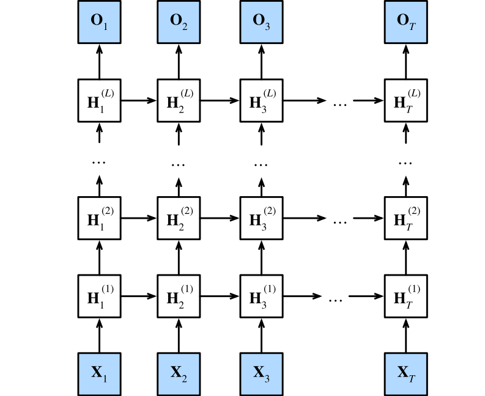
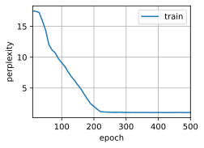

#  
<!--more-->
# 3 深度循环神经网络

- 我们可以将多层循环神经网络堆叠在一起，通过对几个简单层的组合，产生了一个灵活的机制。特别是，数据可能与不同层的堆叠有关。例如，我们可能希望保持有关金融市场状况（熊市或牛市）的宏观数据可用，而微观数据只记录较短期的时间动态。

- 下图描述了一个具有L个隐藏层的深度循环神经网络，每个隐状态都连续地传递到当前层的下一个时间步和下一层的当前时间步。




## 3.1 函数依赖关系

- 假设在时间步t有一个小批量的输入：$ \mathbf{X}_t \in \mathbb{R}^{n \times d} $（样本数：n，每个样本中的输入数：d），$ \mathbf{ H }_ t ^ { ( l ) } \in \mathbb{R}^{n \times h} $表示时间步t时第l隐藏层的隐藏状态（隐藏单元数：h），$ \mathbf{ O }_ t \in \mathbb{R}^{n \times q} $（输出数：q）是时间步t的输出层变量。$ \mathbf{ H }_ t ^ { ( 0 ) } = \mathbf{ X }_ t $。对于l = 1，…，L，隐藏状态的更新方程为：

$$ \begin{aligned} \mathbf{ H }_ t ^ { ( l ) } &= \phi _ l \left( \mathbf{ H }_ t ^ { ( l - 1 ) } \mathbf{ W } _ { x h } ^ { ( l ) } + \mathbf{ H } _ { t - 1 } ^ { ( l ) } \mathbf{ W } _ { hh } ^ { ( l ) } + \mathbf{ b } _ h ^ { ( l ) } \right) \\\\ \mathbf{ O }_ t &= \mathbf{ H }_ t ^ { ( L ) } \mathbf{ W } _ { h q } + \mathbf{ b } _ q \end{aligned} $$

## 3.2 实现


```python
import torch
from torch import nn
from d2l import torch as d2l

batch_size, num_steps = 32, 35
train_iter, vocab = d2l.load_data_time_machine(batch_size, num_steps)
```

- 选择超参数这类架构决策非常相似。因为我们有不同的词元，所以输入和输出都选择相同数量，即vocab_size。隐藏单元的数量仍然是256。唯一的区别是，我们现在通过num_layers的值来设定隐藏层数。


```python
vocab_size, num_hiddens, num_layers = len(vocab), 256, 2
num_inputs = vocab_size
device = d2l.try_gpu()
lstm_layer = nn.LSTM(num_inputs, num_hiddens, num_layers)
model = d2l.RNNModel(lstm_layer, len(vocab))
model = model.to(device)
```

## 3.3 训练和预测


```python
import os
os.environ["KMP_DUPLICATE_LIB_OK"] = "TRUE"

num_epochs, lr = 500, 2
d2l.train_ch8(model, train_iter, vocab, lr*1.0, num_epochs, device)
```

    perplexity 1.0, 6503.5 tokens/sec on cpu
    time travelleryou can show black is white by argument said filby
    travelleryou can show black is white by argument said filby
    


    


    

